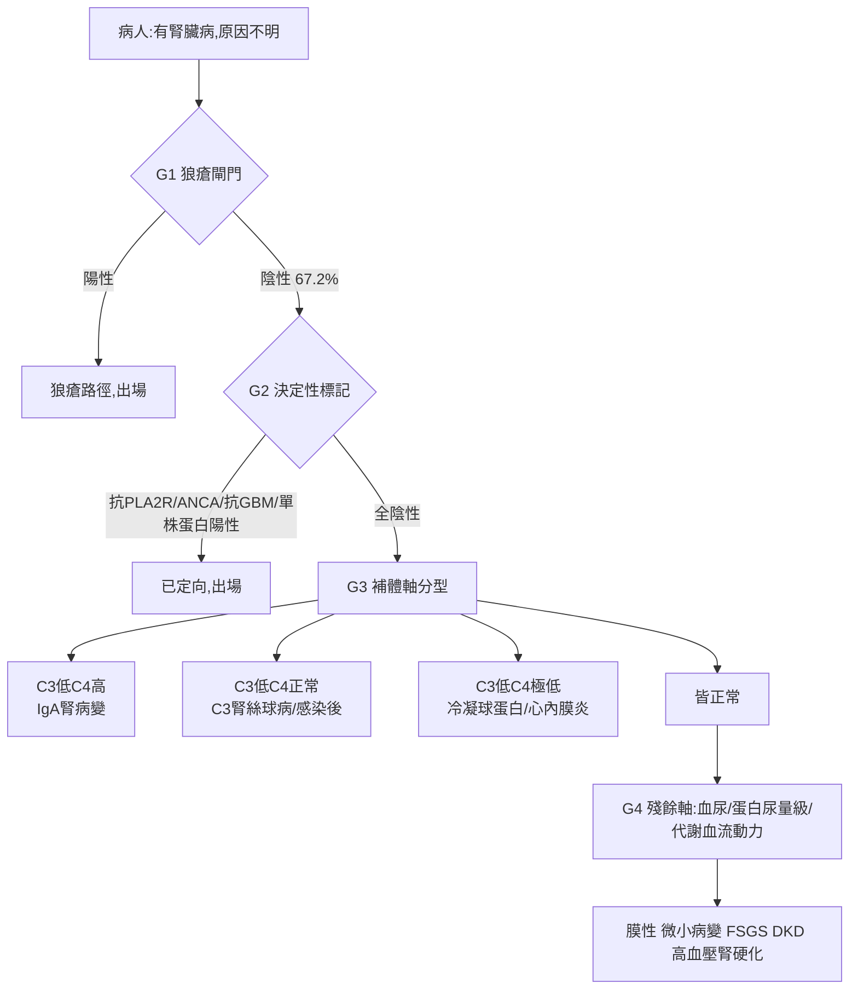

# 研究總覽

## 問題鏈

## 三個層次

| 層 | 文件 | 概念 |
|---|---|---|
| 架構 | [v9 排除式級聯架構修正](../02_%E7%A0%94%E7%A9%B6%E8%A8%88%E7%95%AB%E6%9B%B8/%E7%8F%BE%E8%A1%8C%E4%B8%BB%E7%B7%9A/v9%20%E6%8E%92%E9%99%A4%E5%BC%8F%E7%B4%9A%E8%81%AF%E6%9E%B6%E6%A7%8B%E4%BF%AE%E6%AD%A3.md) | [排除式級聯](../05_%E6%A6%82%E5%BF%B5%E7%AD%86%E8%A8%98/%E6%8E%92%E9%99%A4%E5%BC%8F%E7%B4%9A%E8%81%AF.md)、[通道消耗規則](../05_%E6%A6%82%E5%BF%B5%E7%AD%86%E8%A8%98/%E9%80%9A%E9%81%93%E6%B6%88%E8%80%97%E8%A6%8F%E5%89%87.md) |
| 方法 | [病因全譜與公式推導 v1](../03_%E5%85%AC%E5%BC%8F%E8%88%87%E6%96%B9%E6%B3%95/%E7%97%85%E5%9B%A0%E5%85%A8%E8%AD%9C%E8%88%87%E5%85%AC%E5%BC%8F%E6%8E%A8%E5%B0%8E%20v1.md)、[文獻分析與公式改良建議 v1](../03_%E5%85%AC%E5%BC%8F%E8%88%87%E6%96%B9%E6%B3%95/%E6%96%87%E7%8D%BB%E5%88%86%E6%9E%90%E8%88%87%E5%85%AC%E5%BC%8F%E6%94%B9%E8%89%AF%E5%BB%BA%E8%AD%B0%20v1.md) | [交叉動差](../05_%E6%A6%82%E5%BF%B5%E7%AD%86%E8%A8%98/%E4%BA%A4%E5%8F%89%E5%8B%95%E5%B7%AE.md)、[誤差免疫](../05_%E6%A6%82%E5%BF%B5%E7%AD%86%E8%A8%98/%E8%AA%A4%E5%B7%AE%E5%85%8D%E7%96%AB.md)、[驅動歸因向量](../05_%E6%A6%82%E5%BF%B5%E7%AD%86%E8%A8%98/%E9%A9%85%E5%8B%95%E6%AD%B8%E5%9B%A0%E5%90%91%E9%87%8F.md)、[秩一殘差](../05_%E6%A6%82%E5%BF%B5%E7%AD%86%E8%A8%98/%E7%A7%A9%E4%B8%80%E6%AE%98%E5%B7%AE.md) |
| 錨定 | [負載矩陣錨定表 v1](../03_%E5%85%AC%E5%BC%8F%E8%88%87%E6%96%B9%E6%B3%95/%E8%B2%A0%E8%BC%89%E7%9F%A9%E9%99%A3%E9%8C%A8%E5%AE%9A%E8%A1%A8%20v1.md) | [負載矩陣](../05_%E6%A6%82%E5%BF%B5%E7%AD%86%E8%A8%98/%E8%B2%A0%E8%BC%89%E7%9F%A9%E9%99%A3.md)、[補體四象限](../05_%E6%A6%82%E5%BF%B5%E7%AD%86%E8%A8%98/%E8%A3%9C%E9%AB%94%E5%9B%9B%E8%B1%A1%E9%99%90.md)、[細微數據差異](../05_%E6%A6%82%E5%BF%B5%E7%AD%86%E8%A8%98/%E7%B4%B0%E5%BE%AE%E6%95%B8%E6%93%9A%E5%B7%AE%E7%95%B0.md) |

## 紀律文件

[修正驗證計畫書 v1](../02_%E7%A0%94%E7%A9%B6%E8%A8%88%E7%95%AB%E6%9B%B8/%E7%8F%BE%E8%A1%8C%E4%B8%BB%E7%B7%9A/%E4%BF%AE%E6%AD%A3%E9%A9%97%E8%AD%89%E8%A8%88%E7%95%AB%E6%9B%B8%20v1.md)（十項邏輯漏洞）　[洩漏基準](../05_%E6%A6%82%E5%BF%B5%E7%AD%86%E8%A8%98/%E6%B4%A9%E6%BC%8F%E5%9F%BA%E6%BA%96.md)　[三面統計障壁](../05_%E6%A6%82%E5%BF%B5%E7%AD%86%E8%A8%98/%E4%B8%89%E9%9D%A2%E7%B5%B1%E8%A8%88%E9%9A%9C%E5%A3%81.md)　[旋轉不確定性](../05_%E6%A6%82%E5%BF%B5%E7%AD%86%E8%A8%98/%E6%97%8B%E8%BD%89%E4%B8%8D%E7%A2%BA%E5%AE%9A%E6%80%A7.md)

## 實作

[建置指示 v1 (腎炎病因鑑別)](../03_%E5%85%AC%E5%BC%8F%E8%88%87%E6%96%B9%E6%B3%95/%E5%BB%BA%E7%BD%AE%E6%8C%87%E7%A4%BA%20v1%20%28%E8%85%8E%E7%82%8E%E7%97%85%E5%9B%A0%E9%91%91%E5%88%A5%29.md)　[耦合版實驗紀錄 十一輪迭代](../07_%E5%AF%A6%E9%A9%97%E8%88%87%E7%B5%90%E6%9E%9C/%E8%80%A6%E5%90%88%E7%89%88%E5%AF%A6%E9%A9%97%E7%B4%80%E9%8C%84%20%E5%8D%81%E4%B8%80%E8%BC%AA%E8%BF%AD%E4%BB%A3.md)　[可行性檢核工具說明 v1](../07_%E5%AF%A6%E9%A9%97%E8%88%87%E7%B5%90%E6%9E%9C/%E5%8F%AF%E8%A1%8C%E6%80%A7%E6%AA%A2%E6%A0%B8%E5%B7%A5%E5%85%B7%E8%AA%AA%E6%98%8E%20v1.md)

## 法規

[CGRD試驗計畫書 v4](../08_%E6%B3%95%E8%A6%8F%E9%80%81%E5%AF%A9/CGRD%E8%A9%A6%E9%A9%97%E8%A8%88%E7%95%AB%E6%9B%B8%20v4.md)　[CGRD資料申請表附頁 v1](../08_%E6%B3%95%E8%A6%8F%E9%80%81%E5%AF%A9/CGRD%E8%B3%87%E6%96%99%E7%94%B3%E8%AB%8B%E8%A1%A8%E9%99%84%E9%A0%81%20v1.md)
