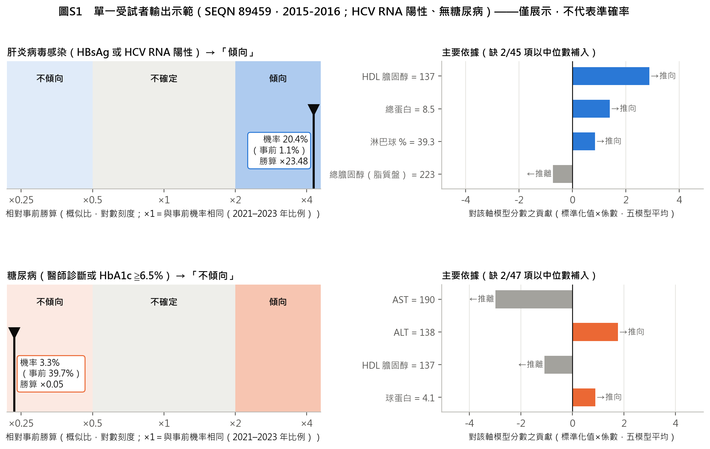

# 常規檢驗能否提供腎臟指標異常的病因線索？

## ——肝炎病毒感染與糖尿病兩個共存標籤：NHANES 1999–2018 重分析、資料修正與 2021–2023 外部評估（v3.2）

作者　＿＿＿＿＿＿　　所屬單位　＿＿＿＿＿＿　　版本　v3.2（2026-09-27）

---

## 摘要

**背景與目的**　本研究的起點是一個臨床問題：腎臟指標異常時，能否只用已有的常規血液與尿液檢驗，指出病因的大概方向。公開健康調查沒有病理診斷，只能提供共存疾病標籤；共存疾病是候選病因，不等於病因。本研究評估兩個共存標籤（肝炎病毒感染、糖尿病）能被常規檢驗辨識到什麼程度，作為病因線索。v3 依 2026 年 9 月 26 日之外部方法學審查以真實資料重建標籤與評估流程；v3.2 再逐週期核對官方文件、修正三類資料錯誤，並評估非線性模型的校準。

**方法**　NHANES 1999–2018 十個週期成人 55,081 人。依官方文件校正跨週期檢驗（1999–2000 與 2005–2006 年血清肌酸酐、2007 年前尿肌酸酐、2001–2002 年以另一變數名發布之四項生化、2017–2018 年生化儀器更換之回推式）；腎臟指標與兩個標籤採三值（陽性、陰性、未知），各軸排除未知者。候選模型為常規套組與全特徵之邏輯迴歸與梯度提升，皆採網頁工具的結構（五折交叉配適集成加保序校準），以分層五折重複五次之巢狀外層評估（校準器與分區門檻只用外層訓練資料），並在同一切分比較只用年齡、性別的基準；另做時間外推、調查權重與抽樣設計變異、標籤定義敏感度與決策曲線。分析計畫皆於執行前提交版本控制。外部資料為 NHANES 2021–2023：v3 事前凍結模型並一次評估；v3.2 模型於修正後資料重新訓練後再評估，屬事後分析。網頁工具以 2021–2023 年資料重新校準，並以依抽樣設計切半 200 次的交叉驗證估計此步驟之可靠度。

**結果**　腎臟指標異常 9,218 人，另有 6,120 人無法判定；肝炎標籤陽性 170 人、糖尿病標籤陽性 3,231 人。網頁工具所用之常規套組邏輯迴歸：肝炎軸 AUROC 0.807（95% CI 0.768–0.838）、平均精確率 0.133（盛行率 0.020）、校準斜率 0.97；糖尿病軸 AUROC 0.761（0.751–0.772）、校準斜率 0.99；只用年齡與性別時為 0.596 與 0.557。糖尿病軸的梯度提升 AUROC 0.821，比邏輯迴歸高（第一次重複之配對差 +0.058，95% CI 0.050–0.066），經同樣保序校準後截距 0.01、斜率 1.04，Brier 分數由 0.1855 降為 0.1617；肝炎軸則無優勢（配對差 −0.010，95% CI −0.037 至 0.019）。肝炎軸的訊號幾乎全來自 C 型肝炎（僅 C 肝標籤 AUROC 0.847，僅 B 肝 0.557）。在 2021–2023 年資料上，糖尿病軸之邏輯迴歸與梯度提升 AUROC 為 0.780 與 0.814，同一批人只用年齡、性別為 0.534；肝炎軸只有 11 名陽性，無法確認。重新校準之交叉驗證中，糖尿病軸測試半平均預測與實際之比中位數 1.01（0.88–1.15）。

**結論**　常規檢驗對 C 型肝炎相關的肝炎標籤與糖尿病標籤有中等辨識力，內部校準良好，可作為病因線索；對 B 型肝炎幾乎沒有訊號。糖尿病軸的非線性模型判別更高、經保序校準後校準同樣接近理想，且在新資料上維持；網頁工具為保留逐項解釋而維持邏輯迴歸。肝炎軸的外部事件太少，仍待確認。辨識共存疾病不等於確定腎損傷病因，且在普遍篩檢的建議下，本工具不宜用來決定誰不必驗肝炎。

**關鍵詞**：NHANES；腎臟指標異常；病因線索；C 型肝炎；糖尿病；預測模型；校準；非線性模型；外部評估

---

## Abstract

**Background** We asked whether routine blood and urine tests can point toward the cause of abnormal kidney markers. Public survey data provide comorbidity labels, not etiology, so we evaluated how well routine tests identify two candidate-cause labels (hepatitis virus infection and diabetes). Version 3 rebuilt the analysis after an external methodological review; version 3.2 corrected three further data errors found by cycle-by-cycle checks of the official documentation and evaluated the calibration of a non-linear model.

**Methods** Adults in NHANES 1999–2018 (n = 55,081). Laboratory values were harmonized across cycles following NCHS documentation, including renamed 2001–2002 biochemistry variables and backward equations for the 2017–2018 analyzer change; labels were three-valued (positive, negative, unknown). Logistic regression and gradient boosting on a routine panel and on all features were fitted with the deployed tool's structure (cross-fitted ensemble with isotonic calibration) and evaluated by nested 5-fold cross-validation repeated five times, with calibration and thresholds learned only in outer training folds, against an age–sex baseline on identical splits. NHANES 2021–2023 served as external data (a pre-specified single evaluation in version 3; post hoc in version 3.2). The web tool was recalibrated on these data, and the reliability of recalibration was estimated by 200 design-based half splits.

**Results** Kidney-marker abnormality was present in 9,218 adults. The routine-panel logistic model had an AUROC of 0.807 (95% CI 0.768–0.838) for hepatitis and 0.761 (0.751–0.772) for diabetes, versus 0.596 and 0.557 for age and sex alone. For diabetes, gradient boosting reached 0.821 (paired difference in the first repeat +0.058, 95% CI 0.050–0.066) with a calibration intercept of 0.01 and slope of 1.04 after the same isotonic calibration; for hepatitis it offered no gain. The hepatitis signal came from hepatitis C (AUROC 0.847) rather than hepatitis B (0.557). In NHANES 2021–2023, the diabetes models reached 0.780 (logistic) and 0.814 (boosting) versus 0.534 for age and sex; the hepatitis axis had only 11 events. After recalibration, the median ratio of mean predicted to observed risk in held-out halves was 1.01 for diabetes.

**Conclusions** Routine tests carry moderate, internally well-calibrated signal for hepatitis C–related and diabetes labels, usable as etiologic clues but not as diagnoses. A non-linear model improved discrimination for diabetes without loss of calibration; the web tool keeps logistic regression for item-level explanations. The hepatitis axis remains unconfirmed externally.

---

## 1　前言

腎臟病的病因評估需要整合病史、共存疾病、用藥、身體檢查、實驗室數據、影像，以及適當情境下的病理或基因檢查；單次 eGFR 下降或白蛋白尿升高，也不足以確認異常已持續三個月以上[1]。臨床上多數人每年都有抽血與驗尿，這些數值早已存在，卻很少被拿來回答「腎臟為什麼出問題」。本研究的核心問題正是這一點：**只用常規檢驗，能不能指出病因的大概方向？**

公開健康調查能回答的範圍有限。美國國家健康與營養調查（NHANES）沒有腎臟病理，只能提供共存疾病的操作型標籤，例如 B 型或 C 型肝炎病毒感染、糖尿病。這些疾病是腎損傷的候選病因，但標籤成立不代表腎損傷由它造成。因此本研究把問題界定為：**常規檢驗能否辨識這兩個候選病因的共存標籤**——辨識得出來，才有資格被稱為「病因線索」；要確認病因，仍需病理或臨床參考標準。

前一版（v2）於 2026 年 9 月 26 日接受外部方法學審查。審查者沒有取得資料與程式，因此將標籤缺失、跨週期校正、校準流程、抽樣權重與時間驗證列為「待執行」；v3 以原始資料執行這些重分析，並發現數項審查者無法看見的資料錯誤。v3 完成後，本研究逐週期檢查每個特徵的有值比例並逐一閱讀 CDC 資料文件，又找到三類能通過雜湊檢查的錯誤；v3 也留下兩個問題：糖尿病軸的梯度提升判別較高，但校準未知；網頁工具以 2021–2023 年資料重新校準，但這一步的可靠度未知。本版（v3.2）修正資料、重建模型並回答這兩個問題。研究目的為：

1. 依 NHANES 官方文件重建跨週期一致的檢驗量尺、腎臟指標與兩個共存標籤，未知不再當作陰性；
2. 以校準與門檻完全留在訓練資料內的巢狀外層評估，報告常規檢驗的判別、校準與三段分區表現[2,3]；
3. 在同一切分比較線性與非線性模型、常規套組與全特徵，並與只用年齡、性別的基準比較；
4. 檢驗時間外推、調查權重與抽樣設計、標籤定義的影響；
5. 重新檢視上游暴露關聯，改在同一批受試者比較血中與尿中金屬；
6. 以未參與開發的 NHANES 2021–2023 評估外部表現；
7. 建立網頁工具，並估計以新資料重新校準的可靠程度。

## 2　材料與方法

### 2.1　研究設計與資料來源

本研究為 NHANES 1999–2018 年十個週期的重複橫斷面次級資料分析，納入年齡至少 20 歲者。各週期為不同受試者，本設計不追蹤個人發病時序，故稱「分析樣本」而非世代。資料檔的來源網址與 SHA256 雜湊記錄於出處帳本，用於確認檔案未被更動；雜湊不能證明資料的單位、合併或標籤正確——v3 與 v3.2 發現的資料錯誤都能通過雜湊檢查。分析計畫皆在執行評估程式之前提交版本控制：v3（`params/v3_analysis_plan.json`，提交 bf269c5）、設計變異（9edd968）、v3.2（`params/v3_2_plan.json`，SHA256 前 16 碼 af946bd3905c369f，提交 f6abc91）。為使本文與 v3 之報告項目一致，另有四項 v3 已有、v3.2 計畫未列之分析（描述性計數、近端特徵消融、擴展視窗、糖尿病標籤定義敏感度）與單變量標記描述，依 v3 之定義於 v3.2 資料重跑；程式亦先提交後執行（0826af6、30b28d6），但執行於 v3.2 主要結果之後。1999–2018 年資料已於先前版本反覆檢視，本版屬探索性修訂，不是確認性驗證。

### 2.2　腎臟指標與檢驗校正

腎臟指標異常定義為單次 eGFR < 60 mL/min/1.73 m² 或尿白蛋白／肌酸酐比（ACR）≧ 30 mg/g。eGFR 以 CKD-EPI 2021 無種族係數公式計算[4]。血清肌酸酐依官方文件校正：1999–2000 年為 1.013 × 原值 ＋ 0.147[5,6]，2005–2006 年為 −0.016 ＋ 0.978 × 原值[7]；2001–2004 年不需校正[5]。v2 在 1999–2000 年誤用了 NHANES III（1988–1994）的公式 −0.184 ＋ 0.960 × 原值，使該週期原值 1.0 mg/dL 被換算為 0.776 而非 1.160，eGFR 因此被高估（v3 更正）。2007 年起尿肌酸酐改用酵素法，依官方分段式轉換 2007 年前之值[8]：原值 X < 75 mg/dL 時為 (1.02√X − 0.36)²，75–250 時為 (1.05√X − 0.74)²，≧ 250 時為 (1.01√X − 0.10)²。

v3.2 另更正兩項跨週期問題。第一，2001–2002 年之鹼性磷酸酶、LDH、磷與總膽紅素，官方以 LBDSAPSI、LBDSLDSI、LBDSPH、LBDSTB 發布[9]；前版只讀取其他週期的變數名，這四項在該週期整週期缺值而以中位數補入，本版改名對應（腎臟指標異常者中有值比例 95%）。第二，2017–2018 年生化儀器由 Beckman Coulter DxC 660i 改為 Roche Cobas 6000，CDC 以 248 份檢體之橋接研究提供回推式，把數值換回舊儀器量尺[10]；本研究特徵中有 12 項適用（另有 9 項 CDC 判定不需調整，球蛋白與滲透壓為計算值）。前版未套用，開發資料因此混用兩種量尺。本版依官方式換算（補充表 S4；鹼性磷酸酶為 log₁₀ 尺度；回推值小於 0 設為 0；球蛋白為總蛋白減白蛋白、滲透壓與 eGFR 由換算後之組成重算）。主分析的 2017–2018 年腎臟指標使用換算後肌酸酐，另以原發布值做敏感度分析。HbA1c 在 2007–2010 年分布右移，CDC 找不到原因並建議使用原始值[11]，本研究照辦。

腎臟結果採三值：任一已測指標達門檻為陽性；兩項皆有值且正常為陰性；一項正常而另一項缺失、或兩項皆缺失為未知。

### 2.3　共存標籤

**肝炎病毒感染標籤**：B 型肝炎表面抗原（HBsAg）陽性或 C 型肝炎病毒 RNA 陽性[12]。HBsAg 在各週期凡有肝炎血清結果者皆為陽性或陰性碼，缺值即未檢測。HCV RNA 依檢驗流程只在抗體陽性或不確定者檢測，故 RNA 缺值且抗體陰性者判為 HCV 陰性；2013 年起 RNA 變數以碼 3 表示「抗體篩檢陰性」[13]；抗體陽性或不確定而無 RNA 者為未知。2003–2004 年的公開檔沒有 HCV RNA 變數，該週期抗體陽性者只能判為未知（v2 將他們判為陰性，v3 更正）。

**糖尿病標籤**：自述曾被醫師診斷糖尿病（問卷 DIQ010＝1，題目已排除妊娠期間）或 HbA1c ≧ 6.5%[14]。DIQ010＝2（否）或 3（邊緣）為問卷陰性，7（拒答）、9（不知道）或缺值為問卷未知；兩項組成任一陽性即陽性，兩項皆陰性才判陰性，其餘為未知。

兩個標籤各自判定、可同時成立，各軸只排除該軸未知者。

### 2.4　特徵

候選特徵 63 項：常規血液與尿液檢驗 49 項（全血球計數、標準生化、血脂、尿白蛋白與肌酸酐，加上 ACR、eGFR、嗜中性球／淋巴球比、年齡、性別），每個週期都有測量；另 14 項非常規檢驗（CRP、骨鹼性磷酸酶、血鉛、血鎘、鐵蛋白、血清葉酸、維生素 B12、同半胱胺酸、甲基丙二酸、血汞、紅血球葉酸、血清可丁尼、25-羥維生素 D、副甲狀腺素）在本研究資料中只有部分週期有值，只用於「全特徵」模型。v3.2 新增 HDL 膽固醇：前版以變數字首封存 D 型肝炎抗體（LBDHD）時，把 HDL（LBDHDL、LBXHDD）一併排除，2005 年起的變數名 LBDHDD 也未讀取；這屬過度排除、不造成洩漏。本版以完整變數名封存 D 型肝炎抗體並讀入 HDL（各週期有值 ≧ 93%）；1999–2002 與 2005–2006 年 HDL 的方法偏差 CDC 已於發布資料中修正[15]。

定義標籤的檢驗（HBsAg、HCV 抗體與 RNA、HbA1c、糖尿病問卷）一律不作特徵。各軸再移除生理上緊鄰標籤的「近端特徵」：肝炎軸移除 ALT、AST、GGT、總膽紅素（餘 59 項），糖尿病軸移除血糖與滲透壓（餘 61 項）。這些近端特徵在預測時合法可得，移除它們是更嚴格的消融，並不表示保留就是資料洩漏。「常規套組」依可得性而非表現事先定義：肝炎軸 45 項、糖尿病軸 47 項。

### 2.5　模型與巢狀評估

候選模型五個：常規套組邏輯迴歸（網頁工具所用之模型族）、常規套組邏輯迴歸不含 HDL（估計補回 HDL 之影響）、常規套組梯度提升、全特徵邏輯迴歸、全特徵梯度提升。邏輯迴歸為中位數插補、標準化與類別平衡權重；梯度提升為 HistGradientBoosting（最大深度 3、學習率 0.08、300 回合、L2 1.0、類別平衡權重），沿用 v3 設定、不調參。五個模型都採網頁工具的結構：以五折交叉配適得到五個模型並平均其機率，再以內層折外分數配適保序迴歸校準。

評估採分層五折、重複五次（隨機種子 20260926），與 v3 相同之切分規則：每一外層折都在外層訓練資料內重新完成插補、標準化、集成、校準與門檻計算，外層受試者只用於評估；每次重複中每人恰有一個外層預測。指標逐次重複計算後取平均並列出最小至最大；95% 信賴區間取第一次重複之受試者層重抽 1,000 次，不含重新配適的變異。只用年齡與性別之邏輯迴歸在同一切分評估。模型間差異取第一次重複之外層預測計算配對差，並以同一批受試者重抽估計其 95% CI；配對差與表中五次重複平均之差可能不同，兩者並列。校準、分區、人口加權與決策曲線皆取第一次重複之外層預測。

判別以 AUROC 與平均精確率（AP，scikit-learn `average_precision_score` 之不內插階梯和[16]）並列該軸盛行率，另報梯形 PR-AUC；肝炎軸盛行率低，以 AP 為主要判別摘要。校準報告校準截距（以預測機率之 logit 為 offset）、校準斜率、Brier 分數與相對僅用盛行率之 Brier skill[17]。逐人外層預測存於 `results/v3_2_oof.csv.gz`，可重算所有指標。

### 2.6　三段分區

輸出分為「傾向」「不確定」「不傾向」：預測勝算 ≧ 事前勝算 2 倍為傾向、≦ 0.5 倍為不傾向，相當於概似比 2 與 0.5（v3 於看到結果前由盛行率倍數規則改為此規則）。常規套組有值不足一半者標示「資料不足」、不給方向；報告「能給出方向的比例」時以全部受試者為分母，各區實際陽性率只計入資料足夠者，「只略過不傾向區」之情境中資料不足者照常送驗。超出開發資料範圍的輸入值另行標示。

### 2.7　同切分比較、時間、權重與標籤敏感度

同切分比較：梯度提升與邏輯迴歸（常規套組）、常規套組與全特徵（邏輯迴歸）、含與不含 HDL、各模型與只用年齡性別。近端特徵消融沿用 v3 之定義：全特徵邏輯迴歸含與不含近端特徵，以同一切分比較。

時間外推以 1999–2008 年開發、2009–2018 年評估（常規套組之邏輯迴歸與梯度提升）；另以擴展視窗逐週期評估網頁工具模型族（每一評估週期只用更早週期訓練）。較晚週期先前已被檢視，屬回溯時間評估。調查權重以合併 20 年 MEC 權重（1999–2002 年四年權重 × 4/20，其後兩年權重 × 2/20）[18] 計算加權盛行率、平均預測、AUROC 與 AP；設計變異依分層（SDMVSTRA，各週期編號互不重複）與 PSU（SDMVPSU），以刪一 PSU 摺刀法建立複製權重[19]，比例之 95% CI 採 NCHS 比例呈現標準之 Korn–Graubard 法[20]，其他指標為估計值 ± t × 標準誤，自由度為 PSU 數減層數；預測視為固定，不含模型重新配適的變異（方法計畫 9edd968）。腎臟指標判定之敏感度：2017–2018 年改用原發布肌酸酐判定腎臟指標，重做主要分析。標籤定義敏感度：僅 HBsAg、僅 HCV RNA、僅糖尿病問卷、僅 HbA1c、排除邊緣回答，皆以常規套組邏輯迴歸重建模。

### 2.8　決策曲線與每千人情境

決策曲線以淨效益 NB ＝ TP/N − FP/N × pt/(1 − pt) 比較「依模型送驗」「全數送驗」「全不送驗」[21]。閾值機率 pt 應反映實際檢驗的利弊；肝炎檢驗便宜、無創，且美國建議成人至少篩檢一次 C 型肝炎[22] 與 B 型肝炎[12]，相當於極低的 pt。每千人情境直接取外層預測之分區結果，並套用資料不足規則。

### 2.9　暴露關聯（探索性）

以全體成人（不對腎臟結果條件化）掃描 213 個暴露與三值腎臟結果之關聯。五層調整為 M0 未調整；M1 年齡、性別、種族；M2 再加 BMI 與吸菸；M3 再加糖尿病與高血壓；M4（僅藥物）再加總用藥數。多重比較的檢定家族定義為 M3 之 213 個雙尾 p 值，以 Benjamini–Hochberg 法控制偽發現率[23]；其他層級只作敏感度。0/1 藥物暴露報告「使用 vs 未使用」之勝算比，連續暴露為每 1 SD。v2 比較血中與尿中金屬時，血中值只來自 1999–2004 年、尿中值只來自 2005–2018 年，沒有任何共同受試者；v3 修正合併，並在同時有血、尿值的同一批受試者中，以相同 M3 調整、log2 量尺（勝算比為濃度加倍），比較血中、尿中原濃度、原濃度加尿肌酸酐共變數[24]、肌酸酐比值四種寫法，對三種結果定義：腎臟指標異常、僅 eGFR < 60、僅 ACR ≧ 30。

暴露分析以 v3.2 之資料修正重跑（計畫與程式先提交 6737bf5）：只把 2017–2018 年生化換成 DxC 660i 量尺，方法、暴露清單、調整層、偽發現率與對照皆與 v3 相同；C1 改名之變數與肝炎封存都不在暴露分析的暴露、共變項或結果定義內。換算使 2017–2018 年 16 人的腎臟結果改變（15 人由異常改為正常、1 人改為未知）；兩版資料的暴露與共變項逐格相同，因此 v3 之結果即「2017–2018 年沿用原發布肌酸酐」之敏感度分析。

### 2.10　外部資料：NHANES 2021–2023

2021–2023 年資料自 2024 年 9 月起分批釋出，其中生化（BIOPRO_L）、尿白蛋白與肌酸酐（ALB_CR_L）與空腹三酸甘油酯（TRIGLY_L）三檔於 2025 年 9 月釋出[25,26,27]，從未參與 v3 之開發決策。v3 在取用前凍結三個模型（部署之全特徵邏輯迴歸、常規套組邏輯迴歸、全特徵梯度提升）與評估規則，記錄其 SHA256 與 17 個待取用檔案（約 12.5 MB）；程式只允許評估一次，且不重新配適、不重新校準、不調整門檻（`params/external_validation_protocol.json`，提交 9ca4e9f）。取用後、計算任何預測之前，逐檔核對 CDC 文件發現：生化儀器由 Cobas 6000 換為 Cobas 8000[25]；尿白蛋白由螢光免疫法改為液相層析串聯質譜[26]；空腹三酸甘油酯改為非甘油空白法並更名[27]；維生素 D 亦更名。因此於評估前提交修正一（`params/external_validation_amendment_1.json`，提交 44b0ace）：凡 CDC 文件建議用於與 2017–2020 年比較的回推式，對模型或標籤用到的變數一律套用（15 項，補充表 S3）；更名者對應回原名；模型、校準、門檻與指標皆不變；依凍結程式原樣、不調和的結果列為事前指定的敏感度分析。一次評估之結果見提交 a7c4af8。

v3.2 事後評估：v3.2 模型在修正後之開發資料重新訓練；2021–2023 年數值先依修正一換回 Cobas 6000 量尺，再依 BIOPRO_J 換回 DxC 660i 量尺，與 v3.2 開發資料一致。這批資料已用於 v3 之一次評估與網頁工具 v3.1 的重新校準（59a2455），v3.2 之外部數字皆屬事後分析。除 MEC 權重外，另以 NCHS 為抽血項目另設之抽血權重（WTPH2YR）加權作敏感度。與只用年齡、性別模型之外部比較，是獨立稽核（2.12）發現原稿以外部結果對照內部基準之後才補做，亦屬事後分析。

### 2.11　網頁工具 v3.2 與重新校準之交叉驗證

網頁工具採常規套組邏輯迴歸，在看到 v3.2 結果之前即決定：工具必須逐項顯示推動因子，邏輯迴歸可由係數直接說明；梯度提升只作比較。以全部 v3.2 開發資料訓練後，依與 v3.1 相同之規則以 2021–2023 年資料更新校準：陽性至少 100 個且斜率概似比檢定 p < 0.05 才同時更新截距與斜率，否則只更新截距[28]；事前機率改為 2021–2023 年該軸比例，分區門檻依勝算規則重算。更新後之校準為表面值。為估計此步驟之可靠度，依抽樣設計把 2021–2023 年資料切半 200 次（每層兩個 PSU 隨機各分一半，隨機種子 20260927），在訓練半依同一規則（含是否更新斜率之判斷、事前機率與門檻）重新校準、在測試半評估，並與不重新校準比較；另報告一個固定切分（PSU 1 訓練、PSU 2 測試）。網頁為單一離線檔案，其計算以 Node.js 與 Python 逐軸核對。

### 2.12　獨立稽核

定稿前以另一個 AI 工具（Codex，唯讀）獨立檢查資料處理與評估程式、以及文件數字與結果檔欄位之對應。四支資料與評估程式未發現問題；文件對應發現三項問題（分區統計未套用資料不足規則、外部比較之年齡性別基準取自內部、特徵數描述不精確），逐項查證屬實後修正（4.3；提交 95e9db4）。

## 3　結果

### 3.1　資料更正與分析樣本

**圖1　分析樣本、三值標籤與 v3.2 資料修正。** 兩個標籤在腎臟指標異常者中各自判定。

依 v2 定義重建之計數與原稿完全一致（v3 稽核：成人 55,081、可判定 51,792、腎臟異常 8,983、肝炎 169、糖尿病 3,183），確認比較基準正確。v3.2 之修正只改變 2017–2018 年的計數，其他九個週期的腎臟、肝炎與糖尿病三值計數與 v3 完全相同。

**表1　資料更正前後的樣本與標籤**

| 項目 | 原稿（v2） | v3 | v3.2 | 說明 |
|---|---|---|---|---|
| 成人 | 55,081 | 55,081 | 55,081 | — |
| 腎臟結果可判定 | 51,792 | 48,962 | 48,961 | v3：一項正常另一項缺失者改列未知；v3.2：2017–2018 年 1 人改為未知 |
| 腎臟指標異常 | 8,983 | 9,234 | 9,218 | v3：新增 252、移出 1；v3.2：2017–2018 年 15 人改為正常、1 人改為未知 |
| 1999–2000 年 eGFR < 60 | 86 | 340 | 同 v3 | 血清肌酸酐公式更正 |
| ACR 跨越 30 mg/g | — | 增 105、減 1 | 同 v3 | 2007 年前尿肌酸酐轉換 |
| 肝炎標籤 陽／陰／未知 | 169／8,814／— | 170／8,543／521 | 170／8,527／521 | v3.2：HBsAg 陽性 49、HCV RNA 陽性 122（兩者皆陽 1） |
| 糖尿病標籤 陽／陰／未知 | 3,183／5,800／— | 3,233／5,757／244 | 3,231／5,743／244 | v3.2：問卷陽性 2,763、HbA1c 陽性 2,350 |
| 兩標籤皆陽性 | 70（推算） | 71 | 71 | 逐人交叉表 |
| 候選特徵 | — | 62 | 63 | v3.2 補回 HDL |
| 2001–2002 年四項常規生化 | — | 整週期缺值 | 有值 95% | 改名對應 |
| 2017–2018 年生化量尺 | — | Cobas 6000 原值 | 換回 DxC 660i 量尺 | BIOPRO_J 回推式（補充表 S4） |

註：9,218 ／ 48,961 ＝ 18.83% 為未加權樣本比例，不是人口盛行率。逐週期計數見補充表 S1。2017–2018 年換算後，12 項中有 9 項的中位數比換算前更接近 2015–2016 年（補充表 S4）。

### 3.2　判別力與同切分基準

**圖2　判別力。** 點為五次重複平均，線為五次重複之最小至最大。

**表2　判別力（巢狀外層評估，五次重複平均；95% CI 為第一次重複）**

| 項目 | 肝炎病毒感染標籤 | 糖尿病標籤 |
|---|---|---|
| n（陽性；盛行率） | 8,697（170；2.0%） | 8,974（3,231；36.0%） |
| 常規套組 LR（網頁工具模型族）AUROC（95% CI） | **0.807**（0.768–0.838） | **0.761**（0.751–0.772） |
| 　AP（95% CI） | **0.133**（0.089–0.168） | **0.632**（0.618–0.653） |
| 　AP ÷ 盛行率；梯形 PR-AUC | 6.8；0.133 | 1.8；0.635 |
| 　五次重複 AUROC 範圍 | 0.801–0.810 | 0.760–0.762 |
| 常規套組 LR 不含 HDL AUROC／AP | 0.795／0.131 | 0.759／0.631 |
| 常規套組梯度提升 AUROC（95% CI）／AP | 0.784（0.754–0.830）／0.119 | **0.821**（0.811–0.829）／0.736 |
| 全特徵 LR AUROC／AP | 0.798／0.127 | 0.767／0.642 |
| 全特徵梯度提升 AUROC／AP | 0.803／0.139 | 0.825／0.742 |
| 只用年齡、性別 AUROC／AP | 0.596／0.023 | 0.557／0.374 |
| 常規套組 LR − 年齡性別：ΔAUROC | +0.200（0.155–0.250）；平均 +0.211 | +0.205（0.191–0.218）；平均 +0.204 |
| 梯度提升 − LR（常規套組）：ΔAUROC | −0.010（−0.037 至 0.019）；平均 −0.023 | +0.058（0.050–0.066）；平均 +0.060 |
| 　ΔAP | −0.001（−0.037 至 0.031）；平均 −0.014 | +0.098（0.084–0.112）；平均 +0.104 |
| 常規套組 − 全特徵（LR）：ΔAUROC | +0.009（−0.004 至 0.021）；平均 +0.008 | −0.006（−0.009 至 −0.003）；平均 −0.007 |
| 含 − 不含 HDL（常規套組 LR）：ΔAUROC | +0.010（−0.004 至 0.026）；平均 +0.011 | +0.002（0.000–0.004）；平均 +0.002 |

註：Δ 各格前為第一次重複之配對差與其 95% CI（同一批受試者重抽，不含重新配適變異），「平均」為五次重複平均之差（與表中平均值相減一致）；差值皆由未四捨五入之值計算。

兩軸的判別力都主要來自檢驗而非人口學：只用年齡與性別時 AUROC 僅 0.596 與 0.557，常規套組邏輯迴歸平均高出 0.211 與 0.204。以下配對差皆取第一次重複。肝炎軸以常規套組即可達到全特徵的判別力（配對差 +0.009，95% CI −0.004 至 0.021），梯度提升沒有優勢（配對差 −0.010，−0.037 至 0.019；五次重複平均差 −0.023）。糖尿病軸則相反：梯度提升明顯高於邏輯迴歸（配對差 ΔAUROC +0.058，0.050–0.066；ΔAP +0.098，0.084–0.112），顯示線性模型未能捕捉糖尿病訊號的非線性結構；常規套組比全特徵低 0.006（−0.009 至 −0.003），差距小。補回 HDL 對糖尿病軸 ΔAUROC +0.002（0.000–0.004），對肝炎軸 +0.010（−0.004 至 0.026），影響都小。

近端特徵消融（全特徵邏輯迴歸，同一切分）：肝炎軸移除ALT、AST、GGT、總膽紅素後，AUROC 由 0.834 降為 0.798（差 0.036，95% CI 0.018–0.054）；糖尿病軸移除血糖、滲透壓後，由 0.875 降為 0.769（差 0.106，0.097–0.114）。這些差值表示模型依賴被移除的資訊，不代表先前較高的分數是洩漏。

**標籤定義敏感度。** 僅以 HCV RNA 為標籤時（陽性 122 人）AUROC 0.847、AP 0.118；僅以 HBsAg 為標籤時（陽性 49 人）AUROC 0.557、AP 0.007，AP 與盛行率 0.56% 幾乎相同。**肝炎軸的訊號幾乎全部來自 C 型肝炎。** 以肝炎軸第一次重複之外層預測分型：C 型陽性 122 人對陰性者 AUROC 0.849（0.817–0.882），B 型陽性 49 人 0.686（0.610–0.762）。糖尿病軸對標籤定義不敏感：僅問卷 0.748、僅 HbA1c 0.777、排除邊緣回答 0.763。

### 3.3　校準與三段分區：線性與非線性模型

**圖3　校準與分區。** 校準曲線以分位數分箱；右欄為三段分區之實際陽性比例（依工具規則，資料不足者不給方向）。

**表3　校準與分區（第一次重複之外層預測）**

| 指標 | 肝炎・邏輯迴歸 | 肝炎・梯度提升 | 糖尿病・邏輯迴歸 | 糖尿病・梯度提升 |
|---|---|---|---|---|
| 校準截距 | 0.04 | 0.01 | 0.00 | 0.01 |
| 校準斜率 | 0.97 | 1.20 | 0.99 | 1.04 |
| Brier（skill） | 0.0181（0.055） | 0.0182（0.051） | 0.1855（0.195） | 0.1617（0.298） |
| 傾向區實際陽性率 | 9.7% | 9.6% | 67.8% | 72.9% |
| 不確定區實際陽性率 | 2.0% | 1.5% | 36.5% | 36.3% |
| 不傾向區實際陽性率 | 0.5% | 0.4% | 12.5% | 10.5% |
| 資料不足（不給方向） | 31 | 31 | 238 | 238 |
| 能給出方向的比例 | 65.2% | 40.9% | 51.9% | 60.6% |

註：能給出方向的比例＝（傾向＋不傾向）人數／全部人數。

兩種模型經同樣的保序校準後都接近理想。糖尿病軸的梯度提升校準截距 0.01、斜率 1.04，Brier 較邏輯迴歸低（差 −0.0238，95% CI −0.0269 至 −0.0208），能給出方向的比例由 51.9% 升至 60.6%，傾向區與不傾向區分得更開（72.9% 對 10.5%）。肝炎軸的梯度提升斜率 1.20、能給出方向的比例只有 40.9%，沒有優於邏輯迴歸。

**表4　肝炎病毒感染標籤之分區（常規套組邏輯迴歸；第一次重複之外層預測）**

| 實際標籤 | 傾向 | 不確定 | 不傾向 | 資料不足 |
|---|---|---|---|---|
| 陽性 | 84 | 60 | 24 | 2 |
| 陰性 | 781 | 2,937 | 4,780 | 29 |
| 該區實際陽性率 | 9.7% | 2.0% | 0.5% | 6.5% |

**表5　糖尿病標籤之分區（常規套組邏輯迴歸）**

| 實際標籤 | 傾向 | 不確定 | 不傾向 | 資料不足 |
|---|---|---|---|---|
| 陽性 | 1,223 | 1,490 | 356 | 162 |
| 陰性 | 581 | 2,590 | 2,496 | 76 |
| 該區實際陽性率 | 67.8% | 36.5% | 12.5% | 68.1% |

肝炎軸落在「不傾向」區的陽性 24 人，占全部陽性 14%。糖尿病軸資料不足者 238 人中糖尿病比例 68.1%，高於全體（36.0%），提示部分沒有抽血資料者是由問卷判定為糖尿病。以全體開發資料之盛行率計算之勝算門檻：肝炎軸傾向 ≧ 3.83%、不傾向 ≦ 0.99%；糖尿病軸傾向 ≧ 52.9%、不傾向 ≦ 22.0%（網頁工具 v3.2 改用 2021–2023 年事前機率，見 3.8）。

### 3.4　時間外推、調查權重與標籤定義

**圖4　穩健性：時間外推（1999–2008 訓練、2009–2018 評估）、人口加權（設計 CI）與腎臟標籤定義。**

以 1999–2008 年開發、2009–2018 年評估：肝炎軸邏輯迴歸 AUROC 0.795（95% CI 0.748–0.842；n 4,455、陽性 99）、梯度提升 0.743（0.691–0.792）；糖尿病軸邏輯迴歸 0.759（0.745–0.772）、梯度提升 0.812（0.800–0.825）。盛行率隨年代上升（肝炎 1.7% → 2.2%，糖尿病 33.0% → 38.9%），使較晚週期的平均預測偏低：校準截距肝炎軸 0.37（梯度提升 0.18），糖尿病軸 0.25（梯度提升 0.11）；梯度提升的偏移較小。

**表6　擴展視窗之逐週期 AUROC（常規套組邏輯迴歸；每一評估週期只用更早週期訓練）**

| 評估週期 | 肝炎：n | 肝炎：陽性 | 肝炎：AUROC（95% CI） |
|---|---|---|---|
| 2005-2006 | 806 | 15 | 0.645（0.489–0.776） |
| 2007-2008 | 985 | 18 | 0.808（0.706–0.893） |
| 2009-2010 | 902 | 18 | 0.852（0.764–0.931） |
| 2011-2012 | 870 | 21 | 0.807（0.727–0.889） |
| 2013-2014 | 913 | 29 | 0.780（0.661–0.872） |
| 2015-2016 | 842 | 15 | 0.844（0.726–0.947） |
| 2017-2018 | 928 | 16 | 0.742（0.608–0.856） |

| 評估週期 | 糖尿病：n | 糖尿病：陽性 | 糖尿病：AUROC（95% CI） |
|---|---|---|---|
| 2005-2006 | 818 | 267 | 0.740（0.704–0.773） |
| 2007-2008 | 1,009 | 388 | 0.743（0.715–0.773） |
| 2009-2010 | 928 | 359 | 0.749（0.720–0.777） |
| 2011-2012 | 891 | 335 | 0.742（0.712–0.773） |
| 2013-2014 | 932 | 338 | 0.773（0.742–0.804） |
| 2015-2016 | 888 | 344 | 0.789（0.758–0.819） |
| 2017-2018 | 966 | 415 | 0.778（0.747–0.806） |

肝炎軸逐週期 AUROC 由 0.645（2005-2006）到 0.852（2009-2010），單一週期陽性僅 15–29 人，區間很寬；糖尿病軸 0.740–0.789，相當穩定。

以 MEC 權重加權，並依抽樣設計估計變異（148 層、301 個 PSU，自由度 153）：肝炎軸加權盛行率 1.61%（95% CI 1.28%–1.99%；未加權 1.95%；設計效應 1.68），邏輯迴歸加權 AUROC 0.810（0.763–0.857）、梯度提升 0.816（0.773–0.860）；糖尿病軸加權盛行率 30.4%（29.0%–31.9%；未加權 36.0%；設計效應 2.20），邏輯迴歸 0.785（0.773–0.797）、梯度提升 0.827（0.815–0.839）。糖尿病軸的加權平均預測高於加權盛行率：邏輯迴歸 2.61 個百分點（95% CI 1.49 至 3.73）、梯度提升 2.19（1.02 至 3.37），區間都不含 0，顯示機率不能直接移植到抽樣組成不同的人群；肝炎軸為 0.03（−0.31 至 0.36），包含 0。

2017–2018 年改用原發布肌酸酐判定腎臟指標時（肝炎軸 n 8,713、糖尿病軸 n 8,990），邏輯迴歸 AUROC 為 0.805 與 0.761、梯度提升 0.782 與 0.822，與主分析幾乎相同。

### 3.5　決策曲線與每千人情境

**圖5　決策曲線。** 閾值機率須由實際檢驗之利弊決定。

肝炎軸在 pt ＝ 0.5% 時，依模型送驗與全數送驗的淨效益幾乎相同（模型 0.0147、全數送驗 0.0146）；pt 為 1% 時模型較高（0.0122 對 0.0096）。由於肝炎血清檢驗便宜、無創，且指引建議成人普遍篩檢[12,22]，合理的 pt 很低，**本工具不宜用來決定誰可以不驗肝炎**。若只略過「不傾向」區（資料不足者照常送驗），每千人送驗 448 人、漏掉 2.8 名陽性（占陽性 14%）。糖尿病軸在 pt 10%–60% 的每個點，兩種模型的淨效益都高於全數送驗與全不送驗（10% 時與全數送驗差距很小：0.2912 對 0.2889），且梯度提升都高於邏輯迴歸；若只略過不傾向區，每千人送驗 682 人、漏 39.7 名陽性（占 11%）。以上為點估計。

### 3.6　暴露關聯（探索性）

結果可判定之成人 48,961 人、腎臟指標異常 9,218 人。213 個暴露中 26 個於 M3 通過偽發現率 0.05；陽性對照命中 2/5（鈣調磷酸酶抑制劑、質子幫浦抑制劑），陰性對照 0/3；砷的毒性形式與砷貝他因皆未達顯著。與 v3（2017–2018 年用原發布之肌酸酐）相比，結果可判定者少 1 人、腎臟指標異常少 16 人；沒有任何暴露改變顯著與否，對數勝算比的最大變動為尿中亞砷酸之 0.013（勝算比 0.751 → 0.761），對照與砷之判定、表 8 各格 p < 0.05 與否皆不變。

**表7　偽發現率最低的 12 項暴露（M3）**

| 暴露 | OR（95% CI） | 量尺 | q 值 | n |
|---|---|---|---|---|
| 利尿劑 | 1.576（1.471–1.688） | 使用 vs 未使用 | 3.1e-36 | 48,224 |
| 胰島素 | 2.247（1.966–2.568） | 使用 vs 未使用 | 1.6e-30 | 48,224 |
| 別嘌醇 | 2.993（2.463–3.636） | 使用 vs 未使用 | 1.9e-26 | 48,224 |
| 血鎘 | 1.154（1.123–1.186） | 每 1 SD | 3.9e-23 | 42,739 |
| 血鉛 | 1.136（1.108–1.165） | 每 1 SD | 7.3e-22 | 42,739 |
| ACEI／ARB | 1.278（1.201–1.360） | 使用 vs 未使用 | 3.5e-13 | 48,224 |
| 雙胍類 | 0.709（0.642–0.782） | 使用 vs 未使用 | 3.0e-10 | 48,224 |
| 尿鉈（肌酸酐比值） | 0.813（0.761–0.869） | 每 1 SD | 2.2e-08 | 11,708 |
| 尿銫（肌酸酐比值） | 0.814（0.759–0.872） | 每 1 SD | 1.4e-07 | 11,707 |
| 尿鉈 | 0.831（0.776–0.890） | 每 1 SD | 3.1e-06 | 11,708 |
| 鈣調磷酸酶抑制劑 | 2.823（1.881–4.235） | 使用 vs 未使用 | 1.0e-05 | 48,224 |
| 血清 PFHxS | 0.851（0.799–0.907） | 每 1 SD | 1.2e-05 | 12,825 |

藥物關聯與處方常規一致：用於腎病或其共病的藥（利尿劑、胰島素、別嘌醇、ACEI／ARB）與腎臟異常正相關，腎功能差時應停用的雙胍類呈負相關（OR 0.709）；教科書腎毒物 NSAID 不顯著（OR 0.914，q ＝ 0.38）。這些方向可由適應症混雜與反向因果解釋，不能作為藥物致病或護腎的證據。

**圖6　同一批受試者之血中與尿中鉛、鎘。** 勝算比為濃度加倍，M3 調整。

**表8　同一批有血、尿值之受試者（n ＝ 11,625；僅 eGFR < 60 之模型 n ＝ 11,588）之血中與尿中金屬（OR 為濃度加倍，95% CI）**

| 金屬／量測 | 腎臟指標異常 | 僅 eGFR < 60 | 僅 ACR ≧ 30 |
|---|---|---|---|
| 鉛：血中 | 1.18（1.11–1.26） | 1.32（1.21–1.45） | 1.17（1.10–1.25） |
| 鉛：尿中原濃度 | 0.96（0.92–1.00） | 0.85（0.80–0.91） | 0.97（0.93–1.02） |
| 鉛：尿中＋尿肌酸酐共變數 | 0.89（0.84–0.94） | 0.63（0.58–0.69） | 1.02（0.96–1.08） |
| 鉛：尿中肌酸酐比值 | 0.89（0.84–0.94） | 0.62（0.57–0.67） | 1.03（0.97–1.09） |
| 鎘：血中 | 1.21（1.14–1.27） | 1.28（1.17–1.39） | 1.21（1.14–1.29） |
| 鎘：尿中原濃度 | 1.03（0.99–1.07） | 0.98（0.93–1.05） | 1.05（1.00–1.10） |
| 鎘：尿中＋尿肌酸酐共變數 | 1.00（0.95–1.06） | 0.79（0.73–0.86） | 1.16（1.10–1.23） |
| 鎘：尿中肌酸酐比值 | 1.00（0.95–1.05） | 0.78（0.72–0.85） | 1.17（1.10–1.24） |

註：低於檢出極限比例，血鉛 0.13%、尿鉛 1.7%、血鎘 7.7%、尿鎘 6.0%；NHANES 以檢出極限除以 √2 填補，本表未另作處理。

在同一批人中，血鉛與血鎘對三種結果定義都呈正相關；尿中金屬的方向則取決於結果定義與寫法。對與尿肌酸酐無共同分母的 eGFR < 60，尿鉛原濃度即呈負相關，OR 0.85（0.80–0.91），加入尿肌酸酐後更明顯——與「腎絲球過濾下降使尿中排出減少」相符。對 ACR ≧ 30，肌酸酐比值寫法的尿鎘 OR 1.17（1.10–1.24），明顯高於原濃度的 1.05（1.00–1.10），部分來自與 ACR 共用的尿肌酸酐分母。這些模式支持排泄與分母機制值得檢查，但單次橫斷面資料不能排除真實暴露效應、殘餘混雜或測量誤差，也不能把 26 個關聯一律歸為反向因果。

### 3.7　外部資料（NHANES 2021–2023）

**圖7　NHANES 2021–2023：v3 事前指定之一次評估（灰）與 v3.2 事後評估（彩色）。**

#### 3.7.1　v3 事前指定之一次評估（照原樣保留）

2021–2023 年成人中，腎臟指標異常 1,111 人（依凍結程式原樣為 1,055 人，差異來自尿白蛋白回推），無法判定 2,327 人。肝炎軸可判定 1,032 人、陽性 11 人（HBsAg 陽性 6、HCV RNA 陽性 5）；糖尿病軸可判定 1,069 人、陽性 420 人。

**表9　v3 事前指定之外部確認（主要分析：修正一調和後）**

| 項目 | 肝炎病毒感染標籤 | 糖尿病標籤 |
|---|---|---|
| n（陽性；盛行率） | 1,032（11；1.07%） | 1,069（420；39.3%） |
| 部署模型（全特徵 LR）AUROC（95% CI） | 0.718（0.609–0.838） | 0.743（0.712–0.774） |
| 部署模型 AP（95% CI） | 0.025（0.010–0.078） | 0.650（0.601–0.699） |
| 校準截距／斜率 | −0.94／0.60 | 0.25／0.82 |
| 平均預測／實際陽性比例 | 2.57%／1.07% | 34.7%／39.3% |
| 常規套組 LR AUROC（95% CI） | 0.743（0.637–0.853） | 0.770（0.740–0.798） |
| 常規套組 − 部署：ΔAUROC（配對 95% CI） | +0.025（−0.013 至 0.064） | +0.027（0.003–0.052） |
| 全特徵梯度提升 AUROC／AP | 0.653／0.016 | 0.807／0.735 |
| MEC 加權 AUROC（設計 95% CI） | 0.787（0.618–0.955） | 0.767（0.736–0.798） |
| 敏感度：依凍結程式原樣 AUROC | 0.729（0.625–0.830） | 0.764（0.732–0.792） |

註：梯度提升依協定只評判別；加權指標之信賴區間依 2021–2023 年抽樣設計（15 層、30 個 PSU，自由度 15）以刪一 PSU 摺刀法於一次評估之後補算（e7d16e4）。v3 模型以含前述資料錯誤之開發資料訓練；本表為當時事前指定之結果，照原樣保留。

糖尿病軸部署模型 AUROC 0.743，常規套組模型 0.770（較部署模型高 0.027，配對 95% CI 0.003–0.052）；肝炎軸只有 11 名陽性，AUROC 0.718（0.609–0.838）無法確認，平均預測為實際的 2.4 倍。一次評估之後的事後探索：部署模型含六項在開發資料中只有 1999–2004 年有值的非常規特徵，2021–2023 年腎臟指標異常者的中位數分別為開發時的 0.41（血鉛）、0.70（血鎘）、0.56（血汞）、0.33（可丁尼）、0.54（鐵蛋白）、1.57（維生素 D）倍；把這六項改為缺值後，糖尿病軸 AUROC 由 0.743 升為 0.769（差 +0.025，95% CI 0.002–0.051）。此發現促成網頁工具 v3.1 改用常規套組模型。

#### 3.7.2　v3.2 事後評估

v3.2 評估資料：成人 7,809 人、腎臟指標異常 1,095 人；肝炎軸 1,016 人（陽性 11）、糖尿病軸 1,053 人（陽性 418）。與 v3 之差異來自 2021–2023 年數值再經 BIOPRO_J 換回 DxC 660i 量尺（腎臟指標異常 1,111 → 1,095）。

**表10　v3.2 事後評估（2021–2023）**

| 模型 | 肝炎：AUROC（95% CI） | 肝炎：校準截距／斜率 | 糖尿病：AUROC（95% CI） | 糖尿病：校準截距／斜率 |
|---|---|---|---|---|
| 只用年齡、性別（稽核後補做） | 0.680（0.565–0.789） | — | 0.534（0.498–0.571） | — |
| 常規套組 LR（重新校準前） | 0.675（0.514–0.830） | −0.48／0.50 | 0.780（0.754–0.806） | 0.11／1.20 |
| 常規套組 LR 不含 HDL | 0.694（0.536–0.842） | −0.52／0.59 | 0.777（0.750–0.804） | 0.13／1.17 |
| 常規套組梯度提升 | 0.676（0.529–0.806） | −0.66／0.55 | 0.814（0.787–0.839） | 0.03／1.11 |
| 全特徵 LR | 0.702（0.555–0.837） | −0.74／0.52 | 0.751（0.723–0.779） | 0.48／0.85 |
| 全特徵梯度提升 | 0.618（0.489–0.754） | −0.49／0.44 | 0.812（0.784–0.838） | −0.05／1.01 |
| v3 常規套組 LR（凍結，DxC 量尺） | 0.734（0.606–0.853） | −0.50／0.63 | 0.775（0.748–0.802） | 0.22／1.18 |

**表11　v3.2 事後評估之配對比較、加權與分區（2021–2023）**

| 項目 | 肝炎病毒感染標籤 | 糖尿病標籤 |
|---|---|---|
| 常規套組 LR − 年齡性別：ΔAUROC（95% CI） | −0.005（−0.184 至 0.146） | +0.246（0.205–0.282） |
| 梯度提升 − 年齡性別 | −0.005（−0.184 至 0.159） | +0.280（0.238–0.321） |
| 梯度提升 − LR（常規套組） | +0.001（−0.101 至 0.123） | +0.034（0.010–0.058） |
| 常規套組 − 全特徵（LR） | −0.027（−0.080 至 0.018） | +0.029（0.008–0.052） |
| 常規套組 LR：MEC 加權 AUROC（設計 95% CI） | 0.758（0.580–0.936） | 0.797（0.753–0.841） |
| 常規套組 LR：抽血權重加權 AUROC | 0.753（0.578–0.928） | 0.805（0.763–0.846） |
| 常規套組 LR：MEC 加權校準差，百分點 | 0.24（−0.84 至 1.32） | −1.87（−4.83 至 1.09） |
| 常規套組 LR：各區實際陽性率（傾向／不確定／不傾向） | 3.3%／1.3%／0.8% | 73.8%／36.8%／9.7% |
| 　能給出方向的比例；資料不足 | 74.2%；36 | 47.6%；71 |

註：分區為重新校準前之基礎模型以開發資料盛行率計算之門檻；各區實際陽性率只計入資料足夠者，能給出方向的比例以全部為分母。抽血權重大於 0 者：肝炎軸 1,016 人、糖尿病軸 1,041 人。

**糖尿病軸**　常規套組邏輯迴歸 AUROC 0.780、梯度提升 0.814，都明顯高於同一批人只用年齡、性別的 0.534；梯度提升比邏輯迴歸高 0.034（95% CI 0.010–0.058），校準截距 0.03、斜率 1.11，比邏輯迴歸（0.11／1.20）更接近理想。全特徵邏輯迴歸只有 0.751，比常規套組低 0.029（95% CI 0.008–0.052）：2021–2023 年沒有測量或只在部分週期有值的非常規特徵在新資料上拖累判別，與 v3 之事後探索一致。以抽血權重加權，結論不變。

**肝炎軸**　只有 11 名陽性，遠低於外部驗證建議的至少 100 個事件[29]。常規套組邏輯迴歸 AUROC 0.675（0.514–0.830），同一批人只用年齡、性別為 0.680，常規套組沒有高於它（ΔAUROC −0.005，95% CI −0.184 至 0.146）；所有區間都極寬，無法確認或否定內部結果。陽性組成也不同：開發資料的肝炎陽性以 C 型為主（122／170），2021–2023 年為 B 型 6 人、C 型 5 人；重新校準後之網頁工具對 C 型陽性 AUROC 0.672（0.361–0.955）、B 型 0.678（0.482–0.848）。

### 3.8　網頁工具 v3.2 與重新校準之交叉驗證

**圖8　重新校準之交叉驗證。** 依抽樣設計把 2021–2023 年資料切半 200 次；點為中位數，線為 2.5–97.5 百分位。

**表12　網頁工具 v3.2 與重新校準之交叉驗證**

| 項目 | 肝炎病毒感染標籤 | 糖尿病標籤 |
|---|---|---|
| 重新校準方式 | 截距更新（陽性 11，未達 100；斜率檢定 p ＝ 0.0495） | 截距與斜率更新（斜率檢定 p ＝ 0.0199） |
| 更新係數 a、b | −0.476、1.000 | 0.201、1.204 |
| 事前機率（2021–2023） | 1.08% | 39.7% |
| 傾向／不傾向門檻 | ≧ 2.14%／≦ 0.54% | ≧ 56.8%／≦ 24.8% |
| 交叉驗證：測試半陽性數（中位數） | 6 | 210 |
| 　平均預測／實際：重新校準 | 0.96（0.29–3.45） | 1.01（0.88–1.15） |
| 　平均預測／實際：不重新校準 | 1.53（0.98–3.23） | 0.95（0.89–1.01） |
| 　校準截距／斜率：重新校準（中位數） | 0.04／0.49 | −0.02／1.21 |
| 　校準截距／斜率：不重新校準（中位數） | −0.46／0.49 | 0.10／1.21 |
| 　訓練半更新斜率之比例 | 0% | 38% |
| 　固定切分（PSU 1 訓練、PSU 2 測試）平均預測／實際 | 1.85 | 1.11 |
| v3.1 同法之交叉驗證：平均預測／實際 | 0.95（0.29–3.35） | 1.01（0.87–1.16） |

糖尿病軸在測試半上，重新校準後平均預測與實際之比中位數 1.01，不重新校準為 0.95（略為低估）：整體高低的更新是可靠的。斜率則不然：以半數資料檢定時，只有 38% 的切分通過「陽性 ≧ 100 且 p < 0.05」而更新斜率，其餘只更新截距，測試半校準斜率中位數仍為 1.21（範圍 0.69–1.45）；以全部資料更新之網頁工具已更新斜率（b ＝ 1.204），但這一步的穩定性有限。肝炎軸每半只有約 6 個事件，平均預測與實際之比範圍 0.29–3.45，無法判斷。

示範受試者（補充圖 S1）為 NHANES 2015–2016 的一名真實成人（HCV RNA 陽性、無糖尿病）：網頁工具 v3.2 之肝炎軸機率 20.45%、相對事前勝算 ×23.48（「傾向」），最大推動因子為 HDL 137 mg/dL（開發資料中位數約 49 mg/dL）；糖尿病軸 3.25%（「不傾向」）。網頁與 Python 的輸出逐軸一致。在 C 型肝炎陽性者中，HDL 的單變量差異其實很小（AUROC 0.560）；它在模型中的推動力是與總膽固醇等共線特徵一起調整後的條件效果，不能單獨解讀。單一示範只展示輸出形式，不代表準確率。

## 4　討論

### 4.1　主要發現

常規檢驗能辨識兩個候選病因的共存標籤，程度中等、內部校準良好：常規套組邏輯迴歸肝炎軸 AUROC 0.807、AP 為盛行率的 6.8 倍；糖尿病軸 AUROC 0.761；兩軸都比只用年齡、性別高約 0.2。肝炎軸實際上是 C 型肝炎軸：B 型肝炎表面抗原陽性者幾乎無法由常規檢驗辨識（僅 B 肝標籤 AUROC 0.557；單變量掃描 53 個標記僅 1 個通過偽發現率校正），可能因多數慢性 B 型肝炎帶原者肝功能與血液檢驗接近正常。C 型肝炎標籤者的型態則一致：球蛋白較高（單變量 AUROC 0.777）、白蛋白較低（0.340）、血小板與總膽固醇較低（0.367、0.374），與慢性病毒性肝炎之血脂研究方向一致[30]；可丁尼亦較高（0.716，僅 26 名陽性有值），提示部分訊號來自與感染風險相關的吸菸暴露，而不只是肝臟生理。

### 4.2　非線性模型與校準

糖尿病軸的梯度提升在內部（0.821 對 0.761）、時間外推（0.812 對 0.759）與 2021–2023 年資料（0.814 對 0.780）都比邏輯迴歸高。經同樣的保序校準後，它的內部校準截距 0.01、斜率 1.04，Brier 較低；時間外推與人口加權時仍有偏移（截距 0.11、加權校準差 2.19 個百分點），但都比邏輯迴歸小；在 2021–2023 年資料上，重新校準前的截距與斜率（0.03／1.11）也比邏輯迴歸接近理想。因此，非線性模型的增益不是以校準為代價換來的。這與「機器學習在臨床預測上常不優於邏輯迴歸」的系統性回顧不同[31]，表示糖尿病標籤與常規檢驗之間存在線性模型沒有抓到的關係；本研究尚未分析是哪些特徵或交互作用造成增益。肝炎軸則沒有這種增益：事件數少，非線性模型的校準斜率偏離 1（1.20），能給出方向的比例也較低。

網頁工具仍維持邏輯迴歸。工具的目的是提供附有「為什麼」的病因線索，邏輯迴歸的推動因子可由係數直接算出；這個選擇在看到 v3.2 結果之前即寫定。代價是糖尿病軸少了約 0.060 的 AUROC（五次重複平均差）。保留增益的方法（可解釋的非線性模型，或在邏輯迴歸中加入經事前指定的交互項）需以獨立資料驗證。

### 4.3　與前版的差異

v3 修正了三類審查者無法看見的錯誤：1999–2000 年血清肌酸酐公式錯用、2003–2004 年缺 HCV RNA 卻判陰性、暴露分析中血中金屬欄位撞名，並把未知從陰性中分出。v3.2 再修正三類：2001–2002 年四項生化以另一變數名發布而整週期缺值、2017–2018 年生化儀器更換之回推式未套用、HDL 未讀入且被誤封存。六項都能通過 SHA256 檢查，說明出處帳本只保證檔案未被更動，不保證分析正確。v3.2 的三項錯誤都是在「逐週期檢查每個特徵的有值比例」與「逐一閱讀 CDC 文件」時發現的；它們對整體判別的影響很小（例如補回 HDL 對糖尿病軸 ΔAUROC +0.002），卻會改變個人的輸出——示範受試者的肝炎軸機率在補回 HDL 後明顯上升（3.8）。

獨立稽核另找到三項報告層級的問題並已更正：(1)「能給出方向的比例」原把資料不足者也算入分區（糖尿病梯度提升 62.5% → 60.6%）；(2) 假設的外部部分原以外部 AUROC 對照內部的年齡性別基準，補做同一批外部受試者的基準後，糖尿病軸成立、肝炎軸無法判斷；(3) 候選特徵原被描述為「全為各週期共有之常規檢驗」。v3 之研究說明書與研究論文亦有第 (1) 項問題，勘誤列於版本紀錄。

### 4.4　作為病因線索的意義與界線

本研究的核心問題是「找原因」。現有資料能支持的結論是：當常規檢驗呈現與 C 型肝炎或糖尿病相符的型態時，這組數值提供了「值得優先查證這兩個候選病因」的線索，而且這個線索附有可追溯的依據（推動因子）與經校準的機率。它不能回答腎損傷是否由該病造成；免疫性病因在 NHANES 缺乏補體、自體抗體與病理，仍無法評估[32]。在臨床行動上，肝炎檢驗應依普遍篩檢建議進行，本工具的角色是解釋與排序，而不是省略檢驗。

### 4.5　研究限制

1. 標籤為共存疾病的操作型定義，不是腎臟病理；單次檢驗不確認慢性性[1]。
2. 1999–2018 年資料已在前幾版反覆使用，本版為探索性重分析；2021–2023 年資料已用於 v3 之一次評估與 v3.1 重新校準，v3.2 之外部數字皆屬事後分析，網頁工具 v3.2 更新後的校準仍無獨立資料驗證。
3. 肝炎陽性僅 170 人，逐週期評估的區間很寬；穩定性取決於事件數與候選參數，而非總樣本數[33]。外部只有 11 個事件，肝炎軸的外部表現仍未確認，對 B 型肝炎幾乎沒有訊號。
4. HbA1c 在 2007–2010 年分布右移而依 CDC 建議使用原值[11]；2013–2014 週期起血球分析儀更換，CDC 無法回溯比對、沒有換算式[34]；非常規特徵的跨週期方法差異未換算（這些特徵只用於全特徵模型）。
5. 設計變異已依 PSU 與分層估計，但預測視為固定，不含模型重新配適的變異。美國調查的機率不能直接移植至臺灣就醫族群，輸入值也必須與開發資料的檢驗量尺一致。
6. 暴露分析為單次橫斷面，無法建立時序。
7. 外部資料的檢驗儀器與方法已變更，本研究以 CDC 官方回推式兩段換算；回推式本身有估計誤差，且血中金屬與可丁尼沒有官方換算式。

### 4.6　下一步

1. **以另一批獨立資料驗證網頁工具 v3.2 的校準**：2021–2023 年資料已用於更新，不能再當驗證；交叉驗證顯示整體高低可靠、斜率更新不穩定。
2. **保留糖尿病軸之非線性增益**：評估可解釋的非線性方法或事前指定的交互項，並以獨立資料驗證。
3. **肝炎軸**：需要更多事件（例如之後的 NHANES 週期），並另建 B 型肝炎的模型。

## 5　結論

常規血液與尿液檢驗對腎臟指標異常成人中的 C 型肝炎相關肝炎標籤與糖尿病標籤，具有中等的辨識力、內部校準良好，可作為病因線索；對 B 型肝炎幾乎沒有訊號。糖尿病軸的非線性模型判別更高，經保序校準後校準同樣接近理想，並在 2021–2023 年資料上維持；網頁工具為保留逐項解釋而維持邏輯迴歸，其重新校準在交叉驗證中整體高低可靠，但仍需獨立資料驗證。肝炎軸外部事件太少而無法確認。這不等於病因診斷，也不支持用來省略肝炎篩檢。資料層級的錯誤已依官方文件更正，所有結果由同版結果檔生成。

---

## 研究聲明

**資料與程式可得性**　資料為 NHANES 公開檔，來源網址見 `params/manifest.json`，逐檔 SHA256 與位元組數見 `results/provenance.json`。程式與結果位於 https://github.com/CBL-AICM/MD.Piece （分支 claude/disease-trajectory-model-prompts-ad24d8，目錄 experiments/kidney_cause）。v3：分析計畫 bf269c5、結果 d5140a9、外部確認協定 9ca4e9f、圖 397c204、修正一 44b0ace、外部確認結果 a7c4af8、網頁工具 v3.1 59a2455、設計變異計畫 9edd968 與結果 e7d16e4。v3.2：計畫 f6abc91、結果 4d48842、稽核後更正 95e9db4、補充分析 0826af6（程式）與 8c69f65（結果）、單變量標記 30b28d6 與 b643c1f、暴露分析 6737bf5（計畫與程式）與 4cd396b（結果）。執行環境見 `requirements-lock.txt`。v3.2 重現入口：`evaluate_v3_2.py` → `external_v3_2.py` → `supplement_v3_2.py` → `markers_v3.py v3.2` → `run_exwas.py v3.2` → `exwas_v3_checks.py v3.2` → `exwas_v3_2_compare.py` → `make_figures_v3_2.py` → `verify_direction_html.py` → `build_paper_v3_2.py`；v3 外部確認之程式見 v3 版。

**研究倫理**　本研究只使用公開、去識別化之 NHANES 資料，未接觸可識別個人之資訊；NHANES 之調查協定由 NCHS 倫理審查委員會核准[35]。

**AI 工具使用**　程式撰寫、資料核對與文件草擬使用 Claude（Anthropic）輔助；獨立稽核使用 Codex（OpenAI，唯讀）。所有數字由結果檔以程式產生，作者須確認後負責。

**作者貢獻、資助與利益衝突**　須由作者確認後填列。

---

## 參考文獻

依首次引用順序編號；網路資料查閱日期 2026-09-26／27。

1. KDIGO CKD Work Group. KDIGO 2024 Clinical Practice Guideline for the Evaluation and Management of Chronic Kidney Disease. Kidney Int. 2024;105(4S):S117–S314. https://doi.org/10.1016/j.kint.2023.10.018
2. Collins GS, Moons KGM, Dhiman P, et al. TRIPOD+AI statement: updated guidance for reporting clinical prediction models that use regression or machine learning methods. BMJ. 2024;385:e078378. https://doi.org/10.1136/bmj-2023-078378
3. Moons KGM, Damen JAA, Kaul T, et al. PROBAST+AI: an updated quality, risk of bias, and applicability assessment tool for prediction models using regression or artificial intelligence methods. BMJ. 2025;388:e082505. https://doi.org/10.1136/bmj-2024-082505
4. National Kidney Foundation. CKD-EPI Creatinine Equation (2021) [undated web page; accessed 2026 Sep 27]. https://www.kidney.org/ckd-epi-creatinine-equation-2021
5. Selvin E, Manzi J, Stevens LA, et al. Calibration of serum creatinine in the National Health and Nutrition Examination Surveys (NHANES) 1988–1994, 1999–2004. Am J Kidney Dis. 2007;50(6):918–926. https://doi.org/10.1053/j.ajkd.2007.08.020
6. NCHS. NHANES 1999–2000 Standard Biochemistry Profile & Hormones (LAB18): serum creatinine correction. First published June 2002; last revised August 2006. https://wwwn.cdc.gov/Nchs/Data/Nhanes/Public/1999/DataFiles/LAB18.htm
7. NCHS. NHANES 2005–2006 Standard Biochemistry Profile (BIOPRO_D): serum creatinine correction. First published March 2008. https://wwwn.cdc.gov/Nchs/Data/Nhanes/Public/2005/DataFiles/BIOPRO_D.htm
8. NCHS. NHANES 2007–2008 Albumin & Creatinine – Urine (ALB_CR_E): urine creatinine method change. First published September 2009. https://wwwn.cdc.gov/Nchs/Data/Nhanes/Public/2007/DataFiles/ALB_CR_E.htm
9. NCHS. NHANES 2001–2002 Standard Biochemistry Profile (L40_B): variables LBDSAPSI, LBDSLDSI, LBDSPH, LBDSTB. First published September 2006. https://wwwn.cdc.gov/Nchs/Data/Nhanes/Public/2001/DataFiles/L40_B.htm
10. NCHS. NHANES 2017–2018 Standard Biochemistry Profile (BIOPRO_J): regression equations for the change from the DxC 660i to the Cobas 6000. First published February 2020. https://wwwn.cdc.gov/Nchs/Data/Nhanes/Public/2017/DataFiles/BIOPRO_J.htm
11. NCHS. NHANES 2009–2010 Glycohemoglobin (GHB_F): shift in the 2007–2010 distribution; use of original values. First published September 2011; last revised March 2012. https://wwwn.cdc.gov/Nchs/Data/Nhanes/Public/2009/DataFiles/GHB_F.htm
12. Conners EE, Panagiotakopoulos L, Hofmeister MG, et al. Screening and Testing for Hepatitis B Virus Infection: CDC Recommendations — United States, 2023. MMWR Recomm Rep. 2023;72(1):1–25. https://doi.org/10.15585/mmwr.rr7201a1
13. NCHS. NHANES 2013–2014 Hepatitis C: RNA (HCV-RNA) and Hepatitis C Genotype (HEPC_H). First published October 2015; last revised September 2017. https://wwwn.cdc.gov/Nchs/Data/Nhanes/Public/2013/DataFiles/HEPC_H.htm
14. National Institute of Diabetes and Digestive and Kidney Diseases. The A1C Test & Diabetes. Last reviewed April 2018. https://www.niddk.nih.gov/health-information/diagnostic-tests/a1c-test
15. NCHS. NHANES 1999–2000 Cholesterol – Total & HDL (Lab13). First published June 2002; last revised April 2010. https://wwwn.cdc.gov/Nchs/Data/Nhanes/Public/1999/DataFiles/LAB13.htm
16. scikit-learn. sklearn.metrics.average_precision_score. https://scikit-learn.org/stable/modules/generated/sklearn.metrics.average_precision_score.html
17. Van Calster B, McLernon DJ, van Smeden M, Wynants L, Steyerberg EW. Calibration: the Achilles heel of predictive analytics. BMC Med. 2019;17(1):230. https://doi.org/10.1186/s12916-019-1466-7
18. NCHS. NHANES Tutorials: Weighting [undated web page; accessed 2026 Sep 27]. https://wwwn.cdc.gov/nchs/nhanes/tutorials/weighting.aspx
19. Rust KF, Rao JNK. Variance estimation for complex surveys using replication techniques. Stat Methods Med Res. 1996;5(3):283–310. https://doi.org/10.1177/096228029600500305
20. Parker JD, Talih M, Malec DJ, et al. National Center for Health Statistics Data Presentation Standards for Proportions. Vital Health Stat 2. 2017;(175):1–22. PMID: 30248016
21. Vickers AJ, Elkin EB. Decision curve analysis: a novel method for evaluating prediction models. Med Decis Making. 2006;26(6):565–574. https://doi.org/10.1177/0272989X06295361
22. Schillie S, Wester C, Osborne M, Wesolowski L, Ryerson AB. CDC Recommendations for Hepatitis C Screening Among Adults — United States, 2020. MMWR Recomm Rep. 2020;69(2):1–17. https://doi.org/10.15585/mmwr.rr6902a1
23. Benjamini Y, Hochberg Y. Controlling the false discovery rate: a practical and powerful approach to multiple testing. J R Stat Soc Series B. 1995;57(1):289–300. https://doi.org/10.1111/j.2517-6161.1995.tb02031.x
24. Barr DB, Wilder LC, Caudill SP, et al. Urinary creatinine concentrations in the U.S. population: implications for urinary biologic monitoring measurements. Environ Health Perspect. 2005;113(2):192–200. https://doi.org/10.1289/ehp.7337
25. NCHS. NHANES August 2021–August 2023 Standard Biochemistry Profile (BIOPRO_L): regression equations for the Cobas 6000 to Cobas 8000 change. First published September 2025. https://wwwn.cdc.gov/Nchs/Data/Nhanes/Public/2021/DataFiles/BIOPRO_L.htm
26. NCHS. NHANES August 2021–August 2023 Albumin & Creatinine – Urine (ALB_CR_L): urine albumin method change. First published September 2025. https://wwwn.cdc.gov/Nchs/Data/Nhanes/Public/2021/DataFiles/ALB_CR_L.htm
27. NCHS. NHANES August 2021–August 2023 Cholesterol – Low-Density Lipoproteins (LDL) & Triglycerides (TRIGLY_L): triglyceride method change. First published September 2025. https://wwwn.cdc.gov/Nchs/Data/Nhanes/Public/2021/DataFiles/TRIGLY_L.htm
28. Vergouwe Y, Nieboer D, Oostenbrink R, et al. A closed testing procedure to select an appropriate method for updating prediction models. Stat Med. 2017;36(28):4529–4539. https://doi.org/10.1002/sim.7179
29. Collins GS, Ogundimu EO, Altman DG. Sample size considerations for the external validation of a multivariable prognostic model: a resampling study. Stat Med. 2016;35(2):214–226. https://doi.org/10.1002/sim.6787
30. Bashir A, Arora R, Mehrotra D, et al. Lipid abnormalities in chronic viral hepatitis: associations and machine learning-enhanced prediction. BMC Gastroenterol. 2026;26:365. https://doi.org/10.1186/s12876-026-04861-y
31. Christodoulou E, Ma J, Collins GS, Steyerberg EW, Verbakel JY, Van Calster B. A systematic review shows no performance benefit of machine learning over logistic regression for clinical prediction models. J Clin Epidemiol. 2019;110:12–22. https://doi.org/10.1016/j.jclinepi.2019.02.004
32. Yang P, Liu Z, Lu F, et al. Machine learning models predicts risk of proliferative lupus nephritis. Front Immunol. 2024;15:1413569. https://doi.org/10.3389/fimmu.2024.1413569
33. Riley RD, Ensor J, Snell KIE, et al. Calculating the sample size required for developing a clinical prediction model. BMJ. 2020;368:m441. https://doi.org/10.1136/bmj.m441
34. NCHS. NHANES 2013–2014 Complete Blood Count with 5-Part Differential – Whole Blood (CBC_H): instrument change without retrospective method comparison. First published July 2016. https://wwwn.cdc.gov/Nchs/Data/Nhanes/Public/2013/DataFiles/CBC_H.htm
35. NCHS. NHANES Ethics Review Board Approval [page dated 2026 Mar 24]. https://www.cdc.gov/nchs/nhanes/about/erb.html

---

## 補充資料

### 表 S1　逐週期三值計數（v3.2；腎臟為全體成人，兩標籤為腎臟指標異常者）

| 週期 | 成人 | 腎臟 陽／陰／未知 | 肝炎 陽／陰／未知 | 糖尿病 陽／陰／未知 | 備註 |
|---|---|---|---|---|---|
| 1999-2000 | 4,880 | 827／3,304／749 | 7／759／61 | 249／556／22 |  |
| 2001-2002 | 5,411 | 900／3,792／719 | 25／836／39 | 262／617／21 | 四項生化改名對應（v3.2） |
| 2003-2004 | 5,041 | 878／3,555／608 | 6／818／54 | 274／584／20 | 無 HCV RNA 變數：HCV 抗體陽性者只能判未知 |
| 2005-2006 | 4,979 | 846／3,610／523 | 15／791／40 | 267／551／28 |  |
| 2007-2008 | 5,935 | 1,049／4,253／633 | 18／967／64 | 388／621／40 |  |
| 2009-2010 | 6,218 | 945／4,738／535 | 18／884／43 | 359／569／17 |  |
| 2011-2012 | 5,560 | 918／3,990／652 | 21／849／48 | 335／556／27 |  |
| 2013-2014 | 5,769 | 954／4,356／459 | 29／884／41 | 338／594／22 | HCV RNA 碼 3＝抗體篩檢陰性 |
| 2015-2016 | 5,719 | 915／4,225／579 | 15／827／73 | 344／544／27 | HCV RNA 碼 3＝抗體篩檢陰性 |
| 2017-2018 | 5,569 | 986／3,920／663 | 16／912／58 | 415／551／20 | 生化依 BIOPRO_J 換回舊量尺（v3.2）；HCV RNA 碼 3＝抗體篩檢陰性 |

### 表 S2　v3 凍結之外部確認模型

| 模型 | 檔案 | SHA256（前 16 碼） |
|---|---|---|
| v3_full_LR（部署） | `params/direction_model.json` | e840be9f9afdd928 |
| v3_basic_LR（常規套組候選） | `params/direction_model_basic.json` | 9d8807dd5e1ecd33 |
| v3_full_HGB（比較，僅判別） | `models/v3_hgb.pkl` | 7e13e6e8575dcdd1 |

### 表 S3　外部資料修正一之官方回推式（2021–2023 年數值換回 2017–2020 年量尺）

| 變數 | 檢驗 | 回推式（舊＝） | 來源 |
|---|---|---|---|
| LBXSAPSI | 鹼性磷酸酶 | 0.6098 ＋ 0.9041 × 新值 | BIOPRO_L |
| LBXSATSI | ALT | −1.529 ＋ 1.035 × 新值 | BIOPRO_L |
| LBXSBU | 尿素氮 BUN | 0.09386 ＋ 1.021 × 新值 | BIOPRO_L |
| LBXSC3SI | 碳酸氫根 | 1.37 ＋ 1.022 × 新值 | BIOPRO_L |
| LBXSCLSI | 氯 | 9.137 ＋ 0.919 × 新值 | BIOPRO_L |
| LBXSGL | 血清葡萄糖（隨機） | −0.7821 ＋ 0.9669 × 新值 | BIOPRO_L |
| LBXSGTSI | GGT | 0.9735 ＋ 0.9444 × 新值 | BIOPRO_L |
| LBXSIR | 鐵 | −1.679 ＋ 0.9918 × 新值 | BIOPRO_L |
| LBXSKSI | 鉀 | 0.2108 ＋ 0.923 × 新值 | BIOPRO_L |
| LBXSLDSI | LDH | 2.46 ＋ 0.979 × 新值 | BIOPRO_L |
| LBXSNASI | 鈉 | 41.95 ＋ 0.6983 × 新值 | BIOPRO_L |
| LBXSTB | 總膽紅素 | 0.01793 ＋ 1.012 × 新值 | BIOPRO_L |
| LBXSTR | 三酸甘油酯 | −0.8463 ＋ 0.9879 × 新值 | BIOPRO_L |
| LBXTR | 三酸甘油酯（空腹） | −12.19 ＋ 0.9785 × 新值 | TRIGLY_L |
| URXUMA | 尿白蛋白 | −1.643 ＋ 1.189 × 新值 | ALB_CR_L |

註：另將 LBXTLG 對應為 LBXTR、LBXVIDMS 對應為 LBDVIDMS；滲透壓、Friedewald LDL 與 ACR 由調整後組成重算；回推值小於 0 者設為 0。修正一於評估前提交（44b0ace），檔案 SHA256 前 16 碼 3ed682c661f82981。

### 表 S4　2017–2018 年生化之 BIOPRO_J 回推式與換算前後中位數（全體成人）

| 變數 | 檢驗 | 回推式（X＝換算值，Y＝2017–2018 原值） | 2015–2016 中位數 | 2017–2018 原值中位數 | 換算後中位數 |
|---|---|---|---|---|---|
| LBXSAL | 血清白蛋白 | X ＝ 1.044 × Y ＋ 0.01128 | 4.3 | 4.1 | 4.292 |
| LBXSASSI | AST | X ＝ 1.018 × Y ＋ 3.762 | 23 | 19 | 23.1 |
| LBXSATSI | ALT | X ＝ 1.013 × Y ＋ 2.688 | 21 | 18 | 20.92 |
| LBXSBU | 尿素氮 BUN | X ＝ 1.001 × Y ＋ 0.4488 | 14 | 14 | 14.46 |
| LBXSCH | 總膽固醇 | X ＝ 1.046 × Y − 2.203 | 190 | 185 | 191.3 |
| LBXSCR | 血清肌酸酐 | X ＝ 1.051 × Y − 0.06945 | 0.83 | 0.85 | 0.8239 |
| LBXSGTSI | GGT | X ＝ 0.8042 × Y ＋ 2.363 | 20 | 21 | 19.25 |
| LBXSIR | 鐵 | X ＝ 0.9776 × Y − 4.494 | 77 | 83 | 76.65 |
| LBXSLDSI | LDH | X ＝ 0.8568 × Y ＋ 2.062 | 126 | 155 | 134.9 |
| LBXSTR | 三酸甘油酯 | X ＝ 0.9655 × Y − 7.02 | 123 | 118 | 106.9 |
| LBXSUA | 尿酸 | X ＝ 0.9323 × Y ＋ 0.2326 | 5.3 | 5.3 | 5.174 |
| LBXSAPSI | 鹼性磷酸酶 | log₁₀X ＝ 1.001 × log₁₀Y − 0.04294 | 66 | 75 | 68.23 |

註：v3.2 對開發資料之 2017–2018 年與外部資料（修正一之後）皆套用此表；球蛋白（總蛋白減白蛋白）與滲透壓由換算後組成重算，重算後中位數分別為 2.9 與 281.2（2015–2016 年 2.8 與 277）。

### 圖 S1　單一受試者輸出示範

**圖 S1　單一受試者輸出示範（網頁工具 v3.2）。** 僅展示工具的輸出形式；單例不代表準確率。推動因子為標準化值乘係數，共線特徵（如 HDL 與兩種總膽固醇）的貢獻可互相抵銷，不能逐項解讀為致病因子。

### 可重算之結果檔

v3.2：`results/v3_2_cohort_audit.json`（資料修正之稽核）、`results/v3_2_eval.json`（內部評估）、`results/v3_2_oof.csv.gz`（逐人外層預測）、`results/v3_2_supplement.json`（補充分析）、`results/v3_2_markers.json`（單變量標記）、`results/v3_2_external.json`（2021–2023 事後評估與重新校準交叉驗證）、`params/direction_model_v3_2_basic.json` 與 `params/direction_model_v3_2.json`（網頁工具重新校準前、後）、`results/direction_v3_2_recalibration.json`（重新校準之表面值）、`results/exwas_v3_2.json` 與 `results/exwas_v3_2_checks.json`（暴露分析）、`results/exwas_v3_2_compare.json`（與 v3 暴露分析之比較）。v3（照原樣）：`results/v3_audit.json`、`results/v3_eval.json`、`results/exwas_v3.json`、`results/exwas_v3_checks.json`（暴露分析；＝2017–2018 年用原發布肌酸酐之敏感度分析）、`params/external_validation_amendment_1.json`、`results/external_2021_2023_precheck.json`、`results/external_2021_2023.json`、`results/external_2021_2023_posthoc.json`、`results/design_variance.json`。版本紀錄：`docs/VERSION_LOG.md`。
