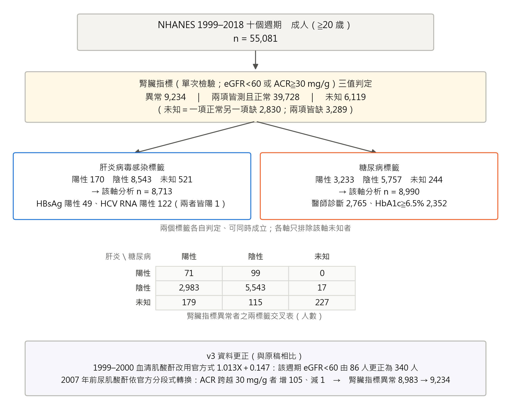
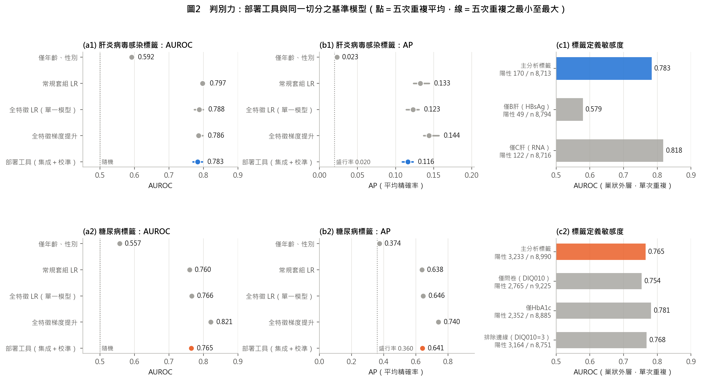
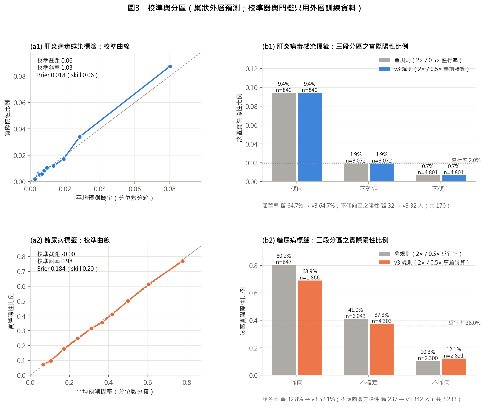
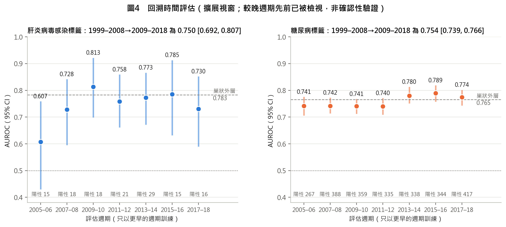
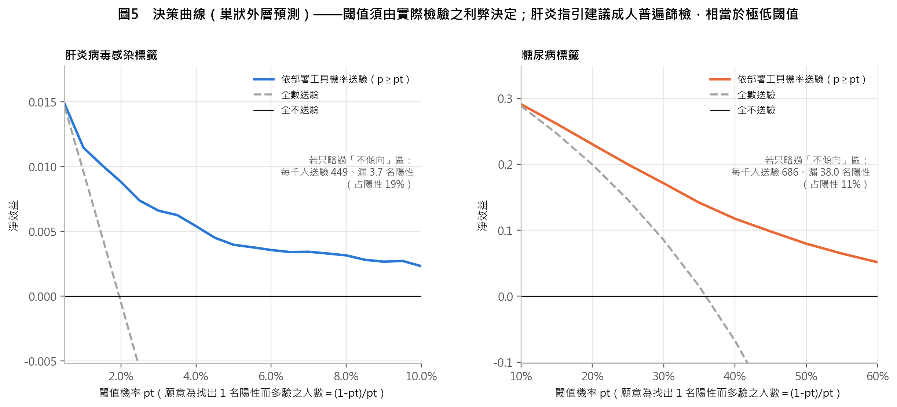
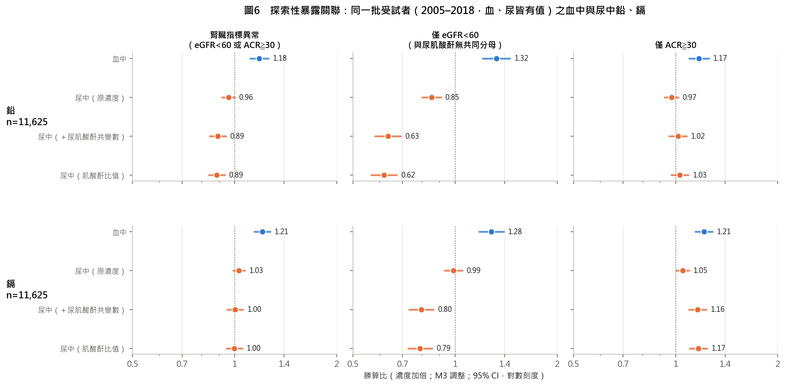
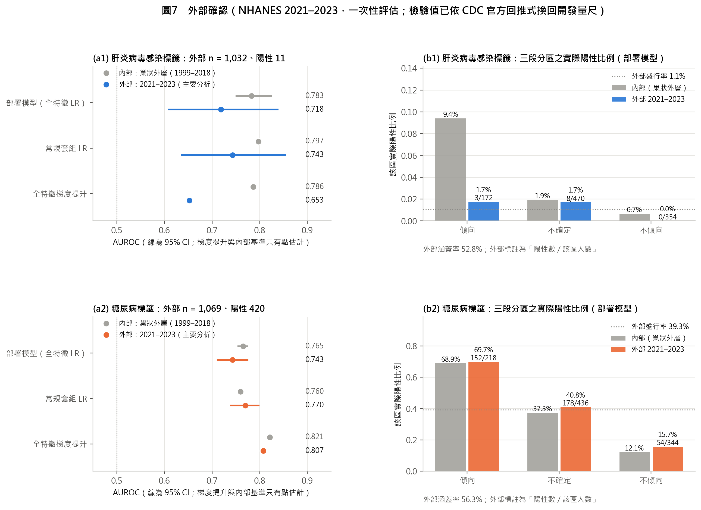
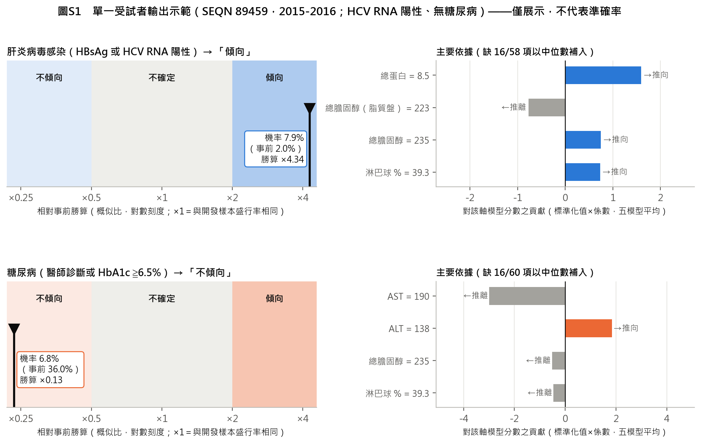

# 常規檢驗能否提供腎臟指標異常的病因線索？

## ——肝炎病毒感染與糖尿病兩個共存標籤：NHANES 1999–2018 重分析與 2021–2023 外部確認（v3）

作者　＿＿＿＿＿＿　　所屬單位　＿＿＿＿＿＿　　版本　v3（2026-09-27）

---

## 摘要

**背景與目的**　本研究的起點是一個臨床問題：腎臟指標異常時，能否只用已有的常規血液與尿液檢驗，指出病因的大概方向。公開健康調查沒有病理診斷，只能提供共存疾病標籤；共存疾病是候選病因，不等於病因。本研究評估兩個共存標籤（肝炎病毒感染、糖尿病）能被常規檢驗辨識到什麼程度，作為病因線索，並依 2026 年 9 月 26 日之外部方法學審查，以真實資料重建標籤與評估流程。

**方法**　NHANES 1999–2018 十個週期成人 55,081 人。更正 1999–2000 年血清肌酸酐校正式、依官方式轉換 2007 年前尿肌酸酐；腎臟指標與兩個標籤改採三值（陽性、陰性、未知），各軸排除未知者。部署模型為五折交叉配適邏輯迴歸集成加保序校準，以分層五折重複五次之巢狀外層評估（校準器與分區門檻只用外層訓練資料），並在同一切分比較人口學、常規套組與梯度提升模型；另做回溯時間評估、調查權重、標籤定義敏感度與決策曲線。分析計畫於執行前提交版本控制。外部確認以從未參與開發的 NHANES 2021–2023 一次評估；取用後、評估前發現檢驗儀器與方法變更，依 CDC 官方回推式把數值換回開發時的量尺，並於評估前提交此修正。

**結果**　腎臟指標異常 9,234 人（原稿 8,983 人），另有 6,119 人無法判定。肝炎標籤陽性 170 人、糖尿病標籤陽性 3,233 人。肝炎軸 AUROC 0.783（95% CI 0.751–0.824）、平均精確率（AP）0.116（盛行率 0.020），校準斜率 1.03；糖尿病軸 AUROC 0.765（0.755–0.774）、AP 0.641（盛行率 0.360），校準斜率 0.98。只用年齡與性別時為 0.592 與 0.557。以 1999–2008 年訓練、2009–2018 年評估，兩軸為 0.750 與 0.754。肝炎軸的訊號幾乎全來自 C 型肝炎：僅 C 肝標籤 AUROC 0.818，僅 B 肝標籤 0.579。糖尿病軸的梯度提升模型比邏輯迴歸高 0.056（95% CI 0.048–0.064）。在 2021–2023 年外部資料中，糖尿病軸 AUROC 0.743（0.712–0.774），只用常規套組的模型為 0.770、梯度提升為 0.807；肝炎軸只有 11 名陽性，AUROC 0.718（0.609–0.838），區間過寬而無法確認，且平均預測為實際的 2.4 倍。

**結論**　常規檢驗對 C 型肝炎相關的肝炎標籤與糖尿病標籤有中等且校準良好的辨識力，可作為病因線索；對 B 型肝炎幾乎沒有訊號。在未參與開發的新資料中，糖尿病軸大致維持判別力，只用常規套組的模型不輸全特徵模型；肝炎軸的外部事件太少，仍待確認，使用前須重新校準。辨識共存疾病不等於確定腎損傷病因，且在普遍篩檢的建議下，本工具不宜用來決定誰不必驗肝炎。

**關鍵詞**：NHANES；腎臟指標異常；病因線索；C 型肝炎；糖尿病；預測模型；校準；外部確認

---

## Abstract

**Background** We asked whether routine blood and urine tests can point toward the cause of abnormal kidney markers. Public survey data provide comorbidity labels, not etiology, so we evaluated how well routine tests identify two candidate-cause labels (hepatitis virus infection and diabetes) and rebuilt the analysis after an external methodological review.

**Methods** Adults in NHANES 1999–2018 (n = 55,081). We corrected the 1999–2000 serum creatinine calibration, harmonized pre-2007 urine creatinine, and used three-valued labels (positive, negative, unknown). The deployed model (cross-fitted logistic ensemble with isotonic calibration) was evaluated by nested 5-fold cross-validation repeated five times, with calibration and thresholds learned only in outer training folds, and compared on identical splits with demographic, routine-panel and gradient-boosting models. External confirmation used NHANES 2021–2023, evaluated once after a pre-evaluation amendment that applied the CDC's official backward equations for laboratory instrument and method changes.

**Results** Kidney-marker abnormality was present in 9,234 adults. The hepatitis axis had an AUROC of 0.783 (95% CI 0.751–0.824) and an average precision of 0.116 at a prevalence of 0.020; the diabetes axis had 0.765 (0.755–0.774) and 0.641 at 0.360. Calibration slopes were 1.03 and 0.98. Training on 1999–2008 and testing on 2009–2018 gave 0.750 and 0.754. The hepatitis signal came from hepatitis C (AUROC 0.818) rather than hepatitis B (0.579). In NHANES 2021–2023, the diabetes axis had an AUROC of 0.743 (0.712–0.774); a routine-panel model reached 0.770 and gradient boosting 0.807. The hepatitis axis had only 11 events (AUROC 0.718, 95% CI 0.609–0.838) and over-predicted risk by a factor of 2.4.

**Conclusions** Routine tests carry calibrated, moderate signal for hepatitis C–related and diabetes labels, usable as etiologic clues but not as diagnoses. New data supported the diabetes axis and favored the routine-panel model; the hepatitis axis remains unconfirmed and needs recalibration.

---

## 1　前言

腎臟病的病因評估需要整合病史、共存疾病、用藥、身體檢查、實驗室數據、影像，以及適當情境下的病理或基因檢查；單次 eGFR 下降或白蛋白尿升高，也不足以確認異常已持續三個月以上[1]。臨床上多數人每年都有抽血與驗尿，這些數值早已存在，卻很少被拿來回答「腎臟為什麼出問題」。本研究的核心問題正是這一點：**只用常規檢驗，能不能指出病因的大概方向？**

公開健康調查能回答的範圍有限。美國國家健康與營養調查（NHANES）沒有腎臟病理，只能提供共存疾病的操作型標籤，例如 B 型或 C 型肝炎病毒感染、糖尿病。這些疾病是腎損傷的候選病因，但標籤成立不代表腎損傷由它造成。因此本研究把問題界定為：**常規檢驗能否辨識這兩個候選病因的共存標籤**——辨識得出來，才有資格被稱為「病因線索」；要確認病因，仍需病理或臨床參考標準。

本研究前一版（v2）於 2026 年 9 月 26 日接受外部方法學審查。審查者沒有取得資料與程式，因此將標籤缺失、跨週期校正、校準流程、抽樣權重與時間驗證列為「待執行」。本版以原始資料執行這些重分析，並在過程中發現數項審查者無法看見的資料錯誤。研究目的為：

1. 依 NHANES 官方文件重建腎臟指標與兩個共存標籤，未知不再當作陰性；
2. 以校準與門檻完全留在訓練資料內的巢狀外層評估，報告兩軸工具的判別、校準與三段分區表現[2,3]；
3. 以同一切分比較簡單基準、檢驗時間外推、調查權重與標籤定義的影響；
4. 重新檢視上游暴露關聯，改在同一批受試者比較血中與尿中金屬；
5. 在取用任何新資料之前凍結外部確認的協定與模型，再以 NHANES 2021–2023 一次評估。

## 2　材料與方法

### 2.1　研究設計與資料來源

本研究為 NHANES 1999–2018 年十個週期的重複橫斷面次級資料分析，納入年齡至少 20 歲者。各週期為不同受試者，本設計不追蹤個人發病時序，故稱「分析樣本」而非世代。資料檔的來源網址與 SHA256 雜湊記錄於出處帳本，用於確認檔案未被更動；雜湊不能證明資料的單位、合併或標籤正確——本版發現的數項錯誤都能通過雜湊檢查。分析計畫（`params/v3_analysis_plan.json`，SHA256 前 16 碼 3ed9a3142c1321f5）在執行評估程式之前提交版本控制（提交 bf269c5）。1999–2018 年資料已於先前版本反覆檢視，本版重分析屬探索性修訂，不是確認性驗證。

### 2.2　腎臟指標與檢驗校正

腎臟指標異常定義為單次 eGFR < 60 mL/min/1.73 m² 或尿白蛋白／肌酸酐比（ACR）≧ 30 mg/g。eGFR 以 CKD-EPI 2021 無種族係數公式計算[4]。血清肌酸酐依官方文件校正：1999–2000 年為 1.013 × 原值 ＋ 0.147[5,6]，2005–2006 年為 −0.016 ＋ 0.978 × 原值[7]；2001–2004 年不需校正[5]。**前一版在 1999–2000 年誤用了 NHANES III（1988–1994）的公式 −0.184 ＋ 0.960 × 原值**，使該週期原值 1.0 mg/dL 被換算為 0.776 而非 1.160，eGFR 因此被高估。2007 年起尿肌酸酐改用酵素法，依官方分段式轉換 2007 年前之值[8]：原值 X < 75 mg/dL 時為 (1.02√X − 0.36)²，75–250 時為 (1.05√X − 0.74)²，≧ 250 時為 (1.01√X − 0.10)²。

腎臟結果採三值：任一已測指標達門檻為陽性；兩項皆有值且正常為陰性；一項正常而另一項缺失、或兩項皆缺失為未知。

### 2.3　共存標籤

**肝炎病毒感染標籤**：B 型肝炎表面抗原（HBsAg）陽性或 C 型肝炎病毒 RNA 陽性[9]。HBsAg 在各週期凡有肝炎血清結果者皆為陽性或陰性碼，缺值即未檢測。HCV RNA 依檢驗流程只在抗體陽性或不確定者檢測，故 RNA 缺值且抗體陰性者判為 HCV 陰性；2013 年起 RNA 變數以碼 3 表示「抗體篩檢陰性」[10]；抗體陽性或不確定而無 RNA 者為未知。**2003–2004 年的公開檔沒有 HCV RNA 變數**，該週期抗體陽性者只能判為未知——前一版將他們一律判為陰性。

**糖尿病標籤**：自述曾被醫師診斷糖尿病（問卷 DIQ010＝1，題目已排除妊娠期間）或 HbA1c ≧ 6.5%[11]。DIQ010＝2（否）或 3（邊緣）為問卷陰性，7（拒答）、9（不知道）或缺值為問卷未知；兩項組成任一陽性即陽性，兩項皆陰性才判陰性，其餘為未知。

兩個標籤各自判定、可同時成立，各軸只排除該軸未知者。

### 2.4　特徵

特徵為各週期共有的常規血液與尿液檢驗 62 項（含 ACR、eGFR、嗜中性球／淋巴球比、年齡、性別）。定義標籤的檢驗（HBsAg、HCV 抗體與 RNA、HbA1c、糖尿病問卷）一律不作特徵；前一版以變數字首封存，誤將血比容與同半胱胺酸一併排除，本版改為明列。各軸再移除生理上緊鄰標籤的「近端特徵」：肝炎軸移除 ALT、AST、GGT、總膽紅素（餘 58 項），糖尿病軸移除血糖與滲透壓（餘 60 項）。這些近端特徵在預測時合法可得，移除它們是更嚴格的消融，並不表示保留就是資料洩漏。

「常規套組」依可得性而非表現事先定義：全血球計數、標準生化、血脂、尿白蛋白與肌酸酐，加上衍生指標與年齡性別（肝炎軸 44 項、糖尿病軸 46 項）；鐵蛋白、葉酸、維生素 B12、同半胱胺酸、甲基丙二酸、維生素 D、副甲狀腺素、骨鹼性磷酸酶、可丁尼、血中金屬與 CRP 不屬常規套組。

### 2.5　部署模型與巢狀評估

部署模型為中位數插補、標準化與類別平衡權重邏輯迴歸，以五折交叉配適得到五個模型並平均其機率，再以保序迴歸校準；校準器只用訓練資料之內層折外分數配適。評估採分層五折、重複五次（隨機種子 20260926）：每一外層折都在外層訓練資料內重新完成插補、標準化、集成、校準與門檻計算，外層受試者只用於評估；每次重複中每人恰有一個外層預測。指標逐次重複計算後取平均並列出最小至最大；95% 信賴區間取第一次重複之受試者層重抽 1,000 次，不含重新配適的變異。

判別以 AUROC 與平均精確率（AP，scikit-learn `average_precision_score` 之不內插階梯和[12]）並列該軸盛行率；肝炎軸盛行率低，以 AP 為主要判別摘要。校準報告校準截距（以預測機率之 logit 為 offset）、校準斜率、Brier 分數與相對僅用盛行率之 Brier skill[13]。逐人外層預測存於 `results/v3_oof.csv.gz`，可重算所有指標。

### 2.6　三段分區

輸出分為「傾向」「不確定」「不傾向」。前一版規則為預測機率 ≧ 2 倍盛行率為傾向、≦ 0.5 倍為不傾向；此規則在盛行率超過 50% 時無法達成，且兩軸代表的證據強度不同。本版在看到結果之前改為**勝算倍數**：預測勝算 ≧ 事前勝算 2 倍為傾向、≦ 0.5 倍為不傾向，相當於概似比 2 與 0.5；低盛行率時與舊規則幾乎相同。兩規則皆報告六格表（實際陽性／陰性 × 三區）、涵蓋率與各區實際陽性率。常規套組有值不足一半者標示「資料不足」，不給分區；超出開發資料範圍的輸入值另行標示。

### 2.7　同切分比較、時間、權重與標籤敏感度

在與部署模型相同的外層切分上比較：僅截距、僅年齡性別、常規套組、全特徵邏輯迴歸（單一模型）與全特徵梯度提升（深度 3、學習率 0.08、300 回合、L2 1.0）。與全特徵邏輯迴歸之差以同一批受試者重抽估計配對信賴區間。近端特徵消融亦以同一切分比較。

時間外推以 1999–2008 年開發、2009–2018 年評估，並以擴展視窗逐週期評估（每週期只用更早週期訓練）；較晚週期先前已被檢視，屬回溯時間評估。調查權重以合併 20 年 MEC 權重（1999–2002 年四年權重 × 4/20，其後兩年權重 × 2/20）[14] 計算加權盛行率、平均預測、AUROC 與 AP。設計變異依抽樣設計的分層（SDMVSTRA，各週期編號互不重複）與 PSU（SDMVPSU）估計：以刪一 PSU 摺刀法建立複製權重[15]，複製權重依全樣本設計建立，分析範圍以指示變數處理；比例之 95% CI 採 NCHS 比例呈現標準之 Korn–Graubard 法[16]，其他指標為估計值 ± t × 標準誤，自由度為分析範圍內 PSU 數減層數；加權盛行率另以泰勒線性化核對。此計畫於計算前提交（9edd968）；預測視為固定，不含模型重新配適的變異。標籤定義敏感度分別以僅 HBsAg、僅 HCV RNA、僅糖尿病問卷、僅 HbA1c、排除邊緣回答重跑。

### 2.8　決策曲線與每千人情境

決策曲線以淨效益 NB ＝ TP/N − FP/N × pt/(1 − pt) 比較「依模型送驗」「全數送驗」「全不送驗」[17]。閾值機率 pt 應反映實際檢驗的利弊；肝炎檢驗便宜、無創，且美國建議成人至少篩檢一次 C 型肝炎[18] 與 B 型肝炎[9]，相當於極低的 pt。每千人情境直接取外層預測之分區結果，不再使用前一版的開發集作業點假設。

### 2.9　暴露關聯（探索性）

以全體成人（不對腎臟結果條件化）掃描 213 個暴露與三值腎臟結果之關聯。五層調整為 M0 未調整；M1 年齡、性別、種族；M2 再加 BMI 與吸菸；M3 再加糖尿病與高血壓；M4（僅藥物）再加總用藥數。多重比較的檢定家族定義為 M3 之 213 個雙尾 p 值，以 Benjamini–Hochberg 法控制偽發現率[19]；其他層級只作敏感度。0/1 藥物暴露報告「使用 vs 未使用」之勝算比（前一版誤將其標準化為每 SD），連續暴露為每 1 SD。

前一版比較血中與尿中金屬時，血中值只來自 1999–2004 年、尿中值只來自 2005–2018 年，兩者沒有任何共同受試者（合併時欄位撞名，2005 年後的血中值被忽略）。本版修正合併，並在同時有血、尿值的同一批受試者中，以相同 M3 調整、log2 量尺（勝算比為濃度加倍），比較血中、尿中原濃度、原濃度加尿肌酸酐共變數[20]、肌酸酐比值四種寫法，對三種結果定義：腎臟指標異常、僅 eGFR < 60（與尿肌酸酐無共同分母）、僅 ACR ≧ 30。

### 2.10　外部確認協定

NHANES 2021–2023 年（週期 L）於 2024 年釋出，從未參與本研究任何決策。本版在取用前凍結三個模型（部署之全特徵邏輯迴歸、常規套組邏輯迴歸、全特徵梯度提升）與評估規則，記錄其 SHA256 與 17 個待取用檔案（約 12.5 MB）；程式只允許評估一次，且不重新配適、不重新校準、不調整門檻（`params/external_validation_protocol.json`，提交 9ca4e9f）。

經使用者同意，17 個檔案於 2026 年 9 月 27 日取用，大小與凍結紀錄一致。取用後、計算任何預測之前，逐檔核對 CDC 文件發現：生化儀器由 Cobas 6000 換為 Cobas 8000[21]；尿白蛋白由螢光免疫法改為液相層析串聯質譜[22]；空腹三酸甘油酯改為非甘油空白法並更名[23]；維生素 D 亦更名。凍結時只核對了血清與尿肌酸酐（兩者官方皆不需轉換）。若照凍結程式原樣執行，兩個更名的特徵會整欄以中位數補入，尿白蛋白（因此 ACR 與腎臟標籤）與十餘項生化值也不在開發時的量尺上。

因此於評估前提交修正一（`params/external_validation_amendment_1.json`，提交 44b0ace）。規則是：凡 CDC 文件建議用於與 2017–2020 年比較的回推式，對模型或標籤用到的變數一律套用（15 項，補充表 S3）；儀器計算的滲透壓、Friedewald LDL 與 ACR 由調整後的組成重算；同一分析物更名者對應回原名；其餘不動。肌酸酐、尿肌酸酐、HbA1c、總膽固醇、HDL、全血球計數與肝炎血清學，CDC 皆判定不需調整；血中金屬的方法有變但未提供換算式，依凍結協定使用原值。模型、校準、門檻與指標皆不變。評估前的資料核對只含標籤計數與特徵分布（`results/external_2021_2023_precheck.json`），評估程式先在開發資料上測試可執行。依凍結程式原樣、不調和的結果列為事前指定的敏感度分析。

## 3　結果

### 3.1　資料更正與分析樣本

**圖1　分析樣本與三值標籤。** 兩個標籤在腎臟指標異常者中各自判定；底部為與原稿相比的資料更正。

依舊定義重建之計數與原稿完全一致（成人 55,081、可判定 51,792、腎臟異常 8,983、肝炎 169、糖尿病 3,183），確認比較基準正確。更正後：

**表1　資料更正前後的樣本與標籤**

| 項目 | 原稿（v2） | 本版（v3） | 說明 |
|---|---|---|---|
| 成人 | 55,081 | 55,081 | — |
| 腎臟結果可判定 | 51,792 | 48,962 | 一項正常另一項缺失之 2,830 人改列未知 |
| 腎臟指標異常 | 8,983 | 9,234 | 新增 252、移出 1 |
| 1999–2000 年 eGFR < 60 | 86 | 340 | 血清肌酸酐公式更正 |
| ACR 跨越 30 mg/g | — | 增 105、減 1 | 2007 年前尿肌酸酐轉換 |
| 肝炎標籤 陽／陰／未知 | 169／8,814／— | 170／8,543／521 | HBsAg 陽性 49、HCV RNA 陽性 122（兩者皆陽 1） |
| 糖尿病標籤 陽／陰／未知 | 3,183／5,800／— | 3,233／5,757／244 | 問卷陽性 2,765、HbA1c 陽性 2,352 |
| 兩標籤皆陽性 | 70（推算） | 71（實數） | — |

註：9,234 ／ 48,962 ＝ 18.86% 為未加權樣本比例，不是人口盛行率。逐週期計數見補充表 S1。

### 3.2　判別力與同切分基準

**圖2　判別力。** 點為五次重複平均，線為五次重複之最小至最大；(c) 為標籤定義敏感度。

**表2　兩軸判別力（巢狀外層評估）**

| 項目 | 肝炎病毒感染標籤 | 糖尿病標籤 |
|---|---|---|
| n（陽性；盛行率） | 8,713（170；2.0%） | 8,990（3,233；36.0%） |
| 部署工具 AUROC（95% CI） | **0.783**（0.751–0.824） | **0.765**（0.755–0.774） |
| 部署工具 AP（95% CI） | **0.116**（0.086–0.168） | **0.641**（0.624–0.660） |
| AP ÷ 盛行率 | 6.0 | 1.8 |
| 梯形 PR-AUC | 0.116 | 0.644 |
| 五次重複 AUROC 範圍 | 0.769–0.797 | 0.764–0.766 |
| 僅年齡、性別 AUROC／AP | 0.592／0.023 | 0.557／0.374 |
| 常規套組 LR AUROC／AP | 0.797／0.133 | 0.760／0.638 |
| 全特徵 LR（單一模型）AUROC／AP | 0.788／0.123 | 0.766／0.646 |
| 全特徵梯度提升 AUROC／AP | 0.786／0.144 | 0.821／0.740 |
| 常規套組 − 全特徵 LR：ΔAUROC（95% CI） | +0.004（−0.004 至 0.012） | −0.006（−0.009 至 −0.003） |
| 常規套組 − 全特徵 LR：ΔAP（95% CI） | +0.013（0.004–0.026） | −0.008（−0.012 至 −0.004） |
| 梯度提升 − 全特徵 LR：ΔAUROC（95% CI） | +0.009（−0.023 至 0.041） | +0.056（0.048–0.064） |
| 梯度提升 − 全特徵 LR：ΔAP（95% CI） | +0.018（−0.031 至 0.071） | +0.094（0.080–0.108） |

註：差值由未四捨五入之值計算，配對信賴區間為同一批受試者重抽，不含重新配適變異。

兩軸的判別力都主要來自檢驗而非人口學：只用年齡與性別時 AUROC 僅 0.592 與 0.557。肝炎軸以常規套組即可達到全特徵的判別力（ΔAUROC +0.004，95% CI −0.004 至 0.012），AP 甚至略高；梯度提升沒有優勢。糖尿病軸則相反：梯度提升明顯高於邏輯迴歸（ΔAUROC +0.056，0.048–0.064），顯示線性模型未能捕捉糖尿病訊號的非線性結構。前一版將糖尿病比較模型 0.816 與原型 0.763 並列，兩者同時更換了模型與分析人群；本版在同一樣本上顯示差距主要來自模型。

近端特徵消融（邏輯迴歸，同一切分）：肝炎軸移除ALT、AST、GGT、總膽紅素後，AUROC 由 0.841 降為 0.789（差 0.052，95% CI 0.033–0.072）；糖尿病軸移除血糖、滲透壓後，由 0.874 降為 0.766（差 0.108，0.099–0.117）。這些差值表示模型依賴被移除的資訊，不代表先前較高的分數是洩漏。

**標籤定義敏感度。** 僅以 HCV RNA 為標籤時（陽性 122 人）AUROC 0.818、AP 0.118；僅以 HBsAg 為標籤時（陽性 49 人）AUROC 0.579、AP 0.007，AP 與盛行率 0.56% 幾乎相同。**肝炎軸的訊號幾乎全部來自 C 型肝炎。** 糖尿病軸對標籤定義不敏感：僅問卷 0.754、僅 HbA1c 0.781、排除邊緣回答 0.768。

### 3.3　校準與三段分區

**圖3　校準與分區。** 校準曲線以分位數分箱；右欄比較兩種分區規則之各區實際陽性比例。

兩軸校準良好：肝炎軸校準截距 0.06、斜率 1.03、Brier 0.0180（skill 0.057）；糖尿病軸截距 0.00、斜率 0.98、Brier 0.1841（skill 0.201）。肝炎軸 Brier skill 很低，反映低盛行率下個別機率的區辨仍有限。

**表3　肝炎病毒感染標籤之六格表（勝算規則；第一次重複之外層預測）**

| 實際標籤 | 傾向 | 不確定 | 不傾向 |
|---|---|---|---|
| 陽性 | 79 | 59 | 32 |
| 陰性 | 761 | 3,013 | 4,769 |
| 該區實際陽性率 | 9.4% | 1.9% | 0.7% |

**表4　糖尿病標籤之六格表（勝算規則）**

| 實際標籤 | 傾向 | 不確定 | 不傾向 |
|---|---|---|---|
| 陽性 | 1,286 | 1,605 | 342 |
| 陰性 | 580 | 2,698 | 2,479 |
| 該區實際陽性率 | 68.9% | 37.3% | 12.1% |

肝炎軸兩規則幾乎相同（涵蓋率 64.7% 與 64.7%），落在「不傾向」區的陽性 32 人，占全部陽性 19%。糖尿病軸改用勝算規則後涵蓋率由 32.8% 升至 52.1%；代價是作答者特異度由 0.942 降至 0.810、落在不傾向區的陽性由 237 增至 342 人。常規套組有值不足一半而標示資料不足者，肝炎軸 31 人、糖尿病軸 238 人。以全體開發資料重新訓練之部署門檻：肝炎軸傾向 ≧ 3.83%、不傾向 ≦ 0.99%；糖尿病軸傾向 ≧ 52.9%、不傾向 ≦ 21.9%。

### 3.4　回溯時間評估與調查權重

**圖4　回溯時間評估。** 每一評估週期只用更早的週期訓練；虛線為巢狀外層評估值。

以 1999–2008 年開發、2009–2018 年評估，肝炎軸 AUROC 0.750（95% CI 0.692–0.807；n 4,471、陽性 99），AP 0.093；糖尿病軸 0.754（0.739–0.766），AP 0.641。兩軸都略低於巢狀外層估計。盛行率隨年代上升（肝炎 1.7% → 2.2%，糖尿病 33.0% → 38.8%），使較晚週期的平均預測偏低（校準截距 0.23 與 0.10）。擴展視窗中，肝炎軸逐週期 AUROC 由 0.607（2005-2006）到 0.813（2009-2010），單一週期陽性僅 15–29 人，區間很寬；糖尿病軸 0.740–0.789，相當穩定。

以 MEC 權重加權，並依抽樣設計估計變異（148 層、301 個 PSU，自由度 153）：肝炎軸加權盛行率 1.61%（95% CI 1.28%–1.99%；未加權 1.95%；設計效應 1.68），加權 AUROC 0.783（0.731–0.835），AP 0.101（0.062–0.140）；糖尿病軸加權盛行率 30.4%（29.0%–31.9%；未加權 36.0%；設計效應 2.19），加權 AUROC 0.786（0.775–0.798），AP 0.626（0.604–0.647）。糖尿病軸的加權平均預測高於加權盛行率 2.57 個百分點（95% CI 1.46 至 3.67），區間不含 0，顯示機率不能直接移植到抽樣組成不同的人群；肝炎軸的加權校準差為 0.05 個百分點（−0.29 至 0.39），區間包含 0。肝炎軸加權 AUROC 的設計區間（0.731–0.835）比未加權之受試者層重抽區間（0.751–0.824）寬，反映抽樣設計的叢集與權重不均。加權盛行率之摺刀法與泰勒線性化標準誤相差不到 0.03%。

### 3.5　決策曲線與每千人情境

**圖5　決策曲線。** 閾值機率須由實際檢驗之利弊決定。

肝炎軸在 pt ＝ 0.5% 時，依模型送驗與全數送驗的淨效益幾乎相同（0.5%：模型 0.0148、全數送驗 0.0146）；pt 為 1% 以上模型才較高（1.0%：模型 0.0115、全數送驗 0.0096）。由於肝炎血清檢驗便宜、無創，且指引建議成人普遍篩檢[9,18]，合理的 pt 很低，**本工具不宜用來決定誰可以不驗肝炎**。若只略過「不傾向」區，每千人送驗 449 人、漏掉 3.7 名陽性（占陽性 19%）。糖尿病軸在 pt ≧ 15% 起淨效益高於全數送驗（15.0%：模型 0.2613、全數送驗 0.2466）；若只略過不傾向區，每千人送驗 686 人、漏 38.0 名陽性（占 11%）。這些數字取自外層預測，不再使用前一版開發集作業點的假設換算。

### 3.6　暴露關聯（探索性）

更正後結果可判定之成人 48,962 人、腎臟指標異常 9,234 人。213 個暴露中 26 個於 M3 通過偽發現率 0.05；陽性對照命中 2/5（鈣調磷酸酶抑制劑、質子幫浦抑制劑），陰性對照 0/3；砷的毒性形式與砷貝他因皆未達顯著。前一版被判讀為「保護」的毒性砷，在更正結果變項後已不顯著。

**表5　偽發現率最低的 12 項暴露（M3）**

| 暴露 | OR（95% CI） | 量尺 | q 值 | n |
|---|---|---|---|---|
| 利尿劑 | 1.579（1.475–1.691） | 使用 vs 未使用 | 1.2e-36 | 48,225 |
| 胰島素 | 2.254（1.972–2.577） | 使用 vs 未使用 | 9.6e-31 | 48,225 |
| 別嘌醇 | 2.985（2.456–3.626） | 使用 vs 未使用 | 2.6e-26 | 48,225 |
| 血鎘 | 1.154（1.123–1.185） | 每 1 SD | 5.4e-23 | 42,740 |
| 血鉛 | 1.137（1.108–1.165） | 每 1 SD | 5.9e-22 | 42,740 |
| ACEI／ARB | 1.283（1.206–1.365） | 使用 vs 未使用 | 1.4e-13 | 48,225 |
| 雙胍類 | 0.709（0.642–0.783） | 使用 vs 未使用 | 3.1e-10 | 48,225 |
| 尿鉈（肌酸酐比值） | 0.814（0.762–0.869） | 每 1 SD | 2.4e-08 | 11,708 |
| 尿銫（肌酸酐比值） | 0.813（0.758–0.871） | 每 1 SD | 1.2e-07 | 11,707 |
| 尿鉈 | 0.833（0.778–0.892） | 每 1 SD | 4.1e-06 | 11,708 |
| 鈣調磷酸酶抑制劑 | 2.814（1.875–4.222） | 使用 vs 未使用 | 1.1e-05 | 48,225 |
| 血清 PFHxS | 0.851（0.798–0.907） | 每 1 SD | 1.1e-05 | 12,825 |

藥物關聯與處方常規一致：用於腎病或其共病的藥（利尿劑、胰島素、別嘌醇、ACEI／ARB）與腎臟異常正相關，腎功能差時應停用的雙胍類呈負相關（OR 0.709）；教科書腎毒物 NSAID 不顯著（OR 0.915，q ＝ 0.39）。這些方向可由適應症混雜與反向因果解釋，不能作為藥物致病或護腎的證據。

**圖6　同一批受試者之血中與尿中鉛、鎘。** 勝算比為濃度加倍，M3 調整。

**表6　同一批受試者（n ＝ 11,625）之血中與尿中金屬（OR 為濃度加倍，95% CI）**

| 金屬／量測 | 腎臟指標異常 | 僅 eGFR < 60 | 僅 ACR ≧ 30 |
|---|---|---|---|
| 鉛：血中 | 1.18（1.11–1.26） | 1.32（1.21–1.45） | 1.17（1.10–1.25） |
| 鉛：尿中原濃度 | 0.96（0.92–1.00） | 0.85（0.80–0.91） | 0.97（0.93–1.02） |
| 鉛：尿中＋尿肌酸酐共變數 | 0.89（0.84–0.94） | 0.63（0.58–0.69） | 1.02（0.96–1.08） |
| 鉛：尿中肌酸酐比值 | 0.89（0.84–0.94） | 0.62（0.57–0.67） | 1.03（0.97–1.09） |
| 鎘：血中 | 1.21（1.14–1.27） | 1.28（1.18–1.39） | 1.21（1.14–1.29） |
| 鎘：尿中原濃度 | 1.03（0.99–1.07） | 0.99（0.93–1.05） | 1.05（1.00–1.10） |
| 鎘：尿中＋尿肌酸酐共變數 | 1.00（0.95–1.06） | 0.80（0.73–0.86） | 1.16（1.10–1.23） |
| 鎘：尿中肌酸酐比值 | 1.00（0.95–1.05） | 0.79（0.73–0.86） | 1.17（1.10–1.24） |

註：低於檢出極限比例，血鉛 0.13%、尿鉛 1.7%、血鎘 7.7%、尿鎘 6.0%；NHANES 以檢出極限除以 √2 填補，本表未另作處理。

在同一批人中，血鉛與血鎘對三種結果定義都呈正相關；尿中金屬的方向則取決於結果定義與寫法。對與尿肌酸酐無共同分母的 eGFR < 60，尿鉛原濃度即呈負相關（0.85（0.80–0.91）），加入尿肌酸酐後更明顯——與「腎絲球過濾下降使尿中排出減少」相符。對 ACR ≧ 30，肌酸酐比值寫法的尿鎘明顯高於原濃度（1.17（1.10–1.24） vs 1.05（1.00–1.10）），部分來自與 ACR 共用的尿肌酸酐分母。這些模式支持排泄與分母機制值得檢查，但單次橫斷面資料不能排除真實暴露效應、殘餘混雜或測量誤差，也不能把 26 個關聯一律歸為反向因果。

### 3.7　外部確認（NHANES 2021–2023）

**圖7　外部確認。** (a) 內部（巢狀外層）與外部 AUROC；(b) 部署模型三段分區之實際陽性比例，外部標註陽性數／該區人數。

2021–2023 年成人中，腎臟指標異常 1,111 人（依凍結程式原樣為 1,055 人，差異來自尿白蛋白回推），無法判定 2,327 人。肝炎軸可判定 1,032 人、陽性 11 人（HBsAg 陽性 6、HCV RNA 陽性 5）；糖尿病軸可判定 1,069 人、陽性 420 人。

**表7　外部確認結果（主要分析：修正一調和後）**

| 項目 | 肝炎病毒感染標籤 | 糖尿病標籤 |
|---|---|---|
| n（陽性；盛行率） | 1,032（11；1.07%） | 1,069（420；39.3%） |
| 部署模型 AUROC（95% CI） | **0.718**（0.609–0.838） | **0.743**（0.712–0.774） |
| 內部參考 AUROC（巢狀外層） | 0.783 | 0.765 |
| 部署模型 AP（95% CI） | 0.025（0.010–0.078） | 0.650（0.601–0.699） |
| AP ÷ 盛行率 | 2.4 | 1.7 |
| 校準截距／斜率 | −0.94／0.60 | 0.25／0.82 |
| 平均預測／實際陽性比例 | 2.57%／1.07% | 34.7%／39.3% |
| Brier（skill） | 0.0118（−0.123） | 0.1983（0.169） |
| 涵蓋率（勝算規則；舊規則） | 52.8%；52.1% | 56.3%；35.5% |
| 各區實際陽性率：傾向／不確定／不傾向 | 1.7%／1.7%／0.0% | 69.7%／40.8%／15.7% |
| 資料不足 | 36 | 71 |
| 常規套組 LR AUROC（95% CI） | 0.743（0.637–0.853） | 0.770（0.740–0.798） |
| 常規套組 − 部署：ΔAUROC（配對 95% CI） | +0.025（−0.013 至 0.064） | +0.027（0.003–0.052） |
| 常規套組 LR 校準截距／斜率 | −0.79／0.64 | −0.12／1.18 |
| 全特徵梯度提升 AUROC／AP | 0.653／0.016 | 0.807／0.735 |
| MEC 加權盛行率（Korn–Graubard 95% CI） | 1.43%（0.56%–2.97%） | 38.2%（35.0%–41.4%） |
| MEC 加權 AUROC（設計 95% CI） | 0.787（0.618–0.955） | 0.767（0.736–0.798） |
| MEC 加權校準差，百分點（設計 95% CI） | 1.19（−0.16 至 2.55） | −3.66（−6.56 至 −0.77） |
| 敏感度：依凍結程式原樣 AUROC（95% CI） | 0.729（0.625–0.830） | 0.764（0.732–0.792） |
| 敏感度：依凍結程式原樣 校準截距／斜率 | −0.76／0.59 | −0.49／1.09 |

註：梯度提升依協定只評判別；差值由未四捨五入之值計算，配對信賴區間為同一批受試者重抽 1,000 次。加權指標之信賴區間依 2021–2023 年抽樣設計（15 層、30 個 PSU，自由度 15）以刪一 PSU 摺刀法估計，於一次性評估之後補算，預測與評估時相同。

**糖尿病軸**　部署模型 AUROC 0.743（0.712–0.774），略低於內部估計 0.765，但內部估計仍在外部區間內；各區實際陽性率（69.7%／40.8%／15.7%）與內部相近，涵蓋率 56.3%。平均預測 34.7% 低於實際 39.3%（校準截距 0.25、斜率 0.82），與回溯時間評估中盛行率上升造成的低估方向一致（3.4）。常規套組模型 AUROC 0.770，比部署模型高 0.027（配對 95% CI 0.003–0.052）；梯度提升 0.807，非線性的優勢在新資料上仍然存在。

**肝炎軸**　陽性只有 11 人，遠低於外部驗證建議的至少 100 個事件[24]；AUROC 0.718 的 95% CI 為 0.609–0.838，既不能確認也不能否定內部估計 0.783。平均預測 2.57% 是實際 1.07% 的 2.4 倍（校準截距 −0.94、斜率 0.60），Brier skill 為負值（−0.123），未經重新校準的機率不應使用。陽性組成也改變了：HCV RNA 陽性占肝炎軸可判定者的比例，開發資料為 1.40%，2021–2023 年只有 0.48%；HBsAg 陽性則為 0.56% 與 0.58%。本工具的訊號幾乎全部來自 C 型肝炎（3.2），陽性組成偏向 B 型肝炎會直接壓低判別力。不傾向區 354 人中沒有陽性，但以 11 個事件無法據此推論漏失率。

**敏感度與事後探索**　依凍結程式原樣、不調和時，糖尿病軸 AUROC 0.764（0.732–0.792），校準截距 −0.49、斜率 1.09；肝炎軸 0.729（0.625–0.830）。兩版的腎臟標籤與樣本不同（1,055 與 1,111 人），判別差異不大，但糖尿病軸的校準方向相反（原樣高估、調和後低估），顯示量尺調和主要影響機率的絕對值。以下為一次評估之後才進行的事後探索，不取代主要結果：部署模型含六項在開發資料中只有 1999–2004 年有值的非常規特徵（血鉛、血鎘、血汞、可丁尼、鐵蛋白、維生素 D），2021–2023 年腎臟指標異常者的中位數分別為開發時的 0.41、0.70、0.56、0.33、0.54、1.57 倍。把這六項改為缺值（即開發資料中 2005–2018 年受試者的處理方式）後，糖尿病軸 AUROC 由 0.743 升為 0.769（差 +0.025，95% CI 0.002–0.051），與常規套組模型相當；肝炎軸由 0.718 升為 0.742（差 +0.024，95% CI −0.022 至 0.070）。這支持一個解釋：開發資料中覆蓋不全、又隨年代大幅變動的特徵，在新資料上會拖累判別。

## 4　討論

### 4.1　主要發現

常規檢驗能辨識兩個候選病因的共存標籤，程度中等且校準良好：肝炎軸 AUROC 0.783、AP 為盛行率的 6.0 倍；糖尿病軸 AUROC 0.765。三項結果改變了對這個工具的理解。第一，肝炎軸實際上是 C 型肝炎軸：B 型肝炎表面抗原陽性者幾乎無法由常規檢驗辨識（AUROC 0.579），可能因多數慢性 B 型肝炎帶原者肝功能與血液檢驗接近正常（單變量掃描 51 個標記僅 1 個通過偽發現率校正）。C 型肝炎標籤者的型態則一致：球蛋白較高（單變量 AUROC 0.771）、白蛋白較低（0.349）、血小板與總膽固醇較低（0.368、0.376），與慢性病毒性肝炎之血脂研究方向一致[25]；可丁尼亦較高（0.716，僅 26 名陽性有值），提示部分訊號來自與感染風險相關的吸菸暴露，而不只是肝臟生理。第二，糖尿病軸的線性模型不足，梯度提升的優勢在同一樣本上重現，下一版應考慮非線性模型或加入交互項。第三，精簡為常規套組並未降低肝炎軸判別力，對實際使用有利；在外部資料上，常規套組模型兩軸皆不低於部署模型，糖尿病軸更高（3.7）。

外部確認的結果分成兩半。糖尿病軸在從未參與開發的 2021–2023 年資料上維持中等判別力，三段分區的實際陽性率也與內部相近，可視為初步確認。肝炎軸則因事件太少而無法確認，機率明顯高估，陽性組成也由以 C 型肝炎為主轉為 B、C 型各半；在以 C 型肝炎訊號為主的工具上，這個轉變本身就會降低判別力。

### 4.2　與前一版的差異

本版修正了三類審查者無法看見的錯誤：1999–2000 年血清肌酸酐公式錯用、2003–2004 年缺 HCV RNA 卻判陰性、暴露分析中血中金屬欄位撞名。這三項都能通過 SHA256 檢查，說明出處帳本只保證檔案未被更動，不保證分析正確——這正是審查意見的重點。修正後兩軸判別力與前一版相近（前一版原型 0.788／0.763，本版 0.783／0.765），但分區統計改由巢狀外層預測計算，校準器不再與評估共用同一批資料。前一版的「血尿方向相反＝反向因果直接證據」建立在沒有共同受試者的比較上，本版已撤回，改以同一批人的分析取代。

### 4.3　作為病因線索的意義與界線

本研究的核心問題是「找原因」。現有資料能支持的結論是：當常規檢驗呈現與 C 型肝炎或糖尿病相符的型態時，這組數值提供了「值得優先查證這兩個候選病因」的線索，而且這個線索附有可追溯的依據（推動因子）與經校準的機率。它不能回答腎損傷是否由該病造成；免疫性病因在 NHANES 缺乏補體、自體抗體與病理，仍無法評估[26]。在臨床行動上，肝炎檢驗應依普遍篩檢建議進行，本工具的角色是解釋與排序，而不是省略檢驗。

### 4.4　研究限制

1. 標籤為共存疾病的操作型定義，不是腎臟病理；單次檢驗不確認慢性性[1]。
2. 1999–2018 年資料已在前一版反覆使用，本版為探索性重分析；保留集曾被評估兩次，本版不再宣稱一次性確認集（詳見版本紀錄）。確認性證據改由 2021–2023 年外部資料提供（3.7）。
3. 肝炎陽性僅 170 人，逐週期評估的區間很寬；穩定性取決於事件數與候選參數，而非總樣本數[27]。外部確認只有 11 個事件，肝炎軸的外部表現仍未確認。
4. 設計變異已依 PSU 與分層估計，但預測視為固定，不含模型重新配適的變異；2021–2023 年依協定使用 MEC 權重，未使用 NCHS 為抽血項目另設的抽血權重。美國調查的機率不能直接移植至臺灣就醫族群。
5. 預測特徵中的血中金屬只來自 1999–2004 年檢驗檔，2015 年後的高敏感度 CRP 未與舊 CRP 合併，這些特徵在其他週期以中位數補入；事後探索顯示這類特徵在新資料上會拖累判別（3.7）。另外，開發時 HDL 膽固醇因肝炎 D 抗體的變數字首規則被一併排除於特徵之外，屬過度排除、不造成洩漏，將於下一版修正。
6. 暴露分析為單次橫斷面，無法建立時序。
7. 外部資料的檢驗儀器與方法已變更，本研究於評估前以 CDC 官方回推式調和；回推式本身有估計誤差，且血中金屬與可丁尼沒有官方換算式。

### 4.5　下一步

1. **部署改用常規套組模型並重新校準**：外部資料顯示常規套組模型兩軸皆不低於全特徵模型，肝炎軸在新資料上高估約 2.4 倍。已於 2026-09-27 完成（網頁工具 v3.1，`params/direction_model_v3_1.json`）：依由簡到繁的更新原則[28]，肝炎軸只有 11 個事件，只更新截距（−0.787）；糖尿病軸之斜率檢定 p ＝ 0.038，更新截距與斜率（−0.074、1.185）。事前機率改為 2021–2023 年之比例（肝炎 1.07%、糖尿病 39.3%），分區門檻依同一勝算規則重算。這批資料已用於更新，更新後的校準仍需另一批獨立資料驗證。
2. **糖尿病軸改用非線性模型**：梯度提升在外部資料上仍達 0.807；下一步評估其校準，並限制於常規套組特徵。
3. **肝炎軸的外部確認**：需要更多事件（例如合併之後的 NHANES 週期或醫院資料），並分開呈現 B 型與 C 型肝炎。
4. **病因研究**：取得具病理或臨床參考標準、診斷前檢驗與免疫檢驗之醫院資料，並處理只接受切片者的選擇偏差[26]。

## 5　結論

常規血液與尿液檢驗對腎臟指標異常成人中的 C 型肝炎相關肝炎標籤與糖尿病標籤，具有中等且校準良好的辨識力，可作為病因線索；對 B 型肝炎幾乎沒有訊號。在未參與開發的 2021–2023 年資料中，糖尿病軸維持中等判別力，只用常規套組的模型不輸全特徵模型；肝炎軸外部事件太少而無法確認，機率也須重新校準。這不等於病因診斷，也不支持用來省略肝炎篩檢。資料層級的錯誤已依官方文件更正，所有結果由同版結果檔生成。

---

## 研究聲明

**資料與程式可得性**　資料為 NHANES 公開檔，來源網址見 `params/manifest.json`，逐檔 SHA256 與位元組數見 `results/provenance.json`。程式與結果位於 https://github.com/CBL-AICM/MD.Piece （分支 claude/disease-trajectory-model-prompts-ad24d8，目錄 experiments/kidney_cause）：分析計畫 bf269c5、結果 d5140a9、外部確認協定 9ca4e9f、圖 397c204、外部確認修正一 44b0ace、外部確認結果 a7c4af8、設計變異計畫 9edd968 與結果 e7d16e4。執行環境見 `requirements-lock.txt`（Python 3.14.3、scikit-learn 1.8.0、pandas 3.0.1、NumPy 2.4.3）。重現入口：`audit_v3.py` → `evaluate_v3.py` → `markers_v3.py` → `run_exwas.py` → `exwas_v3_checks.py` → `make_figures_v3.py` → `build_paper_v3.py`；外部確認為 `external_validation_2021.py`（`--precheck` → `--amend` → `--evaluate`，只允許評估一次），事後探索為 `external_posthoc_2021.py`；網頁工具 v3.1 之重新校準為 `recalibrate_v3_1.py`，網頁與 Python 之一致性以 `verify_direction_html.py` 檢查；設計變異為 `design_variance.py`。

**研究倫理**　本研究使用公開去識別化資料；次級分析之倫理審查或免審認定，須由作者依所屬機構規定補列，本文不預先宣稱。

**作者貢獻、資助與利益衝突**　須由作者確認後填列。

---

## 參考文獻

依首次引用順序編號；網路資料查閱日期 2026-09-26／27。

1. KDIGO CKD Work Group. KDIGO 2024 Clinical Practice Guideline for the Evaluation and Management of Chronic Kidney Disease. Kidney Int. 2024;105(4S):S117–S314. https://kdigo.org/wp-content/uploads/2024/03/KDIGO-2024-CKD-Guideline.pdf
2. Collins GS, et al. TRIPOD+AI statement: updated guidance for reporting clinical prediction models that use regression or machine learning methods. BMJ. 2024;385:e078378. https://doi.org/10.1136/bmj-2023-078378
3. Moons KGM, et al. PROBAST+AI: an updated quality, risk of bias, and applicability assessment tool for prediction models using regression or artificial intelligence methods. BMJ. 2025;388:e082505. https://doi.org/10.1136/bmj-2024-082505
4. National Kidney Foundation. CKD-EPI Creatinine Equation (2021). https://www.kidney.org/ckd-epi-creatinine-equation-2021
5. Selvin E, Manzi J, Stevens LA, et al. Calibration of serum creatinine in the National Health and Nutrition Examination Surveys (NHANES) 1988–1994, 1999–2004. Am J Kidney Dis. 2007;50(6):918–926. https://doi.org/10.1053/j.ajkd.2007.08.020
6. NCHS. NHANES 1999–2000 Standard Biochemistry Profile (LAB18): serum creatinine correction. https://wwwn.cdc.gov/Nchs/Data/Nhanes/Public/1999/DataFiles/LAB18.htm
7. NCHS. NHANES 2005–2006 Standard Biochemistry Profile (BIOPRO_D): serum creatinine correction. https://wwwn.cdc.gov/Nchs/Data/Nhanes/Public/2005/DataFiles/BIOPRO_D.htm
8. NCHS. NHANES 2007–2008 Albumin & Creatinine – Urine (ALB_CR_E): urine creatinine method change. https://wwwn.cdc.gov/Nchs/Data/Nhanes/Public/2007/DataFiles/ALB_CR_E.htm
9. Conners EE, Panagiotakopoulos L, Hofmeister MG, et al. Screening and Testing for Hepatitis B Virus Infection: CDC Recommendations — United States, 2023. MMWR Recomm Rep. 2023;72(1):1–25. https://doi.org/10.15585/mmwr.rr7201a1
10. NCHS. NHANES 2013–2014 Hepatitis C (HEPC_H). https://wwwn.cdc.gov/Nchs/Data/Nhanes/Public/2013/DataFiles/HEPC_H.htm
11. National Institute of Diabetes and Digestive and Kidney Diseases. The A1C Test & Diabetes. https://www.niddk.nih.gov/health-information/diagnostic-tests/a1c-test
12. scikit-learn. sklearn.metrics.average_precision_score. https://scikit-learn.org/stable/modules/generated/sklearn.metrics.average_precision_score.html
13. Van Calster B, McLernon DJ, van Smeden M, Wynants L, Steyerberg EW. Calibration: the Achilles heel of predictive analytics. BMC Med. 2019;17(1):230. https://doi.org/10.1186/s12916-019-1466-7
14. NCHS. NHANES Tutorials: Weighting Module. https://wwwn.cdc.gov/nchs/nhanes/tutorials/weighting.aspx
15. Rust KF, Rao JNK. Variance estimation for complex surveys using replication techniques. Stat Methods Med Res. 1996;5(3):283–310. https://doi.org/10.1177/096228029600500305
16. Parker JD, Talih M, Malec DJ, et al. National Center for Health Statistics Data Presentation Standards for Proportions. Vital Health Stat 2. 2017;(175):1–22. PMID: 30248016
17. Vickers AJ, Elkin EB. Decision curve analysis: a novel method for evaluating prediction models. Med Decis Making. 2006;26(6):565–574. https://doi.org/10.1177/0272989X06295361
18. Schillie S, Wester C, Osborne M, Wesolowski L, Ryerson AB. CDC Recommendations for Hepatitis C Screening Among Adults — United States, 2020. MMWR Recomm Rep. 2020;69(2):1–17. https://doi.org/10.15585/mmwr.rr6902a1
19. Benjamini Y, Hochberg Y. Controlling the false discovery rate: a practical and powerful approach to multiple testing. J R Stat Soc Series B. 1995;57(1):289–300. https://doi.org/10.1111/j.2517-6161.1995.tb02031.x
20. Barr DB, Wilder LC, Caudill SP, et al. Urinary creatinine concentrations in the U.S. population: implications for urinary biologic monitoring measurements. Environ Health Perspect. 2005;113(2):192–200. https://doi.org/10.1289/ehp.7337
21. NCHS. NHANES August 2021–August 2023 Standard Biochemistry Profile (BIOPRO_L): regression equations for the Cobas 6000 to Cobas 8000 change. https://wwwn.cdc.gov/Nchs/Data/Nhanes/Public/2021/DataFiles/BIOPRO_L.htm
22. NCHS. NHANES August 2021–August 2023 Albumin & Creatinine – Urine (ALB_CR_L): urine albumin method change. https://wwwn.cdc.gov/Nchs/Data/Nhanes/Public/2021/DataFiles/ALB_CR_L.htm
23. NCHS. NHANES August 2021–August 2023 Cholesterol – LDL & Triglycerides (TRIGLY_L): triglyceride method change. https://wwwn.cdc.gov/Nchs/Data/Nhanes/Public/2021/DataFiles/TRIGLY_L.htm
24. Collins GS, Ogundimu EO, Altman DG. Sample size considerations for the external validation of a multivariable prognostic model: a resampling study. Stat Med. 2016;35(2):214–226. https://doi.org/10.1002/sim.6787
25. Bashir A, et al. Lipid abnormalities in chronic viral hepatitis: associations and machine learning-enhanced prediction. BMC Gastroenterol. 2026;26:365. https://doi.org/10.1186/s12876-026-04861-y
26. Yang P, et al. Machine learning models predicts risk of proliferative lupus nephritis. Front Immunol. 2024;15:1413569. https://doi.org/10.3389/fimmu.2024.1413569
27. Riley RD, et al. Calculating the sample size required for developing a clinical prediction model. BMJ. 2020;368:m441. https://doi.org/10.1136/bmj.m441
28. Vergouwe Y, Nieboer D, Oostenbrink R, et al. A closed testing procedure to select an appropriate method for updating prediction models. Stat Med. 2017;36(28):4529–4539. https://doi.org/10.1002/sim.7179

---

## 補充資料

### 表 S1　逐週期三值計數（腎臟為全體成人；兩標籤為腎臟指標異常者）

| 週期 | 成人 | 腎臟 陽／陰／未知 | 肝炎 陽／陰／未知 | 糖尿病 陽／陰／未知 | 備註 |
|---|---|---|---|---|---|
| 1999-2000 | 4,880 | 827／3,304／749 | 7／759／61 | 249／556／22 |  |
| 2001-2002 | 5,411 | 900／3,792／719 | 25／836／39 | 262／617／21 |  |
| 2003-2004 | 5,041 | 878／3,555／608 | 6／818／54 | 274／584／20 | 無 HCV RNA 變數：HCV 抗體陽性者只能判未知 |
| 2005-2006 | 4,979 | 846／3,610／523 | 15／791／40 | 267／551／28 |  |
| 2007-2008 | 5,935 | 1,049／4,253／633 | 18／967／64 | 388／621／40 |  |
| 2009-2010 | 6,218 | 945／4,738／535 | 18／884／43 | 359／569／17 |  |
| 2011-2012 | 5,560 | 918／3,990／652 | 21／849／48 | 335／556／27 |  |
| 2013-2014 | 5,769 | 954／4,356／459 | 29／884／41 | 338／594／22 | HCV RNA 碼 3＝抗體篩檢陰性 |
| 2015-2016 | 5,719 | 915／4,225／579 | 15／827／73 | 344／544／27 | HCV RNA 碼 3＝抗體篩檢陰性 |
| 2017-2018 | 5,569 | 1,002／3,905／662 | 16／928／58 | 417／565／20 | HCV RNA 碼 3＝抗體篩檢陰性 |

### 表 S2　凍結之外部確認模型

| 模型 | 檔案 | SHA256（前 16 碼） |
|---|---|---|
| v3_full_LR（部署） | `params/direction_model.json` | e840be9f9afdd928 |
| v3_basic_LR（常規套組候選） | `params/direction_model_basic.json` | 9d8807dd5e1ecd33 |
| v3_full_HGB（比較，僅判別） | `models/v3_hgb.pkl` | 7e13e6e8575dcdd1 |

### 表 S3　外部確認修正一之官方回推式（2021–2023 年數值換回 2017–2020 年量尺）

| 變數 | 檢驗 | 回推式（舊＝） | 來源 |
|---|---|---|---|
| LBXSAPSI | 鹼性磷酸酶 | 0.6098 ＋ 0.9041 × 新值 | BIOPRO_L |
| LBXSATSI | ALT | −1.529 ＋ 1.035 × 新值 | BIOPRO_L |
| LBXSBU | 尿素氮 BUN | 0.09386 ＋ 1.021 × 新值 | BIOPRO_L |
| LBXSC3SI | 碳酸氫根 | 1.37 ＋ 1.022 × 新值 | BIOPRO_L |
| LBXSCLSI | 氯 | 9.137 ＋ 0.919 × 新值 | BIOPRO_L |
| LBXSGL | 血清葡萄糖（隨機） | −0.7821 ＋ 0.9669 × 新值 | BIOPRO_L |
| LBXSGTSI | GGT | 0.9735 ＋ 0.9444 × 新值 | BIOPRO_L |
| LBXSIR | 鐵 | −1.679 ＋ 0.9918 × 新值 | BIOPRO_L |
| LBXSKSI | 鉀 | 0.2108 ＋ 0.923 × 新值 | BIOPRO_L |
| LBXSLDSI | LDH | 2.46 ＋ 0.979 × 新值 | BIOPRO_L |
| LBXSNASI | 鈉 | 41.95 ＋ 0.6983 × 新值 | BIOPRO_L |
| LBXSTB | 總膽紅素 | 0.01793 ＋ 1.012 × 新值 | BIOPRO_L |
| LBXSTR | 三酸甘油酯 | −0.8463 ＋ 0.9879 × 新值 | BIOPRO_L |
| LBXTR | 三酸甘油酯（空腹） | −12.19 ＋ 0.9785 × 新值 | TRIGLY_L |
| URXUMA | 尿白蛋白 | −1.643 ＋ 1.189 × 新值 | ALB_CR_L |

註：另將 LBXTLG 對應為 LBXTR、LBXVIDMS 對應為 LBDVIDMS；滲透壓、Friedewald LDL 與 ACR 由調整後組成重算；回推值小於 0 者設為 0。修正一於評估前提交（44b0ace），檔案 SHA256 前 16 碼 3ed682c661f82981。

### 圖 S1　單一受試者輸出示範

**圖 S1　單一受試者輸出示範。** 僅展示工具的輸出形式；單例不代表準確率。推動因子為標準化值乘係數，共線特徵（如兩種總膽固醇）的貢獻可互相抵銷，不能逐項解讀為致病因子。

### 可重算之結果檔

`results/v3_audit.json`（稽核）、`results/v3_eval.json`（評估）、`results/v3_markers.json`（單變量標記）、`results/v3_oof.csv.gz`（逐人外層預測）、`results/exwas_v3.json`、`results/exwas_v3_checks.json`、`params/external_validation_amendment_1.json`（外部確認修正一）、`results/external_2021_2023_precheck.json`（評估前資料核對）、`results/external_2021_2023.json`（外部確認）、`results/external_2021_2023_posthoc.json`（事後探索）、`params/direction_model_v3_1.json` 與 `results/direction_v3_1_recalibration.json`（網頁工具 v3.1 及其更新校準之表面值）、`params/design_variance_plan.json` 與 `results/design_variance.json`（設計變異）、`docs/VERSION_LOG.md`（版本紀錄）。
