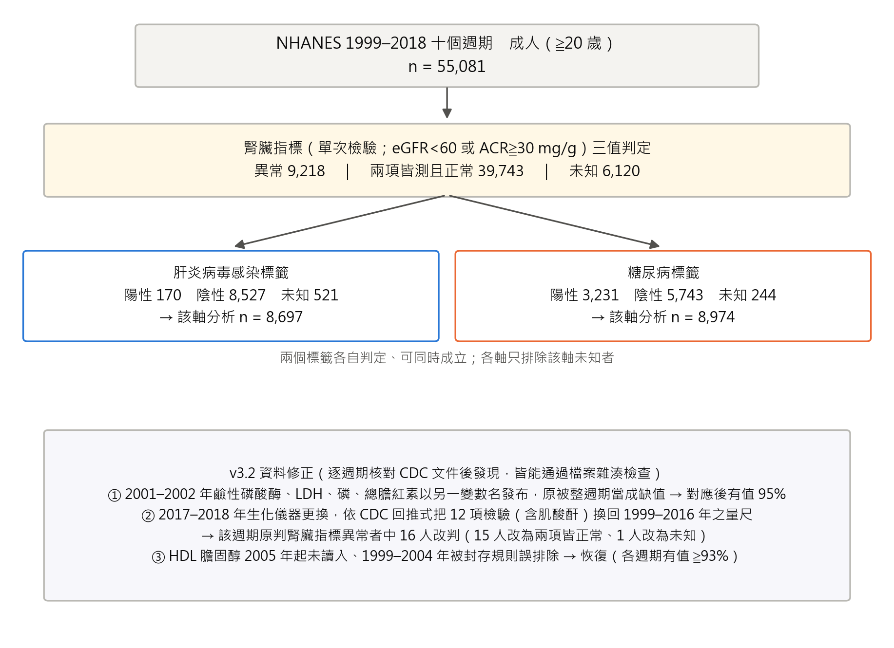
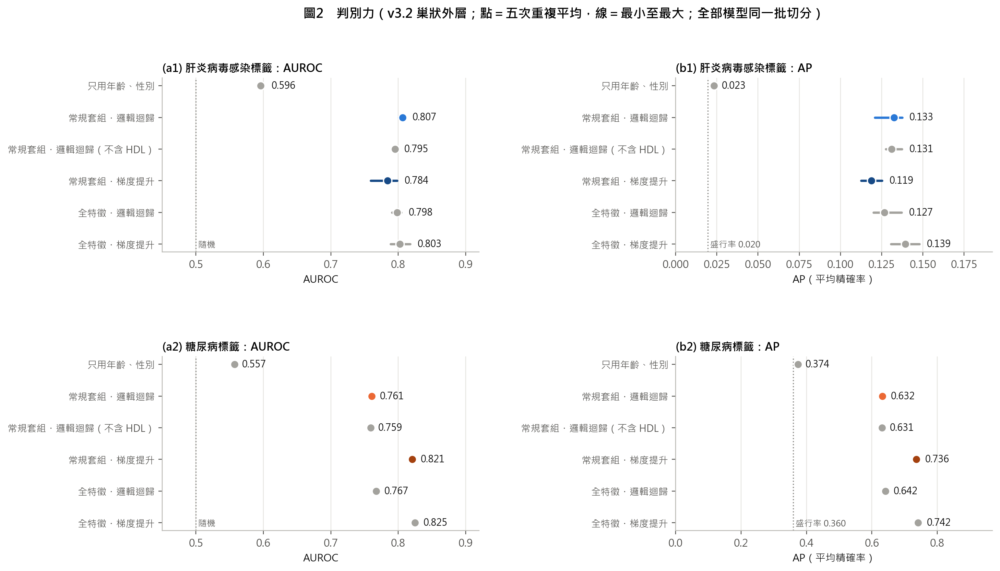
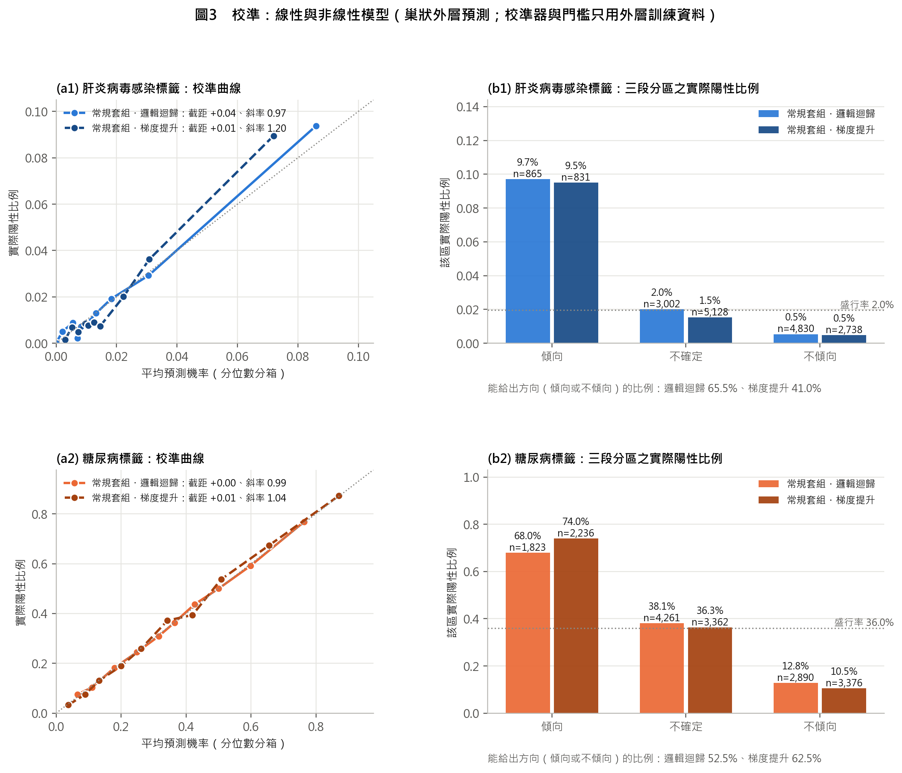
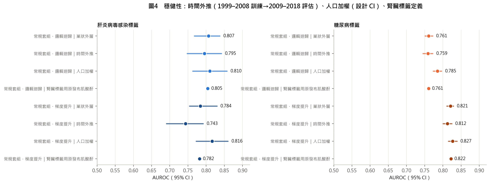
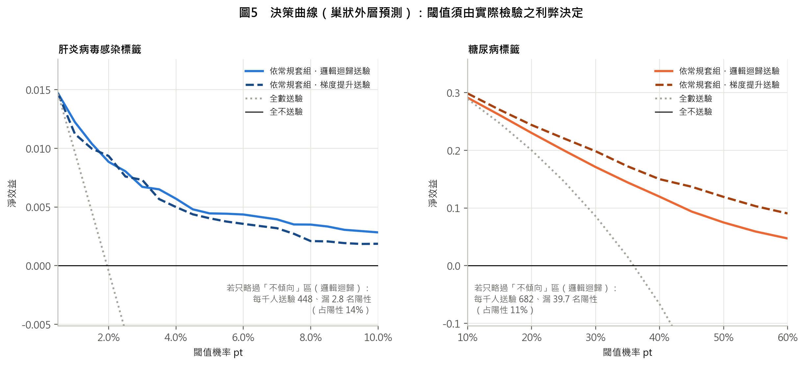
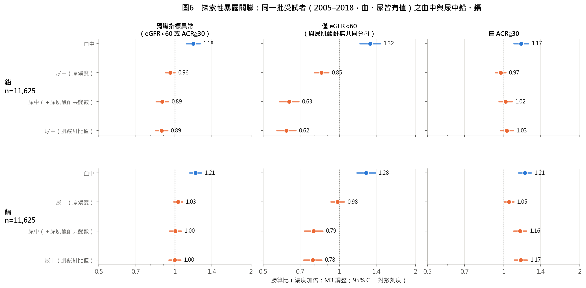
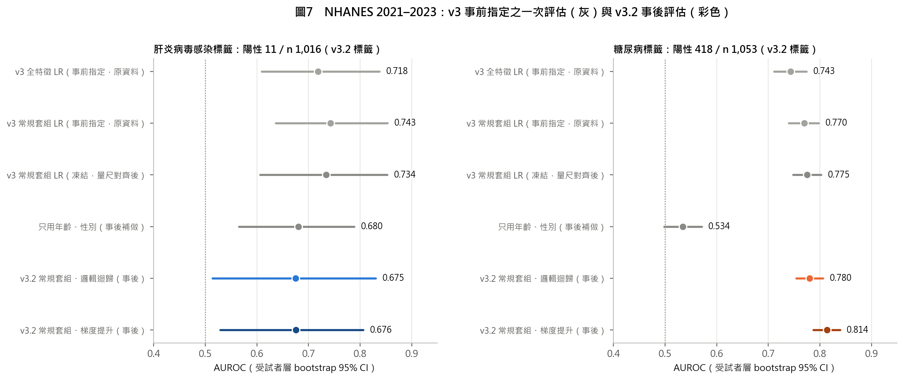
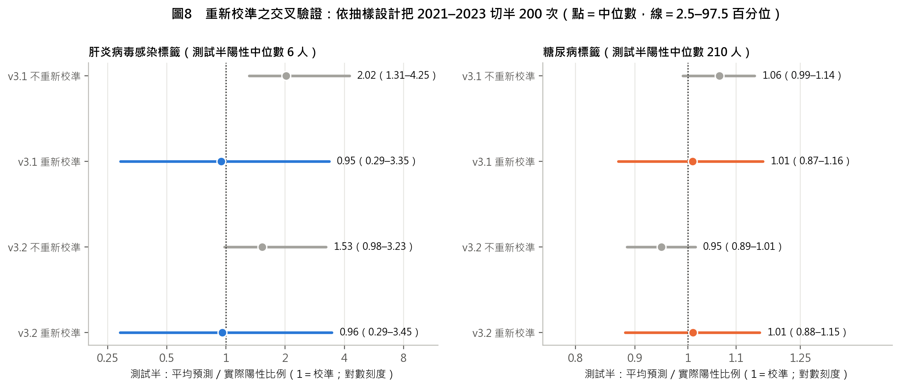

**科　　別**：動物與醫學學科

**組　　別**：高級中等學校組

**作品名稱**：血液會說話嗎？以常規檢驗回推腎炎（腎損傷）的病因方向

**關 鍵 詞**：病因方向、腎炎（腎損傷）、預測模型校準

**編　　號**：

<!-- 分頁 -->

# 血液會說話嗎？以常規檢驗回推腎炎（腎損傷）的病因方向

## 摘要

腎炎（腎損傷）的病因可分為感染、免疫、代謝三個方向。本研究檢驗一般健檢的常規血液與尿液數值能否回推病因方向。使用美國 NHANES 1999–2018 年 55,081 名成人，依官方文件修正檢驗量尺與資料錯誤，在腎臟指標異常者中以巢狀交叉驗證評估。代謝方向（糖尿病）邏輯迴歸 AUROC 0.761、梯度提升 0.821，2021–2023 年維持 0.780 與 0.814；感染方向（病毒性肝炎）0.807，訊號主要來自 C 型肝炎，新資料陽性太少無法確認；免疫方向（抗核抗體）0.546，未優於只用年齡、性別的 0.596。常規檢驗可回推代謝與部分感染方向，不能回推免疫方向，也不能取代診斷。

## 壹、前言

### 一、研究動機

腎臟病的病因評估需要整合病史、共存疾病、用藥、身體檢查、實驗室數據與影像，必要時還需要病理或基因檢查；單次 eGFR 下降或白蛋白尿升高，也不足以確認異常已持續三個月以上（Kidney Disease: Improving Global Outcomes [KDIGO] CKD Work Group, 2024）。另一方面，多數人每年健康檢查都會抽血、驗尿，這些數值早已存在，卻很少被拿來回答「腎臟為什麼出問題」。本研究的核心問題是：腎炎（腎損傷）時，能不能用這些常規數值往回推，指出病因是感染、免疫還是代謝方向？

> ⚠️ **待填寫**：研究者本人的真實動機（接觸的個案、課堂、新聞或閱讀所見）。本說明書不代寫這一段。

### 二、研究目的

**H₁**：在腎炎（腎損傷）成人中，常規血液與尿液檢驗回推感染（病毒性肝炎）、代謝（糖尿病）、免疫（抗核抗體陽性）三個病因方向的能力，明顯優於只用年齡與性別，且在未參與開發的新資料上仍然成立（免疫方向只有 1999–2004 年有檢驗，無新資料可評估）。判定方式事先寫定，不以任何固定分數作為通過門檻。

1. 依 NHANES 官方文件建立跨週期一致的檢驗量尺與三值標籤。
2. 以巢狀交叉驗證評估常規檢驗回推各病因方向的判別與校準，並與只用年齡、性別的基準比較。
3. 比較線性模型（邏輯迴歸）與非線性模型（梯度提升）的判別與校準，特別是糖尿病標籤。
4. 檢驗時間外推、人口加權與抽樣設計下的穩健性，並分開呈現 B 型與 C 型肝炎。
5. 以公開的抗核抗體次樣本評估免疫方向。
6. 以未參與開發的 NHANES 2021–2023 評估外部表現。
7. 建立離線網頁工具，並估計「以新資料重新校準」這一步的可靠程度。

### 三、文獻回顧

#### （一）病因評估與病因方向

KDIGO 2024 指引把腎臟病的病因評估視為需要整合多種資訊的工作（KDIGO CKD Work Group, 2024）。慢性病毒性肝炎會改變血脂與肝臟的合成功能，已有研究以常規肝功能與血脂檢驗建立預測模型（Bashir et al., 2026）；狼瘡腎炎的研究則以腎臟切片為參考標準，說明免疫性病因需要病理與免疫檢驗（Yang et al., 2024）。本研究的標籤是共存疾病，共存不等於腎損傷的原因，因此回推的是「病因方向」（候選病因），不是確診。

#### （二）預測模型的報告與評估

TRIPOD+AI 與 PROBAST+AI 要求完整報告資料來源、標籤、缺值處理、校準與外部驗證（Collins et al., 2024; Moons et al., 2025）。校準常被忽略，但錯誤的機率會誤導決策（Van Calster et al., 2019）；外部驗證一般建議至少約 100 個事件（Collins et al., 2016）；模型移到新族群時，可依由簡到繁的原則只更新截距或同時更新斜率（Vergouwe et al., 2017）。系統性回顧發現機器學習在臨床預測上常不優於邏輯迴歸（Christodoulou et al., 2019），因此非線性模型的增益必須在同一批切分上直接比較，並同時檢查校準。

#### （三）調查資料與跨週期檢驗

NHANES 採複雜抽樣（National Center for Health Statistics [NCHS], n.d.），加權估計與變異估計都必須考慮分層與地區單位（PSU），變異可用複製法估計（Rust & Rao, 1996）；比例的信賴區間採 NCHS 的呈現標準（Parker et al., 2017）。NHANES 各週期的檢驗儀器與方法不同，CDC 在資料文件中提供校正式與回推式，例如 1999–2004 年血清肌酸酐的校正（Selvin et al., 2007）與 2017–2018 年生化儀器更換的回推式（NCHS, 2020）。

#### （四）本作品的延續與新增

本作品延續研究者先前的版本：v1、v2 以同一資料建立三類與兩類病因模型；v3 依外部方法學審查重建三值標籤、校準流程，並完成一次事前凍結的外部確認。本版（v3.2）新增：(1) 逐週期核對 CDC 文件，找出並修正三類新的資料錯誤；(2) 評估非線性模型的校準；(3) 補回 HDL 並以修正後資料重建網頁工具；(4) 分開呈現 B 型與 C 型肝炎；(5) 以抽樣設計切半的交叉驗證估計重新校準的可靠度；(6) 以公開的抗核抗體次樣本，在修正後資料上重新評估免疫方向。

> ⚠️ **待確認**：若本主題曾參加其他競賽或前一屆科展，依實施要點須填寫延續性研究作品說明表並附前次資料；研究者本人之參與比重請依實際情形填寫。

## 貳、研究設備與器材

### 一、資料來源

美國國家健康與營養調查（NHANES）由美國疾病管制與預防中心（CDC）轄下的國家衛生統計中心（NCHS）執行，是具全國代表性的調查，公開檔案可自由下載。

| 資料 | 週期 | 檔案數 | 用途 |
|---|---|---|---|
| 開發資料 | 1999–2018 年十個週期 | 258 | 建立與評估模型 |
| 外部資料 | 2021–2023 年 | 17 | 外部評估 |

合計 275 個檔案、約 400 MB，每個檔案的來源網址、SHA256 雜湊與位元組數都記錄在出處帳本。NHANES 的調查協定由 NCHS 倫理審查委員會核准；本研究使用的週期分屬協定 #98-12（1999–2004）、#2005-06（2005–2010）、#2011-17 與 #2018-01（2011–2018），2021–2023 年一期在該頁列為「NHANES 2021-2022」、協定 #2021-05（NCHS, 2026）；本研究只使用公開、已去識別的檔案，不接觸任何受試者。

### 二、軟硬體

| 項目 | 規格 |
|---|---|
| 電腦 | 一般個人電腦（Windows 11） |
| 分析語言 | Python 3.14.3 |
| 主要套件 | scikit-learn 1.8.0、pandas 3.0.1、numpy 2.4.3、scipy 1.17.1、matplotlib 3.10.9、python-docx 1.2.0 |
| 網頁計算核對 | Node.js v24.14.0 |
| 撰寫與版本控制 | Obsidian、Git（GitHub） |
| AI 輔助工具 | Claude（Anthropic）：程式撰寫、資料核對與文件草擬之輔助；Codex（OpenAI）：唯讀之獨立稽核 ⚠️ 請依實際使用情形與比賽規定確認 |

### 三、防自欺機制（本研究自行設計）

| 機制 | 做法 | 防止什麼 |
|---|---|---|
| 出處帳本 | 每個檔案記錄網址與 SHA256，未登錄的檔案程式拒絕讀取 | 使用來路不明或被改動的資料 |
| 先提交、後執行 | 分析計畫在看到結果前提交版本控制（v3 bf269c5、外部協定 9ca4e9f、設計變異 9edd968、v3.2 f6abc91） | 看到結果後才改方法 |
| 外部資料只評一次 | 事前指定的外部評估程式在結果檔存在時拒絕再跑 | 反覆嘗試到結果好看為止 |
| 逐週期核對官方文件 | 每個特徵逐週期檢查有值比例，並逐一閱讀 CDC 文件的換算說明 | 雜湊檢查抓不到的變數改名與量尺差異 |
| 網頁與 Python 核對 | 以 Node.js 執行網頁中的計算，與 Python 逐軸比對 | 網頁工具算錯 |
| 獨立稽核 | 另以不同的 AI 工具唯讀檢查程式與文件數字的對應，發現的問題逐項查證後才修改 | 同一個作者（或工具）重複同樣的盲點 |

## 參、研究過程與方法

### 一、研究架構

1. 下載 NHANES 公開檔，登錄出處帳本。
2. 依官方文件換算檢驗量尺，建立腎臟指標與感染、代謝、免疫三個病因方向標籤的三值判定。
3. 在腎臟指標異常者中（腎炎／腎損傷之操作型定義），以常規檢驗建立回推各病因方向的線性與非線性模型。
4. 以巢狀交叉驗證評估判別、校準與三段分區，並與基準比較。
5. 檢驗時間外推、人口加權、抽樣設計與標籤定義的穩健性。
6. 掃描上游暴露關聯（探索性）。
7. 以 NHANES 2021–2023 評估外部表現。
8. 建立網頁工具，重新校準並以交叉驗證估計其可靠度。

### 二、分析樣本與三值標籤

納入年齡至少 20 歲者。NHANES 沒有腎炎診斷，本研究以腎臟指標異常作為腎炎（腎損傷）的操作型定義：單次 eGFR < 60 mL/min/1.73 m² 或尿白蛋白／肌酸酐比（ACR）≧ 30 mg/g（KDIGO CKD Work Group, 2024）；eGFR 以 CKD-EPI 2021 無種族係數公式計算（National Kidney Foundation, n.d.）。每一項判定都分成三種結果：

| 判定 | 陽性 | 陰性 | 未知 |
|---|---|---|---|
| 腎臟指標 | 任一已測指標達門檻 | 兩項皆測且正常 | 一項正常而另一項缺，或兩項皆缺 |
| 肝炎病毒感染 | HBsAg 陽性或 HCV RNA 陽性 | 兩者皆可排除 | 其餘，例如抗體陽性但沒有 RNA |
| 糖尿病 | 醫師診斷或 HbA1c ≧ 6.5% | 問卷與 HbA1c 皆為陰性 | 拒答、不知道或缺值 |
| 免疫（抗核抗體） | 1:80 稀釋 3+／4+ | 次樣本中未達 3+ | 不在 1999–2004 年剩餘血清次樣本 |

肝炎之判定依 CDC 篩檢建議與 NHANES 檢驗流程（Conners et al., 2023; NCHS, 2017），糖尿病依 HbA1c 診斷切點（National Institute of Diabetes and Digestive and Kidney Diseases, 2018）；抗核抗體只在 1999–2004 年剩餘血清次樣本檢驗，特異自體抗體只在 3+／4+ 者反射檢驗，因此不另作標籤。各方向只排除該方向的未知者，標籤可以同時成立。

### 三、檢驗量尺與資料修正

NHANES 各週期的檢驗儀器與方法不同。本研究逐週期檢查每個特徵的有值比例，並逐一閱讀 CDC 資料文件，依官方建議處理：

| 週期 | 項目 | 官方文件 | 本研究的處理 |
|---|---|---|---|
| 1999–2000 | 血清肌酸酐 | 建議校正至標準方法（NCHS, 2006a; Selvin et al., 2007） | 1.013 × 原值 ＋ 0.147 |
| 2001–2002 | 鹼性磷酸酶、LDH、磷、總膽紅素 | 兩家實驗室交叉比對後以另一變數名發布調和值（NCHS, 2006b） | 改名對應（v3.2 新增） |
| 2005–2006 | 血清肌酸酐 | 建議校正（NCHS, 2008） | −0.016 ＋ 0.978 × 原值 |
| 1999–2006 | 尿肌酸酐 | 2007 年換方法，提供分段轉換（NCHS, 2009） | 依官方分段式轉換 |
| 1999–2018 | HDL 膽固醇 | 1999–2002、2005–2006 年之方法偏差已於發布資料中修正；2005 年起變數改名（NCHS, 2010） | 改名對應並解除誤封存（v3.2 新增） |
| 2017–2018 | 12 項生化（含肌酸酐） | 儀器改為 Cobas 6000，提供回推式（NCHS, 2020） | 換回 1999–2016 年之量尺（v3.2 新增，附錄二） |
| 2021–2023 | 13 項生化、尿白蛋白、空腹三酸甘油酯 | 儀器與方法更換，提供回推式（NCHS, 2025a, 2025b, 2025c） | 先換回 2017–2020 年量尺，再依上一列換回（附錄二） |
| 1999–2010 | HbA1c | 分布右移原因不明，建議使用原始值（NCHS, 2012） | 使用原始值（列為限制） |

### 四、特徵

候選特徵共 63 項：常規血液與尿液檢驗 49 項（含 ACR、eGFR、嗜中性球／淋巴球比、年齡與性別），每個週期都有測量；另 14 項非常規檢驗（如 C 反應蛋白、血鉛、鐵蛋白、副甲狀腺素）在本研究資料中只有部分週期有值，只用於「全特徵」模型。定義標籤的檢驗一律不作特徵。各軸再移除生理上緊鄰標籤的「近端特徵」：肝炎軸移除 ALT、AST、GGT、總膽紅素，糖尿病軸移除血糖與滲透壓。「常規套組」依是否為一般健檢項目事先定義，不看表現挑選（肝炎軸 45 項、糖尿病軸 47 項；附錄一）。

### 五、模型與巢狀評估

比較兩種模型：邏輯迴歸（線性）與梯度提升樹（HistGradientBoosting，最大深度 3、學習率 0.08、300 次迭代，沿用 v3 設定、不調參；非線性）。兩者都採網頁工具的結構：先以五折交叉配適得到五個模型並取平均，再用內層折外分數做保序校準。評估採分層五折、重複五次的巢狀外層評估：補值、標準化、配適、校準與門檻都只用外層訓練資料，被評估的人從未參與任何一步（Collins et al., 2024; Moons et al., 2025）。

判別以 AUROC 與平均精確率（AP）報告，並列五次重複之平均；校準以校準截距、校準斜率與 Brier 分數報告（Van Calster et al., 2019），校準曲線、三段分區、人口加權與決策曲線取第一次重複。模型間差異取第一次重複之外層預測計算配對差，並以同一批受試者 bootstrap 1,000 次估計 95% 信賴區間；配對差可能與五次重複平均之差略有不同，兩者並列。

### 六、三段分區

工具輸出「傾向」「不確定」「不傾向」三區，規則在看到結果前寫定：預測勝算達事前勝算 2 倍以上為傾向，0.5 倍以下為不傾向，相當於概似比 2 與 0.5。常規套組有值不足一半時標示「資料不足」、不給方向；報告「能給出方向的比例」時以全部受試者為分母。

### 七、穩健性與分型

1. 時間外推：以 1999–2008 年開發、2009–2018 年評估。
2. 人口加權與抽樣設計：以合併 20 年的 MEC 權重計算加權指標（NCHS, n.d.），變異以刪一 PSU 摺刀法估計（Rust & Rao, 1996），比例採 Korn–Graubard 區間（Parker et al., 2017）。
3. 腎臟標籤定義：2017–2018 年改用原發布的肌酸酐判定腎臟指標，重做主要分析。
4. 肝炎分型：以常規套組邏輯迴歸的外層預測，分別計算 C 型與 B 型陽性者對陰性者的 AUROC。
5. 免疫方向：只有 1999–2004 年三個週期與次樣本，事前寫定不做時間外推、人口加權與外部評估。

### 八、決策曲線與暴露探索

決策曲線比較「依模型送驗」「全數送驗」「全不送驗」三種做法的淨效益（Vickers & Elkin, 2006）；肝炎檢驗便宜、無創，且指引建議成人普遍篩檢（Conners et al., 2023; Schillie et al., 2020），合理的閾值機率很低。暴露探索以 v3.2 資料修正重跑：以全體成人掃描 213 個暴露，以 Benjamini–Hochberg 法控制偽發現率（Benjamini & Hochberg, 1995），並在同時有血、尿值的同一批受試者中比較血中與尿中金屬。

### 九、外部資料：NHANES 2021–2023

2021–2023 年資料自 2024 年 9 月起分批釋出，本研究使用的生化檔於 2025 年 9 月釋出（NCHS, 2025c），未參與任何開發決策。v3 在取用前凍結模型與評估規則（9ca4e9f），取用後、評估前發現儀器與方法更換，先提交量尺調和的修正（44b0ace），再依協定只評一次（a7c4af8），此為事前指定的確認結果。本版模型在修正後資料上重新訓練，並把 2021–2023 年數值兩段換算到開發資料的量尺後評估；這批資料已用過，所以列為事後分析。另以抽血權重（WTPH2YR）與 MEC 權重分別加權。

### 十、網頁工具 v3.2 與重新校準的交叉驗證

網頁工具採常規套組邏輯迴歸。模型種類在看到結果前決定：工具必須逐項顯示推動因子，邏輯迴歸可由係數直接說明，梯度提升只作為比較基準。以 2021–2023 年資料依由簡到繁的規則重新校準：陽性至少 100 個且斜率檢定 p < 0.05 才更新斜率，否則只更新截距（Vergouwe et al., 2017）；事前機率改為 2021–2023 年的比例。為估計這一步的可靠度，依抽樣設計把 2021–2023 年資料切半 200 次（每層兩個 PSU 各分一半），在一半重新校準、在另一半評估。網頁為單一離線檔案，計算以 Node.js 與 Python 逐軸核對。

## 肆、研究結果

### 一、資料修正與分析樣本

**圖1　分析樣本、三值標籤與 v3.2 資料修正**

逐週期核對後，v3 另有三類資料錯誤：2001–2002 年四項常規生化整週期缺值（對應後有值 95%），2017–2018 年 12 項生化不在共同量尺上，HDL 未讀入。修正後腎臟指標異常 9,218 人（2017–2018 年 15 人改為兩項皆正常、1 人改為未知），肝炎軸 8,697 人（陽性 170）、糖尿病軸 8,974 人（陽性 3,231）。

### 二、判別力

**圖2　判別力（點＝五次重複平均，線＝最小至最大）**

**表1　各模型之判別力（巢狀外層，五次重複平均）**

| 模型 | 肝炎 AUROC | 肝炎 AP | 糖尿病 AUROC | 糖尿病 AP |
|---|---|---|---|---|
| 只用年齡、性別 | 0.596 | 0.023 | 0.557 | 0.374 |
| 常規套組・邏輯迴歸 | **0.807** | 0.133 | **0.761** | 0.632 |
| 常規套組・邏輯迴歸（不含 HDL） | 0.795 | 0.131 | 0.759 | 0.631 |
| 常規套組・梯度提升 | 0.784 | 0.119 | **0.821** | 0.736 |
| 全特徵・邏輯迴歸 | 0.798 | 0.127 | 0.767 | 0.642 |
| 全特徵・梯度提升 | 0.803 | 0.139 | 0.825 | 0.742 |

1. 常規檢驗的判別明顯優於年齡、性別；肝炎軸 AP 0.133 是盛行率 2.0% 的 6.8 倍。
2. 糖尿病軸的梯度提升明顯較高：第一次重複之配對 ΔAUROC +0.058（95% CI 0.050–0.066），五次重複平均差 +0.060；肝炎軸則沒有優勢：配對差 −0.010（95% CI −0.037 至 0.019），平均差 −0.023。
3. 補回 HDL 的影響很小（配對差）：糖尿病 +0.002（95% CI 0.000–0.004），肝炎 +0.010（95% CI −0.004 至 0.026）。

### 三、校準：線性與非線性模型

**圖3　校準曲線與三段分區之實際陽性比例**

**表2　校準與分區（第一次重複之外層預測）**

| 指標 | 肝炎・邏輯迴歸 | 肝炎・梯度提升 | 糖尿病・邏輯迴歸 | 糖尿病・梯度提升 |
|---|---|---|---|---|
| 校準截距 | +0.04 | +0.01 | +0.00 | +0.01 |
| 校準斜率 | 0.97 | 1.20 | 0.99 | 1.04 |
| Brier 分數 | 0.0181 | 0.0182 | 0.1855 | 0.1617 |
| 傾向區實際陽性率 | 9.7% | 9.6% | 67.8% | 72.9% |
| 不傾向區實際陽性率 | 0.5% | 0.4% | 12.5% | 10.5% |
| 資料不足（不給方向）人數 | 31 | 31 | 238 | 238 |
| 能給出方向的比例 | 65.2% | 40.9% | 51.9% | 60.6% |

註：能給出方向的比例＝（傾向＋不傾向）人數／全部人數；各區實際陽性率只計入資料足夠者。

兩種模型經同樣的保序校準後都接近理想（截距接近 0、斜率接近 1）。糖尿病軸的梯度提升 Brier 分數較低，能給出方向的比例由 51.9% 升至 60.6%，且傾向區與不傾向區分得更開。肝炎軸的梯度提升斜率 1.20、能給出方向的比例降為 40.9%，沒有優於邏輯迴歸。

### 四、穩健性

**圖4　穩健性：時間外推、人口加權與腎臟標籤定義**

**表3　穩健性分析**

| 分析 | 肝炎・邏輯迴歸 | 肝炎・梯度提升 | 糖尿病・邏輯迴歸 | 糖尿病・梯度提升 |
|---|---|---|---|---|
| 時間外推 AUROC | 0.795 | 0.743 | 0.759 | 0.812 |
| 時間外推校準截距 | +0.37 | +0.18 | +0.25 | +0.11 |
| 人口加權 AUROC | 0.810 | 0.816 | 0.785 | 0.827 |
| 加權平均預測減盛行率（百分點，設計 95% CI） | +0.03（−0.31 至 0.36） | +0.15（−0.18 至 0.48） | +2.61（1.49–3.73） | +2.19（1.02–3.37） |
| 腎臟標籤用原發布肌酸酐 AUROC | 0.805 | 0.782 | 0.761 | 0.822 |

時間外推時，評估週期的糖尿病比例（38.9%）高於開發週期（33.0%），兩種模型都低估（截距為正），梯度提升較輕。人口加權後，糖尿病軸平均預測比母體盛行率高約 2 至 3 個百分點（設計效應 2.20）：機率不能直接移植到組成不同的人群。改用原發布肌酸酐判定腎臟標籤，結果幾乎不變。

### 五、肝炎軸：C 型與 B 型

**表4　肝炎軸分型（常規套組邏輯迴歸之外層預測）**

| 分型 | 陽性人數 | AUROC（95% CI） | 傾向 | 不確定 | 不傾向 | 資料不足 |
|---|---|---|---|---|---|---|
| C 型（HCV RNA 陽性） | 122 | 0.849（0.817–0.882） | 71 | 39 | 11 | 1 |
| B 型（HBsAg 陽性） | 49 | 0.686（0.610–0.762） | 14 | 21 | 13 | 1 |

以 C 型或 B 型單獨作標籤重新建模，AUROC 分別為 0.847 與 0.557（合併感染 1 人）。肝炎軸實際上是 C 型肝炎軸。

### 六、免疫方向：抗核抗體

腎臟指標異常且在抗核抗體次樣本者 616 人，其中 3+／4+ 陽性 115 人（18.7%；女性 81／337、男性 34／279）。常規套組邏輯迴歸 AUROC 0.546、梯度提升 0.536，只用年齡、性別為 0.596；邏輯迴歸減年齡性別之配對 ΔAUROC −0.007（95% CI −0.066 至 0.055），依事前規則判為「無法可靠回推」。校準斜率只有 0.30，模型學到的多半是雜訊。陽性者中與全身性紅斑狼瘡相關的特異抗體很少：Ro/SSA 9 人、U1-RNP 3 人、La/SSB 2 人、Sm 1 人。

### 七、決策曲線

**圖5　決策曲線**

肝炎軸在閾值 0.5% 時，依模型送驗與全數送驗的淨效益幾乎相同（0.0147 對 0.0146）。若只略過「不傾向」區（資料不足者照常送驗），每千人送驗 448 人，但漏掉 2.8 名陽性，占陽性的 14%。**因此本工具不能用來決定誰可以不驗肝炎。**糖尿病軸在閾值 10%–60% 的每個點，兩種模型的淨效益都高於全數送驗與全不送驗（10% 時與全數送驗差距很小），且梯度提升都高於邏輯迴歸；以上為點估計。

### 八、暴露關聯（探索性）

**圖6　同一批受試者之血中與尿中鉛、鎘（勝算比為濃度加倍）**

213 個暴露中 26 個通過偽發現率 0.05。資料修正使 2017–2018 年 16 人的腎臟結果改變；與修正前資料的結果相比，沒有任何暴露改變顯著與否。藥物關聯與處方常規一致，例如腎功能差時應停用的雙胍類呈負相關，可由適應症與反向因果解釋，不能當作致病證據。前一版「血中升、尿中降就是反向因果的直接證據」建立在沒有共同受試者的比較上，已撤回；在同一批 11,625 人中，尿中金屬的方向取決於結果定義與寫法。

### 九、2021–2023 年外部資料

**圖7　NHANES 2021–2023：v3 事前指定之一次評估與 v3.2 事後評估**

**表5　2021–2023 年外部資料之判別與校準**

| 項目 | 肝炎軸 | 糖尿病軸 |
|---|---|---|
| **v3 事前指定一次評估**：陽性／人數 | 11／1,032 | 420／1,069 |
| 　全特徵邏輯迴歸（當時之部署模型） | 0.718（0.609–0.838） | 0.743（0.712–0.774） |
| 　常規套組邏輯迴歸 | 0.743 | 0.770 |
| **v3.2 事後評估**：陽性／人數 | 11／1,016 | 418／1,053 |
| 　只用年齡、性別（稽核後補做） | 0.680（0.565–0.789） | 0.534（0.498–0.571） |
| 　常規套組邏輯迴歸 | 0.675（0.514–0.830） | 0.780（0.754–0.806） |
| 　常規套組梯度提升 | 0.676（0.529–0.806） | 0.814（0.787–0.839） |
| 　校準截距／斜率：邏輯迴歸（重新校準前） | −0.48／0.50 | +0.11／1.20 |
| 　校準截距／斜率：梯度提升 | −0.66／0.55 | +0.03／1.11 |

1. 糖尿病軸在新資料上大致維持，並明顯高於同一批人只用年齡、性別的 0.534：ΔAUROC 邏輯迴歸 +0.246（95% CI 0.205–0.282）、梯度提升 +0.280（95% CI 0.238–0.321）。梯度提升比邏輯迴歸高 +0.034（95% CI 0.010–0.058），校準也較接近理想。
2. 肝炎軸只有 11 名陽性，遠低於建議的約 100 個事件（Collins et al., 2016）。只用年齡、性別的 AUROC 為 0.680，常規套組邏輯迴歸並未高於它，ΔAUROC −0.005（95% CI −0.184 至 0.146），信賴區間極寬而無法判讀；陽性組成由開發時以 C 型為主，變為 B 型 6 人、C 型 5 人。
3. 與年齡、性別模型的外部比較，是獨立稽核發現原稿拿外部結果和內部基準比較之後才補做的，屬事後分析。
4. 以抽血權重加權，糖尿病軸邏輯迴歸 AUROC 0.805，與 MEC 權重的 0.797 相近。

### 十、網頁工具 v3.2 與重新校準的交叉驗證

**圖8　重新校準之交叉驗證（依抽樣設計切半 200 次）**

**表6　網頁工具 v3.2**

| 項目 | 肝炎軸 | 糖尿病軸 |
|---|---|---|
| 重新校準 | 只更新截距（事件 11 個，不足 100） | 截距與斜率（斜率檢定 p ＝ 0.0199） |
| 事前機率（2021–2023） | 1.08% | 39.7% |
| 傾向／不傾向門檻 | ≧ 2.14%／≦ 0.54% | ≧ 56.8%／≦ 24.8% |
| 交叉驗證：測試半平均預測／實際 | 0.96（0.29–3.45） | 1.01（0.88–1.15） |
| 　不重新校準 | 1.53（0.98–3.23） | 0.95（0.89–1.01） |

糖尿病軸在另一半資料上，重新校準後平均預測仍對準實際（中位數 1.01），不重新校準則略為低估（0.95）；肝炎軸每半只有約 6 個事件，範圍極寬而無法判斷。示範受試者為 NHANES 2015–2016 的一名真實成人（C 型肝炎 RNA 陽性、無糖尿病）：肝炎軸「傾向」（機率 20.45%，相對事前勝算 ×23.48），最大推動因子為 HDL 137 mg/dL（開發資料中位數 49 mg/dL）；糖尿病軸「不傾向」（3.25%）。網頁與 Python 的輸出逐軸一致。單一示範只展示輸出形式，不代表準確率。

## 伍、討論

### 一、假設的成立範圍

H₁ 在糖尿病軸成立。內部 AUROC 邏輯迴歸 0.761、梯度提升 0.821，只用年齡、性別為 0.557（五次重複平均差 +0.204 與 +0.264）；第一次重複之配對差 ΔAUROC：邏輯迴歸 +0.205（95% CI 0.191–0.218）、梯度提升 +0.263（95% CI 0.249–0.277）。外部 AUROC 為 0.780 與 0.814，同一批人只用年齡、性別為 0.534；ΔAUROC：邏輯迴歸 +0.246（95% CI 0.205–0.282）、梯度提升 +0.280（95% CI 0.238–0.321），此外部比較為事後分析。肝炎軸的內部結果支持 H₁：0.807 對 0.596（平均差 +0.211），第一次重複之配對差 +0.200（95% CI 0.155–0.250）。外部則沒有高於年齡、性別，ΔAUROC −0.005（95% CI −0.184 至 0.146），但只有 11 名陽性，無法確認或否定。因此 H₁ **部分成立**。

免疫方向的 H₁ 不成立：常規套組 AUROC 0.546 未優於只用年齡、性別的 0.596（配對 ΔAUROC −0.007，95% CI −0.066 至 0.055）。

### 二、非線性模型帶來什麼

糖尿病軸的梯度提升在內部、時間外推與外部資料上都比邏輯迴歸高；經同樣的保序校準後，內部與 2021–2023 年的校準接近理想，時間外推與人口加權時的偏移也比邏輯迴歸小（表3）。這與「機器學習常不優於邏輯迴歸」的系統性回顧不同（Christodoulou et al., 2019），表示糖尿病標籤與常規檢驗之間存在線性模型沒有抓到的關係；本研究尚未分析是哪些特徵或交互作用造成增益。代價是可解釋性：網頁工具必須逐項說明「為什麼」，邏輯迴歸的推動因子可由係數直接算出。本研究事前決定工具維持邏輯迴歸，梯度提升的增益留待可解釋的非線性方法與獨立資料驗證。

### 三、肝炎軸其實是 C 型肝炎軸

C 型肝炎的常規檢驗型態清楚（AUROC 0.849），與慢性病毒性肝炎改變血脂與肝臟合成功能的描述一致（Bashir et al., 2026）；B 型肝炎帶原者的常規檢驗大多接近正常（0.686）。2021–2023 年的陽性組成偏向 B 型，正好落在工具的弱點上。

### 四、雜湊抓不到的錯誤

本研究最重要的方法學教訓是：資料來源正確，不等於分析正確。下列問題都能通過 SHA256 檢查：

| 版本 | 問題 | 後果 | 更正 |
|---|---|---|---|
| v3 | 1999–2000 年肌酸酐套錯校正公式 | 該週期腎功能被高估 | eGFR < 60 由 86 人增為 340 人 |
| v3 | 2003–2004 年沒有 HCV RNA 變數 | 抗體陽性者被判為陰性 | 改判為未知 |
| v3 | 沒做檢驗的人被當成陰性 | 陰性組混入未受檢者 | 三值判定；腎臟可判定 51,792 → 48,962 人 |
| v3 | 血中、尿中金屬合併時欄位撞名 | 血尿比較不是同一批人 | 在同一批 11,625 人中重新比較 |
| v3 外部 | 2021–2023 年儀器與方法更換 | 兩個特徵整欄缺值、十餘項不在同一量尺 | 評估前提交修正 |
| v3.2 | 2001–2002 年四項常規生化改名 | 整週期缺值 | 改名對應 |
| v3.2 | 2017–2018 年生化儀器更換 | 開發資料混用兩種量尺 | 12 項換回共同量尺 |
| v3.2 | HDL 未讀入且被誤封存 | 常規套組少一項 | 讀入並解除封存 |

這些錯誤都不會讓程式當掉，只會安靜地產生看似合理的數字。v3.2 的三項錯誤是在「逐週期檢查每個特徵的有值比例」與「逐一閱讀 CDC 文件」時發現的；它們對整體判別的影響很小，卻會改變個人的輸出，例如示範受試者的肝炎軸機率因補回 HDL 而明顯上升。

### 五、回推病因方向的意義與界線

本研究的核心問題是回推腎炎（腎損傷）的病因方向。現有公開資料能支持的結論是：代謝方向（糖尿病）可以回推；感染方向只有 C 型肝炎可以回推；免疫方向回推不了。當常規檢驗呈現與 C 型肝炎或糖尿病相符的型態時，這組數值指出值得優先查證的病因方向，並附有推動因子與經校準的機率；它不能回答腎損傷是否由該病造成。免疫方向在公開資料中只有抗核抗體可用，缺乏補體與病理，常規檢驗沒有可學習的訊號（Yang et al., 2024）。在臨床行動上，肝炎檢驗應依普遍篩檢建議進行，本工具的角色是解釋與排序，不是省略檢驗。

### 六、研究限制

1. 病因方向的標籤是共存疾病的操作型定義，不是腎臟病理；腎炎（腎損傷）以單次腎臟指標異常定義，不能確認慢性，也無法區分腎炎與其他腎損傷。
2. 1999–2018 年資料已在前幾版反覆使用，內部結果屬探索性；2021–2023 年資料也已用於 v3 外部確認與重新校準，v3.2 的外部數字是事後分析，網頁工具更新後的校準仍無獨立資料驗證。
3. 肝炎軸外部只有 11 個事件，對 B 型肝炎幾乎沒有訊號。
4. 2007–2010 年 HbA1c 分布右移原因不明而依 CDC 建議使用原值（NCHS, 2012）；2013–2014 週期起血球分析儀更換，CDC 無法回溯比對、沒有換算式（NCHS, 2016）；非常規特徵的跨週期方法差異未換算。
5. 預測視為固定，設計變異不含模型重新配適的變異。
6. 暴露分析為單次橫斷面資料；美國調查的機率不能直接移植到臺灣的就醫族群，輸入值也必須與開發資料的檢驗量尺一致。
7. 免疫方向以抗核抗體 3+／4+ 為標籤，抗核抗體陽性不等於免疫性腎炎；只有 1999–2004 年剩餘血清次樣本、未加權，也沒有新資料可評估。

### 七、未來展望

| 階段 | 目標 | 資料 | 狀態 |
|---|---|---|---|
| 一 | 界定常規檢驗回推病因方向的能力與邊界 | NHANES 公開資料 | 完成（本作品） |
| 二 | 從關聯推進到因果方向 | 公開縱貫資料或公開基因摘要統計 | 未定 |

近期工作：(1) 以獨立資料驗證網頁工具的校準；(2) 以可解釋的非線性方法保留糖尿病軸的增益；(3) 累積肝炎事件，另建 B 型肝炎的模型；(4) 建立臺灣常用檢驗方法與 NHANES 量尺的對照。

## 陸、結論

1. 代謝方向可以回推：常規血液與尿液檢驗對腎炎（腎損傷）成人中的糖尿病有中等辨識力，內部校準良好，並在內部與 2021–2023 年資料上都明顯優於只用年齡、性別；非線性模型更高（內部 0.821、2021–2023 年 0.814），校準也接近理想。
2. 感染方向只能部分回推：訊號主要來自 C 型肝炎；對 B 型肝炎幾乎沒有訊號。外部事件太少，且未高於只用年齡、性別，無法確認。
3. 免疫方向回推不了：以公開的抗核抗體次樣本評估，常規檢驗未優於只用年齡、性別。
4. 網頁工具 v3.2 採修正後資料訓練的常規套組邏輯迴歸，保留逐項解釋；重新校準在交叉驗證中大致維持，但仍需獨立資料驗證。
5. 本工具回推的是病因方向，不是診斷，也不能用來省略肝炎篩檢。
6. 資料來源正確不等於分析正確：本研究共找到並更正八項能通過雜湊檢查的資料問題。

## 柒、參考文獻資料

Bashir, A., Arora, R., Mehrotra, D., Bala, M., Parry, A. H., & Iqball, A. (2026). Lipid abnormalities in chronic viral hepatitis: Associations and machine learning-enhanced prediction. *BMC Gastroenterology, 26*, 365. https://doi.org/10.1186/s12876-026-04861-y

Benjamini, Y., & Hochberg, Y. (1995). Controlling the false discovery rate: A practical and powerful approach to multiple testing. *Journal of the Royal Statistical Society: Series B (Methodological), 57*(1), 289–300. https://doi.org/10.1111/j.2517-6161.1995.tb02031.x

Christodoulou, E., Ma, J., Collins, G. S., Steyerberg, E. W., Verbakel, J. Y., & Van Calster, B. (2019). A systematic review shows no performance benefit of machine learning over logistic regression for clinical prediction models. *Journal of Clinical Epidemiology, 110*, 12–22. https://doi.org/10.1016/j.jclinepi.2019.02.004

Collins, G. S., Moons, K. G. M., Dhiman, P., Riley, R. D., Beam, A. L., Van Calster, B., Ghassemi, M., Liu, X., Reitsma, J. B., van Smeden, M., Boulesteix, A.-L., Camaradou, J. C., Celi, L. A., Denaxas, S., Denniston, A. K., Glocker, B., Golub, R. M., Harvey, H., Heinze, G., … Logullo, P. (2024). TRIPOD+AI statement: Updated guidance for reporting clinical prediction models that use regression or machine learning methods. *BMJ, 385*, e078378. https://doi.org/10.1136/bmj-2023-078378

Collins, G. S., Ogundimu, E. O., & Altman, D. G. (2016). Sample size considerations for the external validation of a multivariable prognostic model: A resampling study. *Statistics in Medicine, 35*(2), 214–226. https://doi.org/10.1002/sim.6787

Conners, E. E., Panagiotakopoulos, L., Hofmeister, M. G., Spradling, P. R., Hagan, L. M., Harris, A. M., Rogers-Brown, J. S., Wester, C., & Nelson, N. P. (2023). Screening and testing for hepatitis B virus infection: CDC recommendations—United States, 2023. *MMWR Recommendations and Reports, 72*(1), 1–25. https://doi.org/10.15585/mmwr.rr7201a1

Kidney Disease: Improving Global Outcomes (KDIGO) CKD Work Group. (2024). KDIGO 2024 clinical practice guideline for the evaluation and management of chronic kidney disease. *Kidney International, 105*(4S), S117–S314. https://doi.org/10.1016/j.kint.2023.10.018

Moons, K. G. M., Damen, J. A. A., Kaul, T., Hooft, L., Andaur Navarro, C., Dhiman, P., Beam, A. L., Van Calster, B., Celi, L. A., Denaxas, S., Denniston, A. K., Ghassemi, M., Heinze, G., Kengne, A. P., Maier-Hein, L., Liu, X., Logullo, P., McCradden, M. D., Liu, N., … van Smeden, M. (2025). PROBAST+AI: An updated quality, risk of bias, and applicability assessment tool for prediction models using regression or artificial intelligence methods. *BMJ, 388*, e082505. https://doi.org/10.1136/bmj-2024-082505

National Center for Health Statistics. (n.d.). *Weighting* [NHANES tutorials]. Retrieved September 27, 2026, from https://wwwn.cdc.gov/nchs/nhanes/tutorials/weighting.aspx

National Center for Health Statistics. (2006a, August). *Standard biochemistry profile & hormones (LAB18)* [NHANES 1999–2000 data documentation]. https://wwwn.cdc.gov/Nchs/Data/Nhanes/Public/1999/DataFiles/LAB18.htm

National Center for Health Statistics. (2006b, September). *Standard biochemistry profile (L40_B)* [NHANES 2001–2002 data documentation]. https://wwwn.cdc.gov/Nchs/Data/Nhanes/Public/2001/DataFiles/L40_B.htm

National Center for Health Statistics. (2008, March). *Standard biochemistry profile (BIOPRO_D)* [NHANES 2005–2006 data documentation]. https://wwwn.cdc.gov/Nchs/Data/Nhanes/Public/2005/DataFiles/BIOPRO_D.htm

National Center for Health Statistics. (2009, September). *Albumin & creatinine – urine (ALB_CR_E)* [NHANES 2007–2008 data documentation]. https://wwwn.cdc.gov/Nchs/Data/Nhanes/Public/2007/DataFiles/ALB_CR_E.htm

National Center for Health Statistics. (2010, April). *Cholesterol – total & HDL (Lab13)* [NHANES 1999–2000 data documentation]. https://wwwn.cdc.gov/Nchs/Data/Nhanes/Public/1999/DataFiles/LAB13.htm

National Center for Health Statistics. (2012, March). *Glycohemoglobin (GHB_F)* [NHANES 2009–2010 data documentation]. https://wwwn.cdc.gov/Nchs/Data/Nhanes/Public/2009/DataFiles/GHB_F.htm

National Center for Health Statistics. (2016, July). *Complete blood count with 5-part differential – whole blood (CBC_H)* [NHANES 2013–2014 data documentation]. https://wwwn.cdc.gov/Nchs/Data/Nhanes/Public/2013/DataFiles/CBC_H.htm

National Center for Health Statistics. (2017, September). *Hepatitis C: RNA (HCV-RNA) and hepatitis C genotype (HEPC_H)* [NHANES 2013–2014 data documentation]. https://wwwn.cdc.gov/Nchs/Data/Nhanes/Public/2013/DataFiles/HEPC_H.htm

National Center for Health Statistics. (2020, February). *Standard biochemistry profile (BIOPRO_J)* [NHANES 2017–2018 data documentation]. https://wwwn.cdc.gov/Nchs/Data/Nhanes/Public/2017/DataFiles/BIOPRO_J.htm

National Center for Health Statistics. (2025a, September). *Albumin & creatinine – urine (ALB_CR_L)* [NHANES August 2021–August 2023 data documentation]. https://wwwn.cdc.gov/Nchs/Data/Nhanes/Public/2021/DataFiles/ALB_CR_L.htm

National Center for Health Statistics. (2025b, September). *Cholesterol – low-density lipoproteins (LDL) & triglycerides (TRIGLY_L)* [NHANES August 2021–August 2023 data documentation]. https://wwwn.cdc.gov/Nchs/Data/Nhanes/Public/2021/DataFiles/TRIGLY_L.htm

National Center for Health Statistics. (2025c, September). *Standard biochemistry profile (BIOPRO_L)* [NHANES August 2021–August 2023 data documentation]. https://wwwn.cdc.gov/Nchs/Data/Nhanes/Public/2021/DataFiles/BIOPRO_L.htm

National Center for Health Statistics. (2026, March 24). *Ethics review board approval*. https://www.cdc.gov/nchs/nhanes/about/erb.html

National Institute of Diabetes and Digestive and Kidney Diseases. (2018, April). *The A1C test & diabetes*. https://www.niddk.nih.gov/health-information/diagnostic-tests/a1c-test

National Kidney Foundation. (n.d.). *CKD-EPI creatinine equation (2021)*. Retrieved September 27, 2026, from https://www.kidney.org/ckd-epi-creatinine-equation-2021

Parker, J. D., Talih, M., Malec, D. J., Beresovsky, V., Carroll, M., Gonzalez, J. F., Hamilton, B. E., Ingram, D. D., Kochanek, K., McCarty, F., Moriarity, C., Shimizu, I., Strashny, A., & Ward, B. W. (2017). *National Center for Health Statistics data presentation standards for proportions* (Vital and Health Statistics, Series 2, No. 175). National Center for Health Statistics.

Rust, K. F., & Rao, J. N. K. (1996). Variance estimation for complex surveys using replication techniques. *Statistical Methods in Medical Research, 5*(3), 283–310. https://doi.org/10.1177/096228029600500305

Schillie, S., Wester, C., Osborne, M., Wesolowski, L., & Ryerson, A. B. (2020). CDC recommendations for hepatitis C screening among adults—United States, 2020. *MMWR Recommendations and Reports, 69*(2), 1–17. https://doi.org/10.15585/mmwr.rr6902a1

Selvin, E., Manzi, J., Stevens, L. A., Van Lente, F., Lacher, D. A., Levey, A. S., & Coresh, J. (2007). Calibration of serum creatinine in the National Health and Nutrition Examination Surveys (NHANES) 1988–1994, 1999–2004. *American Journal of Kidney Diseases, 50*(6), 918–926. https://doi.org/10.1053/j.ajkd.2007.08.020

Van Calster, B., McLernon, D. J., van Smeden, M., Wynants, L., & Steyerberg, E. W. (2019). Calibration: The Achilles heel of predictive analytics. *BMC Medicine, 17*(1), 230. https://doi.org/10.1186/s12916-019-1466-7

Vergouwe, Y., Nieboer, D., Oostenbrink, R., Debray, T. P. A., Murray, G. D., Kattan, M. W., Koffijberg, H., Moons, K. G. M., & Steyerberg, E. W. (2017). A closed testing procedure to select an appropriate method for updating prediction models. *Statistics in Medicine, 36*(28), 4529–4539. https://doi.org/10.1002/sim.7179

Vickers, A. J., & Elkin, E. B. (2006). Decision curve analysis: A novel method for evaluating prediction models. *Medical Decision Making, 26*(6), 565–574. https://doi.org/10.1177/0272989X06295361

Yang, P., Liu, Z., Lu, F., Sha, Y., Li, P., Zheng, Q., Wang, K., Zhou, X., Zeng, X., & Wu, Y. (2024). Machine learning models predicts risk of proliferative lupus nephritis. *Frontiers in Immunology, 15*, 1413569. https://doi.org/10.3389/fimmu.2024.1413569

## 附錄

### 附錄一　常規套組變數字典

「近端排除」表示該軸因生理上緊鄰標籤而移除。

| 代號 | 名稱 | 單位 | 肝炎軸 | 糖尿病軸 |
|---|---|---|---|---|
| LBXWBCSI | 白血球 | 10³/uL | ✓ | ✓ |
| LBXLYPCT | 淋巴球 % |  | ✓ | ✓ |
| LBXMOPCT | 單核球 % |  | ✓ | ✓ |
| LBXNEPCT | 嗜中性球 % |  | ✓ | ✓ |
| LBXEOPCT | 嗜酸性球 % |  | ✓ | ✓ |
| LBXBAPCT | 嗜鹼性球 % |  | ✓ | ✓ |
| LBXRBCSI | 紅血球 | 10⁶/uL | ✓ | ✓ |
| LBXHGB | 血色素 | g/dL | ✓ | ✓ |
| LBXHCT | 血比容 | % | ✓ | ✓ |
| LBXMCVSI | MCV | fL | ✓ | ✓ |
| LBXMC | MCHC | g/dL | ✓ | ✓ |
| LBXMCHSI | MCH | pg | ✓ | ✓ |
| LBXRDW | RDW | % | ✓ | ✓ |
| LBXPLTSI | 血小板 | 10³/uL | ✓ | ✓ |
| LBXMPSI | 平均血小板體積 | fL | ✓ | ✓ |
| LBXSCR | 血清肌酸酐 | mg/dL | ✓ | ✓ |
| LBXSBU | 尿素氮 BUN | mg/dL | ✓ | ✓ |
| LBXSUA | 尿酸 | mg/dL | ✓ | ✓ |
| LBXSAL | 血清白蛋白 | g/dL | ✓ | ✓ |
| LBXSCH | 總膽固醇 | mg/dL | ✓ | ✓ |
| LBXSTR | 三酸甘油酯 | mg/dL | ✓ | ✓ |
| LBXSGTSI | GGT | U/L | 近端排除 | ✓ |
| LBXSASSI | AST | U/L | 近端排除 | ✓ |
| LBXSATSI | ALT | U/L | 近端排除 | ✓ |
| LBXSLDSI | LDH | U/L | ✓ | ✓ |
| LBXSAPSI | 鹼性磷酸酶 | U/L | ✓ | ✓ |
| LBXSTB | 總膽紅素 | mg/dL | 近端排除 | ✓ |
| LBXSTP | 總蛋白 | g/dL | ✓ | ✓ |
| LBXSGB | 球蛋白 | g/dL | ✓ | ✓ |
| LBXSPH | 磷 | mg/dL | ✓ | ✓ |
| LBXSCA | 鈣 | mg/dL | ✓ | ✓ |
| LBXSNASI | 鈉 | mmol/L | ✓ | ✓ |
| LBXSKSI | 鉀 | mmol/L | ✓ | ✓ |
| LBXSCLSI | 氯 | mmol/L | ✓ | ✓ |
| LBXSC3SI | 碳酸氫根 | mmol/L | ✓ | ✓ |
| LBXSIR | 鐵 | ug/dL | ✓ | ✓ |
| LBXTC | 總膽固醇（脂質盤） | mg/dL | ✓ | ✓ |
| LBDHDL | HDL 膽固醇 | mg/dL | ✓ | ✓ |
| LBDLDL | LDL 膽固醇 | mg/dL | ✓ | ✓ |
| LBXTR | 三酸甘油酯（空腹） | mg/dL | ✓ | ✓ |
| URXUMA | 尿白蛋白 | ug/mL | ✓ | ✓ |
| URXUCR | 尿肌酸酐 | mg/dL | ✓ | ✓ |
| ACR | 尿白蛋白/肌酸酐比（mg/g） | mg/g | ✓ | ✓ |
| eGFR | 估計腎絲球過濾率（CKD-EPI 2021） | mL/min/1.73m² | ✓ | ✓ |
| NLR | 嗜中性球/淋巴球比 | 比值 | ✓ | ✓ |
| age | 年齡 | 歲 | ✓ | ✓ |
| sex | 性別 | 1=男 2=女 | ✓ | ✓ |
| LBXSGL | 血清葡萄糖（隨機） | mg/dL | ✓ | 近端排除 |
| LBXSOSSI | 滲透壓 | mmol/kg | ✓ | 近端排除 |

### 附錄二　CDC 官方回推式（X 為換算後、Y 為原值）

| 變數 | 名稱 | 2017–2018 → 1999–2016 量尺（BIOPRO_J） | 2021–2023 → 2017–2020 量尺（修正一） |
|---|---|---|---|
| LBXSAL | 血清白蛋白 | X ＝ 0.01128 ＋ 1.044 × Y | 不需調整 |
| LBXSASSI | AST | X ＝ 3.762 ＋ 1.018 × Y | 不需調整 |
| LBXSATSI | ALT | X ＝ 2.688 ＋ 1.013 × Y | X ＝ 1.035 × Y − 1.529（BIOPRO_L） |
| LBXSBU | 尿素氮 BUN | X ＝ 0.4488 ＋ 1.001 × Y | X ＝ 0.09386 ＋ 1.021 × Y（BIOPRO_L） |
| LBXSCH | 總膽固醇 | X ＝ 1.046 × Y − 2.203 | 不需調整 |
| LBXSCR | 血清肌酸酐 | X ＝ 1.051 × Y − 0.06945 | 不需調整 |
| LBXSGTSI | GGT | X ＝ 2.363 ＋ 0.8042 × Y | X ＝ 0.9735 ＋ 0.9444 × Y（BIOPRO_L） |
| LBXSIR | 鐵 | X ＝ 0.9776 × Y − 4.494 | X ＝ 0.9918 × Y − 1.679（BIOPRO_L） |
| LBXSLDSI | LDH | X ＝ 2.062 ＋ 0.8568 × Y | X ＝ 2.46 ＋ 0.979 × Y（BIOPRO_L） |
| LBXSTR | 三酸甘油酯 | X ＝ 0.9655 × Y − 7.02 | X ＝ 0.9879 × Y − 0.8463（BIOPRO_L） |
| LBXSUA | 尿酸 | X ＝ 0.2326 ＋ 0.9323 × Y | 不需調整 |
| LBXSAPSI | 鹼性磷酸酶 | log₁₀X ＝ 1.001 × log₁₀Y − 0.04294 | X ＝ 0.6098 ＋ 0.9041 × Y（BIOPRO_L） |
| LBXSC3SI | 碳酸氫根 | 不需調整 | X ＝ 1.37 ＋ 1.022 × Y（BIOPRO_L） |
| LBXSCLSI | 氯 | 不需調整 | X ＝ 9.137 ＋ 0.919 × Y（BIOPRO_L） |
| LBXSGL | 血清葡萄糖（隨機） | 不需調整 | X ＝ 0.9669 × Y − 0.7821（BIOPRO_L） |
| LBXSKSI | 鉀 | 不需調整 | X ＝ 0.2108 ＋ 0.923 × Y（BIOPRO_L） |
| LBXSNASI | 鈉 | 不需調整 | X ＝ 41.95 ＋ 0.6983 × Y（BIOPRO_L） |
| LBXSTB | 總膽紅素 | 不需調整 | X ＝ 0.01793 ＋ 1.012 × Y（BIOPRO_L） |
| LBXTR | 三酸甘油酯（空腹） | 不需調整 | X ＝ 0.9785 × Y − 12.19（TRIGLY_L） |
| URXUMA | 尿白蛋白 | 不需調整 | X ＝ 1.189 × Y − 1.643（ALB_CR_L） |

### 附錄三　資料與程式可得性

程式與結果存放於 Git 儲存庫（目錄 experiments/kidney_cause），每一步都有提交代碼可供查核。

> ⚠️ **待確認**：是否附上儲存庫網址。網址與提交紀錄可能透露作者或學校，請依比賽規定決定。

重要提交：v3 分析計畫 bf269c5、外部確認協定 9ca4e9f、修正一 44b0ace、外部確認結果 a7c4af8、設計變異計畫 9edd968、v3.2 計畫 f6abc91。v3.2 重現入口：`evaluate_v3_2.py` → `external_v3_2.py` → `make_figures_v3_2.py` → `verify_direction_html.py` → `build_fair_v3_2.py`；版本沿革見 `docs/VERSION_LOG.md`。
