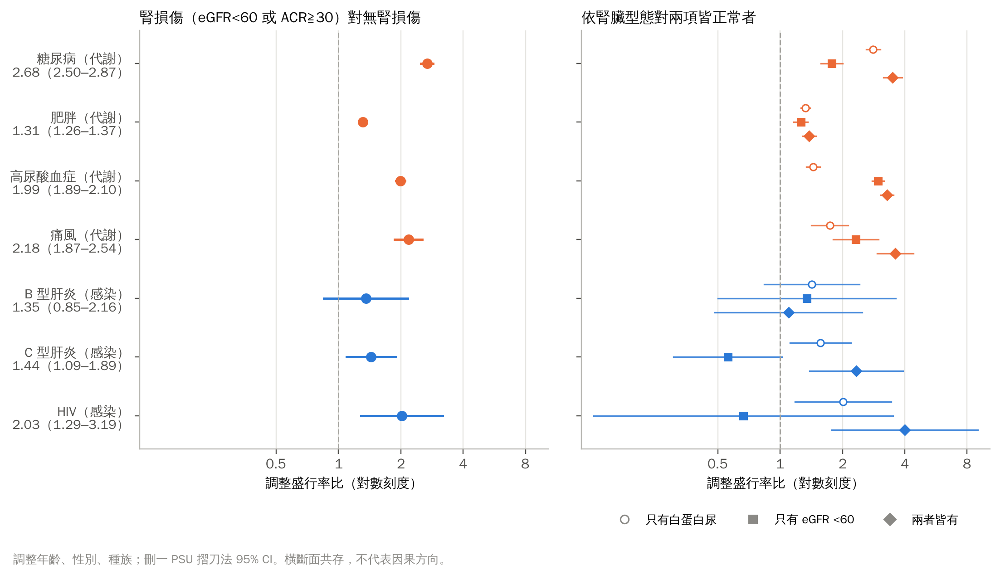

附件三

**研究報告封面**

**2027 年臺灣國際科學展覽**

**研究報告**

區別：

科別：

作品名稱：血液會說話嗎？以常規檢驗回推腎損傷的病因方向

關鍵詞：腎臟病因檢驗判斷、人工智慧醫療、反向因果

編號：

（編號由國立臺灣科學教育館統一填列）

<!-- 分頁 -->

# 血液會說話嗎？以常規檢驗回推腎損傷的病因方向

## 摘要

腎損傷的病因可分為感染、免疫、代謝三個方向。本研究檢驗一般健檢的常規血液與尿液數值能否回推病因方向。使用美國 NHANES 1999–2018 年 55,081 名成人，依公開資料修正檢驗量尺與資料錯誤，在腎臟指標異常者中以巢狀交叉驗證評估。代謝方向（糖尿病）邏輯迴歸 AUROC 0.761、梯度提升 0.821，2021–2023 年維持 0.780 與 0.814；感染方向（病毒性肝炎）0.807，訊號主要來自 C 型肝炎，新資料陽性太少無法確認；免疫方向（抗核抗體）0.546，未優於只用年齡、性別的 0.596。常規檢驗可回推代謝與部分感染方向，不能回推免疫方向，也不能取代診斷。另以事前提交之分析計畫檢驗九種病因中 NHANES 量得到的七項：調整年齡、性別、種族後，腎損傷成人較常見者依序為糖尿病（2.68）、痛風（2.18）、HIV（2.03）、高尿酸血症（1.99）、C 型肝炎（1.44）、肥胖（1.31），B 型肝炎無法區分，七項皆與文獻預期一致。依腎損傷型態比較，高尿酸血症與痛風集中於 eGFR 下降者，糖尿病、C 型肝炎與 HIV 在僅有白蛋白尿者即較常見，與文獻所述各病之傷腎機轉相符。

## 壹、研究動機

### 一、一個臨床上的斷層

在臺灣的盛行率居全球前列，而確定其病因兩大病因為感染或慢性代謝，目前在於腎臟病的診斷主要仰賴於腎臟切片。而切片需住院、具出血風險，且並非每位病人都適合。於是臨床上出現一個斷層，多數病人每年都在抽血檢驗，那檢驗出的數值都早已存在，卻沒有被用來回答「為什麼」。本研究者本人因鑑於網路上具有許多腎臟病病友，無論什麼原因都會因「做腎臟切片」飽受之苦，亦從此角度出發，若他們可以少做一次腎切，就可以少一次出血風險，少一次需住院的問題。

### 二、從「能不能」到「能到什麼程度」

教科書上，兩大類病因各有典型的血液表現，如慢性肝炎影響肝臟合成功能，糖尿病改變代謝指標。既然如此，把常規數值交給模型，是否能在切片前縮小疾病或是檢驗上之範圍？

但進一步思考後出現第二個問題，若這件事這麼直覺，為什麼臨床上沒有人這樣做？是沒有人試過，還是試過而做不到？

本研究因此不預設答案。研究者於模型訓練分析前即設定，若假設不成立，將如實報告失敗原因並對原因進行解剖，而非調整方法直到得出好看的數字。

### 三、研究背景與文獻回顧

腎臟病的病因評估需要整合病史、共存疾病、用藥、身體檢查、實驗室數據與影像，必要時還需要病理或基因檢查；單次 eGFR 下降或白蛋白尿升高，也不足以確認異常已持續三個月以上（Kidney Disease: Improving Global Outcomes [KDIGO] CKD Work Group, 2024）。另一方面，多數人每年健康檢查都會抽血、驗尿，這些數值早已存在，卻很少被拿來回答「腎臟為什麼出問題」。本研究的核心問題是：腎損傷時，能不能用這些常規數值往回推，指出病因是感染、免疫還是代謝方向？

#### （一）病因評估與病因方向

KDIGO 2024 顯示把腎臟病的病因評估視為需要整合多種資訊的工作（KDIGO CKD Work Group, 2024）。慢性病毒性肝炎會改變血脂與肝臟的合成功能，已有研究以常規肝功能與血脂檢驗建立預測模型（Bashir et al., 2026）；狼瘡腎損傷的研究則以腎臟切片為參考標準，說明免疫性病因需要病理與免疫檢驗（Yang et al., 2024）。本研究的標籤是共存疾病，共存並不代表為腎損傷的原因，因此本研究推估的是候選病因方向，並非診斷。

#### （二）預測模型的報告與評估

TRIPOD+AI 與 PROBAST+AI 要求完整報告資料來源、標籤、缺值處理、校準與外部驗證（Collins et al., 2024; Moons et al., 2025）。校準常被忽略，但錯誤的機率會誤導決策（Van Calster et al., 2019）；外部驗證一般建議至少約 100 個事件（Collins et al., 2016）；模型移到新族群時，可依由簡到繁的原則只更新截距或同時更新斜率（Vergouwe et al., 2017）。系統性回顧發現機器學習在臨床預測上常不優於邏輯迴歸（Christodoulou et al., 2019），因此非線性模型的增益必須在同一批切分上直接比較，並同時檢查校準。

#### （三）調查資料與跨週期檢驗

NHANES 採複雜抽樣（National Center for Health Statistics [NCHS], n.d.），加權估計與變異估計都必須考慮分層與地區單位（PSU），變異可用複製法估計（Rust & Rao, 1996）；比例的信賴區間採 NCHS 的呈現標準（Parker et al., 2017）。NHANES 各週期的檢驗儀器與方法不同，CDC 在資料文件中提供校正式與回推式，例如 1999–2004 年血清肌酸酐的校正（Selvin et al., 2007）與 2017–2018 年生化儀器更換的回推式（NCHS, 2020）。

## 貳、研究目的

### 一、回推腎損傷的病因方向

本研究旨為在腎損傷時，能不能用健檢原本就有的常規血液與尿液檢驗，回推出病因屬於感染、免疫或代謝方向。研究中只使用公開、去識別化的 NHANES 資料。NHANES 沒有腎損傷診斷，以腎臟指標異常（eGFR < 60 或 ACR ≧ 30）作為腎損傷的操作型定義；三個病因方向各以一個可驗證的標籤代表：

| 病因方向 | 標籤（操作型定義） | 可用資料 |
|---|---|---|
| 感染 | 病毒性肝炎：HBsAg 或 HCV RNA 陽性 | 1999–2018 年；另以 2021–2023 年評估 |
| 代謝 | 糖尿病：醫師診斷或 HbA1c ≧ 6.5% | 1999–2018 年；另以 2021–2023 年評估 |
| 免疫 | 抗核抗體：1:80 稀釋 3+／4+ | 1999–2004 年剩餘血清次樣本 |

本研究結論僅限於病因方向：標籤成立不代表腎損傷由該病造成（貳之二的 假說一）。本研究亦檢驗單次橫斷面資料能否找出病因：上游暴露掃描（肆之八）與逐週期資料稽核（肆之三）。

除以三個標籤評估模型之外，本研究也從臨床角度探討：已知腎損傷時，可能同時存在哪些疾病，以及這些疾病為何與腎損傷共存。依文獻在代謝、免疫、感染三個方向各選三種會傷腎的疾病，以公開資料比較其在腎損傷與無腎損傷成人中的盛行率，並整理各病的傷腎機轉與腎臟表現，作為回推病因方向的臨床依據。

### 二、研究目的與假設

本研究的總目的，是以公開的 NHANES 資料，檢驗常規檢驗回推腎損傷病因方向的能力，並說明公開資料的限制。具體目的如下：

1. 建立可回推的資料基礎：依 NHANES 公開資料校正跨週期的檢驗量尺，以腎臟指標異常定義腎損傷，並為三個病因方向建立三值標籤（陽性、陰性、未知）：感染＝病毒性肝炎、代謝＝糖尿病、免疫＝抗核抗體。

2. 回推代謝方向：評估常規檢驗回推糖尿病方向的判別力與校準，並比較線性與非線性模型。

3. 回推感染方向：評估常規檢驗回推病毒性肝炎方向的能力，並把 B 型與 C 型肝炎分開檢驗。

4. 回推免疫方向：以公開的抗核抗體次樣本，評估常規檢驗能否回推免疫方向。

5. 檢驗回推的有效度與用途與只用年齡、性別的基準比較；檢驗時間外推、抽樣權重、標籤定義與 2021–2023 年新資料上的表現，並以決策曲線評估能否用來省略檢驗。

6. 檢驗橫斷面資料推論病因的限制：以上游暴露掃描檢驗單次橫斷面資料能否找到原因，並記錄能通過雜湊檢查的資料錯誤。

7. 把回推結果做成工具：建立離線網頁工具，逐項顯示推動因子，並估計用新資料重新校準的可靠度。

8. 探討已知腎損傷時可能共存的疾病及其機轉：依事前提交之分析計畫，比較腎損傷與無腎損傷成人中九種候選病因之盛行率，並依腎損傷型態（僅白蛋白尿、僅 eGFR 下降、兩者皆有）分別比較；再以文獻說明各病傷腎之機轉，對照資料中觀察到的型態。

假說一：在腎損傷成人中，常規檢驗回推三個病因方向的能力，明顯優於只用年齡與性別，而且在新資料上仍然成立（免疫方向只有 1999–2004 年有檢驗，無新資料可評估）。判定方式事先寫定，不以任何固定分數作為通過門檻。

假說二：在 NHANES 量得到的七項疾病中，除 B 型肝炎外，腎損傷成人之調整盛行率皆高於無腎損傷者。B 型肝炎因橫斷面統合分析未見關聯（Fabrizi et al., 2017），事前預期無法區分。各病之預期方向均在計算前寫入分析計畫。

## 參、研究設備及器材

### 一、資料來源

美國國家健康與營養調查（NHANES）由美國疾病管制與預防中心（CDC）轄下的國家衛生統計中心（NCHS）執行，是具全國代表性的調查，公開檔案可自由下載。

| 資料 | 週期 | 檔案數 | 用途 |
|---|---|---|---|
| 開發資料 | 1999–2018 年十個週期 | 268 | 建立與評估模型 |
| 外部資料 | 2021–2023 年 | 17 | 外部評估 |

合計 285 個檔案、約 401 MB，每個檔案的來源網址、SHA256 雜湊與位元組數都記錄在出處研究紀錄本。NHANES 的調查協定由 NCHS 倫理審查委員會核准；本研究使用的週期分屬協定 #98-12（1999–2004）、#2005-06（2005–2010）、#2011-17 與 #2018-01（2011–2018），2021–2023 年一期在該頁列為「NHANES 2021-2022」、協定 #2021-05（NCHS, 2026）；本研究只使用公開、已去識別的檔案，不接觸任何受試者。

### 二、軟硬體

| 項目 | 規格 |
|---|---|
| 電腦 | 一般個人電腦（Windows 11） |
| 分析語言 | Python 3.14.3 |
| 主要套件 | scikit-learn 1.8.0、pandas 3.0.1、numpy 2.4.3、scipy 1.17.1、matplotlib 3.10.9、python-docx 1.2.0 |
| 網頁計算核對 | Node.js v24.14.0 |
| 撰寫與控制 | Obsidian、Git（GitHub） |
| AI 輔助工具 | 程式撰寫、資料核對 |

### 三、研究品質管控

| 機制 | 做法 | 防止什麼 |
|---|---|---|
| 出處研究紀錄本 | 每個檔案記錄網址與 SHA256，未登錄的檔案程式拒絕讀取 | 使用來路不明或被改動的資料 |
| 先提交、後執行 | 分析計畫在看到結果前提交控制、外部協定、設計變異 | 看到結果後才改方法 |
| 外部資料只評一次 | 事前指定的外部評估程式在結果檔存在時拒絕再跑 | 反覆嘗試到結果好看為止 |
| 逐週期核對公開資料 | 每個特徵逐週期檢查有值比例，並逐一閱讀 CDC 文件的換算說明 | 雜湊檢查抓不到的變數改名與量尺差異 |
| 網頁與 Python 核對 | 以 Node.js 執行網頁中的計算，與 Python 逐軸比對 | 網頁工具算錯 |

## 肆、研究過程或方法

### 一、研究架構

1. 下載 NHANES 公開檔，登錄出處研究紀錄本。

2. 依公開資料換算檢驗量尺，建立腎臟指標與感染、代謝、免疫三個病因方向標籤的三值判定。

3. 在腎臟指標異常者中（腎炎／腎損傷之操作型定義），以常規檢驗建立回推各病因方向的線性與非線性模型。

4. 以巢狀交叉驗證評估判別、校準與三段分區，並與基準比較。

5. 檢驗時間外推、人口加權、抽樣設計與標籤定義的穩健性。

6. 了解上游暴露關聯。

7. 以 NHANES 2021–2023 評估外部表現。

8. 建立網頁工具，重新校準並以交叉驗證估計其可靠度。

### 二、分析樣本與三值標籤

納入年齡至少 20 歲者。NHANES 沒有腎損傷診斷，本研究以腎臟指標異常作為腎損傷的操作型定義：單次 eGFR < 60 mL/min/1.73 m² 或尿白蛋白／肌酸酐比（ACR）≧ 30 mg/g（KDIGO CKD Work Group, 2024）；eGFR 以 CKD-EPI 2021 無種族係數公式計算（National Kidney Foundation, n.d.）。每一項判定都分成三種結果：

| 判定 | 陽性 | 陰性 | 未知 |
|---|---|---|---|
| 腎臟指標 | 任一已測指標達門檻 | 兩項皆測且正常 | 一項正常而另一項缺，或兩項皆缺 |
| 肝炎病毒感染 | HBsAg 陽性或 HCV RNA 陽性 | 兩者皆可排除 | 其餘，例如抗體陽性但沒有 RNA |
| 糖尿病 | 醫師診斷或 HbA1c ≧ 6.5% | 問卷與 HbA1c 皆為陰性 | 拒答、不知道或缺值 |
| 免疫（抗核抗體） | 1:80 稀釋 3+／4+ | 次樣本中未達 3+ | 不在 1999–2004 年剩餘血清次樣本 |

肝炎之判定依 CDC 篩檢建議與 NHANES 檢驗流程（Conners et al., 2023; NCHS, 2017），糖尿病依 HbA1c 診斷切點（National Institute of Diabetes and Digestive and Kidney Diseases, 2018）；抗核抗體只在 1999–2004 年剩餘血清次樣本檢驗，特異自體抗體只在 3+／4+ 者反射檢驗，因此不另作標籤。各方向只排除該方向的未知者，標籤可以同時成立。

### 三、檢驗量尺

NHANES 各週期的檢驗儀器與方法不同。本研究逐週期檢查每個特徵的有值比例，並逐一閱讀 CDC 資料文件，依官方建議處理：

| 週期 | 項目 | 公開資料 | 本研究的處理 |
|---|---|---|---|
| 1999–2000 | 血清肌酸酐 | 建議校正至標準方法（NCHS, 2006a; Selvin et al., 2007） | 1.013 × 原值 ＋ 0.147 |
| 2001–2002 | 鹼性磷酸酶、LDH、磷、總膽紅素 | 兩家實驗室交叉比對後以另一變數名發布調和值（NCHS, 2006b） | 改名對應（新增） |
| 2005–2006 | 血清肌酸酐 | 建議校正（NCHS, 2008） | −0.016 ＋ 0.978 × 原值 |
| 1999–2006 | 尿肌酸酐 | 2007 年換方法，提供分段轉換（NCHS, 2009） | 依官方分段式轉換 |
| 1999–2018 | HDL 膽固醇 | 1999–2002、2005–2006 年之方法偏差已於發布資料中修正；2005 年起變數改名（NCHS, 2010） | 改名對應並解除誤封存 |
| 2017–2018 | 12 項生化（含肌酸酐） | 儀器改為 Cobas 6000，提供回推式（NCHS, 2020） | 換回 1999–2016 年之量尺（新增） |
| 2021–2023 | 13 項生化、尿白蛋白、空腹三酸甘油酯 | 儀器與方法更換，提供回推式（NCHS, 2025a, 2025b, 2025c） | 先換回 2017–2020 年量尺，再依上一列換回 |
| 1999–2010 | HbA1c | 分布右移原因不明，建議使用原始值（NCHS, 2012） | 使用原始值（列為限制） |

### 四、特徵

候選特徵共 63 項：常規血液與尿液檢驗 49 項（含 ACR、eGFR、嗜中性球／淋巴球比、年齡與性別），每個週期都有測量；另 14 項非常規檢驗（如 C 反應蛋白、血鉛、鐵蛋白、副甲狀腺素）在本研究資料中只有部分週期有值，只用於「全特徵」模型。定義標籤的檢驗一律不作特徵。各軸再移除生理上緊鄰標籤的「近端特徵」：肝炎軸移除 ALT、AST、GGT、總膽紅素，糖尿病軸移除血糖與滲透壓。「常規套組」依是否為一般健檢項目事先定義，不看表現挑選（肝炎軸 45 項、糖尿病軸 47 項）。

### 五、模型與巢狀評估

比較兩種模型：邏輯迴歸（線性）與梯度提升樹（HistGradientBoosting，最大深度 3、學習率 0.08、300 次迭代，沿用設定、不調參；非線性）。兩者都採網頁工具的結構：先以五折交叉配適得到五個模型並取平均，再用內層折外分數做保序校準。評估採分層五折、重複五次的巢狀外層評估：補值、標準化、配適、校準與門檻都只用外層訓練資料，被評估的人從未參與任何一步（Collins et al., 2024; Moons et al., 2025）。

判別以 AUROC 與平均精確率（AP）報告，並列五次重複之平均；校準以校準截距、校準斜率與 Brier 分數報告（Van Calster et al., 2019），校準曲線、三段分區、人口加權與決策曲線取第一次重複。模型間差異取第一次重複之外層預測計算配對差，並以同一批受試者bootstrap 1,000 次估計 95% 信賴區間；配對差可能與五次重複平均之差略有不同，兩者並列。

### 六、三段分區

工具輸出「傾向」「不確定」「不傾向」三區，規則在看到結果前寫定：預測勝算達事前勝算 2 倍以上為傾向，0.5 倍以下為不傾向，相當於概似比 2 與 0.5。常規套組有值不足一半時標示「資料不足」、不給方向；報告「能給出方向的比例」時以全部受試者為分母。

### 七、穩健性與分型

1. 時間外推：以 1999–2008 年開發、2009–2018 年評估。

2. 人口加權與抽樣設計：以合併 20 年的 MEC 權重計算加權指標（NCHS, n.d.），變異以刪一 PSU 摺刀法估計（Rust & Rao, 1996），比例採 Korn–Graubard 區間（Parker et al., 2017）。

3. 腎臟標籤定義：2017–2018 年改用原發布的肌酸酐判定腎臟指標，重做主要分析。

4. 肝炎分型：以常規套組邏輯迴歸的外層預測，分別計算 C 型與 B 型陽性者對陰性者的AUROC。

5. 免疫方向：只有 1999–2004 年三個週期與次樣本，事前寫定不做時間外推、人口加權與外部評估。

### 八、決策曲線與暴露探索

決策曲線比較「依模型送驗」「全數送驗」「全不送驗」三種做法的淨效益（Vickers &Elkin, 2006）；肝炎檢驗便宜、無創，且指引建議成人普遍篩檢（Conners et al., 2023; Schillie et al., 2020），合理的閾值機率很低。暴露探索以資料修正重跑：以全體成人掃描213 個暴露，以 Benjamini–Hochberg 法控制偽發現率（Benjamini & Hochberg, 1995），並在同時有血、尿值的同一批受試者中比較血中與尿中金屬。

### 九、外部資料：NHANES 2021–2023

2021–2023 年資料自 2024 年 9 月起分批釋出，本研究使用的生化檔於 2025 年 9 月釋出（NCHS, 2025c），未參與任何開發決策。在取用前凍結模型與評估規則，取用後、評估前發現儀器與方法更換，先提交量尺調和的修，再依協定只評一次，此為事前指定的確認結果。

模型在修正後資料上重新訓練，並把 2021–2023 年數值兩段換算到開發資料的量尺後評估；這批資料已用過，所以列為事後分析。另以抽血權重（WTPH2YR）與 MEC 權重分別加權。

### 十、網頁工具與重新校準的交叉驗證

網頁工具採常規套組邏輯迴歸。模型種類在看到結果前決定：工具必須逐項顯示推動因子，邏輯迴歸可由係數直接說明，梯度提升只作為比較基準。以 2021–2023 年資料依由簡到繁的規則重新校準：陽性至少 100 個且斜率檢定 p < 0.05 才更新斜率，否則只更新截距（Vergouwe et al., 2017）；事前機率改為 2021–2023 年的比例。為估計這一步的可靠度，依抽樣設計把 2021–2023 年資料切半 200 次（每層兩個 PSU 各分一半），在一半重新校準、在另一半評估。網頁為單一離線檔案，計算以 Node.js 與 Python 逐軸核對。

### 十一、九種病因之公開資料檢驗

前述三個方向各以一個標籤代表；本節從臨床角度，檢驗已知腎損傷時各候選病因的盛行率，依文獻在代謝、免疫、感染三個方向各選三種會傷腎的糖尿病、肥胖、高尿酸血症／痛風；紅斑性狼瘡、IgA 腎病變、ANCA 相關血管炎；B 型肝炎、C 型肝炎、HIV，並在計算前提交分析計畫（params/nine_causes_plan.json），寫下每種病依文獻預期的方向。NHANES 1999–2018 量得到其中七項（痛風問卷只有 2007–2018；HIV 只驗 20–49 歲，2009 年起 20–59 歲）；免疫方向三種病沒有診斷問卷、專項抗體或切片，只做文獻回顧。比較腎損傷與無腎損傷成人之加權盛行率，以加權邏輯斯迴歸調整年齡、性別、種族後，以邊際標準化求調整盛行率比，變異以刪一 PSU 摺刀法估計；95% CI 下界大於 1 判讀為「腎損傷者較常見」，上界小於 1 為「較少見」，其餘為「無法區分」。另依腎臟型態（只有白蛋白尿、只有 eGFR<60、兩者皆有）分別比較。

文獻部分以 PubMed 檢索，選取臨床指引、系統性回顧與統合分析及代表性原始研究，共 73 篇（臨床指引 8 篇、系統性回顧與統合分析 9 篇）；每篇的作者、期刊、卷期與 DOI 均以 PubMed 紀錄核對，並確認無撤回。每種疾病依四點整理：為何傷腎、造成何種腎臟表現、盛行程度，以及已知腎損傷時應做的檢驗。

## 伍、研究結果

### 一、資料修正與分析樣本

![[figure/v3_2/圖1_分析樣本與資料修正.png]]

**圖 1 分析樣本、三值標籤與 資料修正**

逐週期核對後， 另有三類資料錯誤：2001–2002 年四項常規生化整週期缺值（對應後有值95%），2017–2018 年 12 項生化不在共同量尺上，HDL 未讀入。修正後腎臟指標異常 9,218人（2017–2018 年 15 人改為兩項皆正常、1 人改為未知），肝炎軸 8,697 人（陽性 170）、糖尿病軸 8,974 人（陽性 3,231）。

### 二、判別力

![[figure/v3_2/圖2_判別力.png]]

**圖 2 判別力（點＝五次重複平均，線＝最小至最大）**

**表 1 各模型之判別力（巢狀外層，五次重複平均）**

| 模型 | 肝炎 AUROC | 肝炎 AP | 糖尿病 AUROC | 糖尿病 AP |
|---|---|---|---|---|
| 只用年齡、性別 | 0.596 | 0.023 | 0.557 | 0.374 |
| 常規套組・邏輯迴歸 | **0.807** | 0.133 | **0.761** | 0.632 |
| 常規套組・邏輯迴歸（不含 HDL） | 0.795 | 0.131 | 0.759 | 0.631 |
| 常規套組・梯度提升 | 0.784 | 0.119 | **0.821** | 0.736 |
| 全特徵・邏輯迴歸 | 0.798 | 0.127 | 0.767 | 0.642 |
| 全特徵・梯度提升 | 0.803 | 0.139 | 0.825 | 0.742 |

1. 常規檢驗的判別明顯優於年齡、性別；肝炎軸 AP 0.133 是盛行率 2.0% 的 6.8 倍。

2. 糖尿病軸的梯度提升明顯較高：第一次重複之配對 ΔAUROC +0.058（95% CI 0.050–0.066），五次重複平均差 +0.060；肝炎軸則沒有優勢：配對差 −0.010（95% CI −0.037 至0.019），平均差 −0.023。

3. 補回 HDL 的影響很小（配對差）：糖尿病 +0.002（95% CI 0.000–0.004），肝炎 +0.010（95% CI −0.004 至 0.026）。

### 三、校準：線性與非線性模型

![[figure/v3_2/圖3_校準_線性與非線性.png]]

**圖 3 校準曲線與三段分區之實際陽性比例**

**表 2 校準與分區（第一次重複之外層預測）**

| 指標 | 肝炎・邏輯迴歸 | 肝炎・梯度提升 | 糖尿病・邏輯迴歸 | 糖尿病・梯度提升 |
|---|---|---|---|---|
| 校準截距 | +0.04 | +0.01 | +0.00 | +0.01 |
| 校準斜率 | 0.97 | 1.20 | 0.99 | 1.04 |
| Brier 分數 | 0.0181 | 0.0182 | 0.1855 | 0.1617 |
| 傾向區實際陽性率 | 9.7% | 9.6% | 67.8% | 72.9% |
| 不傾向區實際陽性率 | 0.5% | 0.4% | 12.5% | 10.5% |
| 資料不足（不給方向）人數 | 31 | 31 | 238 | 238 |
| 能給出方向的比例 | 65.2% | 40.9% | 51.9% | 60.6% |

兩種模型經同樣的保序校準後都接近理想（截距接近 0、斜率接近 1）。糖尿病軸的梯度提升 Brier 分數較低，能給出方向的比例由 51.9% 升至 60.6%，且傾向區與不傾向區分得更開。

肝炎軸的梯度提升斜率 1.20、能給出方向的比例降為 40.9%，沒有優於邏輯迴歸。

### 四、穩健性

![[figure/v3_2/圖4_穩健性.png]]

**圖 4 穩健性：時間外推、人口加權與腎臟標籤定義**

**表 3 穩健性分析**

| 分析 | 肝炎・邏輯迴歸 | 肝炎・梯度提升 | 糖尿病・邏輯迴歸 | 糖尿病・梯度提升 |
|---|---|---|---|---|
| 時間外推 AUROC | 0.795 | 0.743 | 0.759 | 0.812 |
| 時間外推校準截距 | +0.37 | +0.18 | +0.25 | +0.11 |
| 人口加權 AUROC | 0.810 | 0.816 | 0.785 | 0.827 |
| 加權平均預測減盛行率（百分點，設計 95% CI） | +0.03（−0.31 至 0.36） | +0.15（−0.18 至 0.48） | +2.61（1.49–3.73） | +2.19（1.02–3.37） |
| 腎臟標籤用原發布肌酸酐 AUROC | 0.805 | 0.782 | 0.761 | 0.822 |

AUROC時間外推時，評估週期的糖尿病比例（38.9%）高於開發週期（33.0%），兩種模型都低估（截距為正），梯度提升較輕。人口加權後，糖尿病軸平均預測比母體盛行率高約 2 至 3 個百分點（設計效應 2.20）：機率不能直接移植到組成不同的人群。改用原發布肌酸酐判定腎臟標籤，結果幾乎不變。

### 五、肝炎軸：C 型與 B 型

表 4 肝炎軸分型

| 分型 | 陽性人數 | AUROC（95% CI） | 傾向 | 不確定 | 不傾向 | 資料不足 |
|---|---|---|---|---|---|---|
| C 型（HCV RNA 陽性） | 122 | 0.849（0.817–0.882） | 71 | 39 | 11 | 1 |
| B 型（HBsAg 陽性） | 49 | 0.686（0.610–0.762） | 14 | 21 | 13 | 1 |

以 C 型或 B 型單獨作標籤重新建模，AUROC 分別為 0.847 與 0.557（合併感染 1 人）。肝炎軸的判別力主要來自 C 型肝炎。

### 六、免疫方向：抗核抗體

腎臟指標異常且在抗核抗體次樣本者 616 人，其中 3+／4+ 陽性 115 人（18.7%；女性 81／337、男性 34／279）。常規套組邏輯迴歸 AUROC 0.546、梯度提升 0.536，只用年齡、性別為 0.596；邏輯迴歸減年齡性別之配對 ΔAUROC −0.007（95% CI −0.066 至 0.055），依研究設定規則判為「無法有效回推」。校準斜率僅 0.30，顯示模型過度配適。陽性者中與全身性紅斑狼瘡相關的特異抗體很少：Ro/SSA 9 人、U1-RNP 3 人、La/SSB 2 人、Sm 1 人。

### 七、決策曲線

![[figure/v3_2/圖5_決策曲線.png]]

**圖 5 決策曲線**

肝炎軸在閾值 0.5% 時，依模型送驗與全數送驗的淨效益幾乎相同（0.0147 對 0.0146）。若只略過「不傾向」區（資料不足者照常送驗），每千人送驗 448 人，但漏掉 2.8 名陽性，占陽性的 14%。糖尿病軸在閾值 10%–60% 的每個點，兩種模型的淨效益都高於全數送驗與全不送驗（10% 時與全數送驗差距很小），且梯度提升都高於邏輯迴歸；以上為點估計。

### 八、暴露關聯

![[figure/v3_2/圖6_暴露血尿比較.png]]

**圖 6 同一批受試者之血中與尿中鉛、鎘（勝算比為濃度加倍）**

213 個暴露中 26 個通過偽發現率 0.05。資料修正使 2017–2018 年 16 人的腎臟結果改變；與修正前資料的結果相比，沒有任何暴露改變顯著與否。藥物關聯與處方常規一致，例如腎功能差時應停用的雙胍類呈負相關，可由適應症與反向因果解釋，不能當作致病證據。在同一批 11,625 人中，尿中金屬的方向取決於結果定義與寫法。

### 九、2021–2023 年外部資料

![[figure/v3_2/圖7_外部資料.png]]

**圖7 NHANES 2021–2023： 事前指定之一次評估與 事後評估**

**表 5 2021–2023 年外部資料之判別與校準**

| 項目 | 肝炎軸 | 糖尿病軸 |
|---|---|---|
| ** 事前指定一次評估**：陽性／人數 | 11／1,032 | 420／1,069 |
| 　全特徵邏輯迴歸（當時之部署模型） | 0.718（0.609–0.838） | 0.743（0.712–0.774） |
| 　常規套組邏輯迴歸 | 0.743 | 0.770 |
| ** 事後評估**：陽性／人數 | 11／1,016 | 418／1,053 |
| 　只用年齡、性別（稽核後補做） | 0.680（0.565–0.789） | 0.534（0.498–0.571） |
| 　常規套組邏輯迴歸 | 0.675（0.514–0.830） | 0.780（0.754–0.806） |
| 　常規套組梯度提升 | 0.676（0.529–0.806） | 0.814（0.787–0.839） |
| 　校準截距／斜率：邏輯迴歸（重新校準前） | −0.48／0.50 | +0.11／1.20 |
| 　校準截距／斜率：梯度提升 | −0.66／0.55 | +0.03／1.11 |

1. 糖尿病軸在新資料上大致維持，並明顯高於同一批人只用年齡、性別的 0.534：ΔAUROC邏輯迴歸 +0.246（95% CI 0.205–0.282）、梯度提升 +0.280（95% CI 0.238–0.321）。梯度提升比邏輯迴歸高 +0.034（95% CI 0.010–0.058），校準也較接近理想。

2. 肝炎軸只有 11 名陽性，遠低於建議的約 100 個事件（Collins et al., 2016）。只用年齡、性別的 AUROC 為 0.680，常規套組邏輯迴歸並未高於它，ΔAUROC −0.005（95% CI −0.184 至0.146），信賴區間極寬而無法判讀；陽性組成由開發時以 C 型為主，變為 B 型 6 人、C 型5 人。

3. 與年齡、性別模型的外部比較，此比較為事後分析，屬事後分析。

4. 以抽血權重加權，糖尿病軸邏輯迴歸 AUROC 0.805，與 MEC 權重的 0.797 相近。

### 十、網頁工具與重新校準的交叉驗證

![[figure/v3_2/圖8_重新校準交叉驗證.png]]

**圖 8 重新校準之交叉驗證（依抽樣設計切半 200 次）**

**表 6 網頁工具**

| 項目 | 肝炎軸 | 糖尿病軸 |
|---|---|---|
| 重新校準 | 只更新截距（事件 11 個，不足 100） | 截距與斜率（斜率檢定 p ＝ 0.0199） |
| 事前機率（2021–2023） | 1.08% | 39.7% |
| 傾向／不傾向門檻 | ≧ 2.14%／≦ 0.54% | ≧ 56.8%／≦ 24.8% |
| 交叉驗證：測試半平均預測／實際 | 0.96（0.29–3.45） | 1.01（0.88–1.15） |
| 　不重新校準 | 1.53（0.98–3.23） | 0.95（0.89–1.01） |

實際不重新校準糖尿病軸在另一半資料上，重新校準後平均預測仍對準實際（中位數 1.01），不重新校準則略為低估（0.95）；肝炎軸每半只有約 6 個事件，範圍極寬而無法判斷。示範受試者為NHANES 2015–2016 的一名真實成人（C 型肝炎 RNA 陽性、無糖尿病）：肝炎軸「傾向」（機率 20.45%，相對事前勝算 ×23.48），最大推動因子為 HDL 137 mg/dL（開發資料中位數 49 mg/dL）；糖尿病軸「不傾向」（3.25%）。網頁與 Python 的輸出逐軸一致。單一示範只展示輸出形式，不代表準確率。

### 十一、已知腎損傷，可能是哪一種病？

**表 7 腎損傷與無腎損傷成人之七項疾病盛行率（NHANES 1999–2018）**

| 方向 | 疾病 | 腎損傷者：陽性／人數；加權盛行率 | 無腎損傷者：陽性／人數；加權盛行率 | 調整盛行率比（95% CI） | 判讀（文獻預期） |
|---|---|---|---|---|---|
| 代謝 | 糖尿病 | 3,231／8,974；30.4% | 4,163／39,673；7.8% | 2.68（2.50–2.87） | 腎損傷者較常見（符合） |
| 代謝 | 肥胖 | 3,736／8,798；43.4% | 13,384／38,082；34.1% | 1.31（1.26–1.37） | 腎損傷者較常見（符合） |
| 代謝 | 高尿酸血症 | 3,318／8,738；37.8% | 6,687／39,732；16.9% | 1.99（1.89–2.10） | 腎損傷者較常見（符合） |
| 代謝 | 痛風 | 680／5,758；10.5% | 813／25,461；3.0% | 2.18（1.87–2.54） | 腎損傷者較常見（符合） |
| 感染 | B 型肝炎 | 49／8,778；0.46% | 203／39,618；0.32% | 1.35（0.85–2.16） | 無法區分（符合） |
| 感染 | C 型肝炎 | 122／8,700；1.16% | 429／39,390；0.95% | 1.44（1.09–1.89） | 腎損傷者較常見（符合） |
| 感染 | HIV | 35／2,462；1.03% | 128／26,383；0.40% | 2.03（1.29–3.19） | 腎損傷者較常見（符合） |

**圖 9 腎損傷成人之調整盛行率比（左：腎損傷對無腎損傷；右：依腎臟型態對兩項皆正常者；橫線為 95% CI）**

調整年齡、性別與種族後，腎損傷成人較常見的依序為：糖尿病（2.68）、痛風（2.18）、HIV（2.03）、高尿酸血症（1.99）、C 型肝炎（1.44）、肥胖（1.31）；B 型肝炎無法區分（1.35，95% CI 0.85–2.16）。7 項皆與計算前寫下的文獻預期方向一致。以盛行率而言，腎損傷成人中最常見的是肥胖（43.4%）、高尿酸血症（37.8%）與糖尿病（30.4%）；感染方向三種病都不到 2%。HIV 陽性人數少（腎損傷者 35 人），限 20–49 歲之敏感度分析結果相近（2.18，95% CI 1.25–3.79）。

**表 8 依腎臟型態之調整盛行率比（對照組：eGFR 與 ACR 皆正常）**

| 疾病 | 只有白蛋白尿 | 只有 eGFR<60 | 兩者皆有 |
|---|---|---|---|
| 糖尿病 | 2.81（2.60–3.04） | 1.77（1.57–2.00） | 3.49（3.15–3.87） |
| 肥胖 | 1.32（1.26–1.39） | 1.26（1.16–1.36） | 1.38（1.28–1.49） |
| 高尿酸血症 | 1.44（1.34–1.56） | 2.96（2.78–3.16） | 3.29（3.07–3.52） |
| 痛風 | 1.74（1.42–2.13） | 2.32（1.80–2.99） | 3.59（2.94–4.39） |
| B 型肝炎 | 1.42（0.84–2.42） | 1.34（0.50–3.61） | 1.10（0.48–2.49） |
| C 型肝炎 | 1.56（1.11–2.19） | 0.56（0.31–1.02） | 2.33（1.38–3.93） |
| HIV | 2.01（1.18–3.43） | 0.66（0.13–3.51） | 4.00（1.78–8.99） |

腎損傷型態與疾病分布有關：高尿酸血症與痛風集中在 eGFR 下降者（高尿酸血症：只有eGFR<60 為 2.96，95% CI 2.78–3.16；只有白蛋白尿為 1.44），與「過濾減少使尿酸排泄減少」一致，顯示尿酸升高較可能為腎功能下降之結果；糖尿病、C 型肝炎與 HIV 在白蛋白尿者即已較常見（只有白蛋白尿：糖尿病 2.81，95% CI 2.60–3.04；C 型肝炎 1.56，95% CI 1.11–2.19；HIV 2.01，95% CI 1.18–3.43），與這些病以腎絲球病變傷腎一致。

### 十二、各候選病因的共病機轉

依文獻整理九種候選病因的傷腎機轉與典型腎臟表現，並與本研究的調整盛行率比及腎損傷型態對照（表 9）。

**表 9　九種候選病因之傷腎機轉、腎臟表現與本研究結果**

| 方向 | 疾病 | 傷腎機轉（文獻） | 典型腎臟表現（文獻） | 本研究調整盛行率比與型態 |
|---|---|---|---|---|
| 代謝 | 糖尿病 | 長期高血糖造成腎絲球高過濾、肥大與系膜擴張，終至腎絲球硬化與間質纖維化（Alicic et al., 2017; Tervaert et al., 2010） | 先出現白蛋白尿，後 eGFR 下降（Alicic et al., 2017） | 2.68；單一異常中以「只有 白蛋白尿」較高（2.81） |
| 代謝 | 肥胖 | 腎絲球過濾率與腎血漿流量上升，入球小動脈擴張使腎絲球承受高壓，形成肥大與適應性局部節段性硬化（Chagnac et al., 2000; D'Agati et al., 2016） | 緩慢進展之蛋白尿（Kambham et al., 2001） | 1.31；三種型態相近（1.32、1.26、1.38） |
| 代謝 | 高尿酸血症／痛風 | 雙向：腎功能下降使尿酸排泄減少；高尿酸亦可造成腎內血管病變，加重已受損之腎臟（Johnson et al., 2018; Kang et al., 2002） | 隨 eGFR 下降而增加（Juraschek et al., 2013） | 1.99；單一異常中以「只有 eGFR <60」較高（2.96） |
| 免疫 | 紅斑性狼瘡 | 自體抗體與腎內抗原結合並活化補體，形成免疫複合體腎絲球腎炎（Lech & Anders, 2013） | 蛋白尿、血尿；依切片分 I–VI 級（Weening et al., 2004） | NHANES 無資料 |
| 免疫 | IgA 腎病變 | 半乳糖缺乏之 IgA1 與其自體抗體形成免疫複合體，沉積於系膜（Suzuki et al., 2011） | 顯微或肉眼血尿，常合併蛋白尿（Lai et al., 2016） | NHANES 無資料 |
| 免疫 | ANCA 相關血管炎 | ANCA 活化嗜中性球，造成小血管壞死性發炎（Jennette & Falk, 2014） | 急進性腎絲球腎炎，可於數週內惡化（Berden et al., 2010） | NHANES 無資料 |
| 感染 | B 型肝炎 | 病毒抗原與抗體形成免疫複合體沉積於腎絲球（Bhimma & Coovadia, 2004） | 膜性腎病變，蛋白尿至腎病症候群（Gupta & Quigg, 2015） | 無法區分（1.35） |
| 感染 | C 型肝炎 | 病毒刺激 B 細胞產生冷凝球蛋白，沉積於腎絲球（Johnson et al., 1993; Roccatello et al., 2018） | 膜增生性腎絲球腎炎，蛋白尿、顯微血尿、低補體（Gupta & Quigg, 2015） | 1.44；單一異常中以「只有 白蛋白尿」較高（1.56） |
| 感染 | HIV | 病毒直接感染腎絲球與腎小管上皮；APOL1 風險基因與部分抗病毒藥物增加風險（Bruggeman et al., 2000; Kopp et al., 2011; Ryom et al., 2013） | 大量蛋白尿、腎功能快速下降（Rosenberg et al., 2015） | 2.03；單一異常中以「只有 白蛋白尿」較高（2.01） |

註：調整盛行率比為腎損傷對無腎損傷（調整年齡、性別、種族）；型態比較之對照組為 eGFR 與 ACR 皆正常者。免疫方向三種病在 NHANES 1999–2018 沒有診斷問卷、專項抗體或腎臟切片。

以腎絲球為主要損傷部位的疾病，在僅有白蛋白尿者即較常見。糖尿病的長期高血糖使腎絲球高過濾、肥大與系膜擴張，最後腎絲球硬化並伴隨間質纖維化，病程上白蛋白尿先於 eGFR 下降出現（Alicic et al., 2017; Thomas et al., 2015）；本研究中僅有白蛋白尿者之調整盛行率比為 2.81，95% CI 2.60–3.04。C 型肝炎病毒刺激 B 細胞產生冷凝球蛋白並沉積於腎絲球，最常見第 1 型膜增生性腎絲球腎炎，常合併低補體（Johnson et al., 1993; Roccatello et al., 2018）；本研究中僅白蛋白尿者為 1.56，95% CI 1.11–2.19，僅 eGFR 下降者無法區分（0.56，95% CI 0.31–1.02）。HIV 可直接感染腎絲球與腎小管上皮細胞（Bruggeman et al., 2000），帶兩個 APOL1 風險基因者發生 HIV 相關腎病變之勝算比為 29（Kopp et al., 2011），部分抗病毒藥物的累積使用也與腎功能下降有關（Ryom et al., 2013）；本研究中僅白蛋白尿者為 2.01，95% CI 1.18–3.43，兩項皆異常者為 4.00，95% CI 1.78–8.99。B 型肝炎以病毒抗原抗體複合體沉積造成膜性腎病變（Bhimma & Coovadia, 2004; Gupta & Quigg, 2015），但本研究中無法區分（1.35，95% CI 0.85–2.16），與橫斷面統合分析一致（Fabrizi et al., 2017）。

高尿酸血症與痛風則集中於 eGFR 下降者。腎功能下降使尿酸排泄減少，高尿酸常被視為腎功能下降的指標（Johnson et al., 2018）；動物研究另顯示高尿酸可造成腎內血管病變，加重已受損腎臟的腎絲球硬化與纖維化（Kang et al., 2002; Mazzali et al., 2001），痛風盛行率也隨慢性腎臟病期別上升（Juraschek et al., 2013）。本研究中高尿酸血症在僅 eGFR 下降者為 2.96，95% CI 2.78–3.16，在僅白蛋白尿者為 1.44。肥胖使腎絲球過濾率與腎血漿流量上升，入球小動脈擴張使腎絲球承受高壓，形成肥大與適應性局部節段性腎絲球硬化（Chagnac et al., 2000; D'Agati et al., 2016）；本研究中三種型態的調整盛行率比相近（1.32、1.26、1.38）。

免疫方向的三種病在 NHANES 沒有可用資料，依文獻整理如下：狼瘡性腎炎由自體抗體與補體活化形成免疫複合體腎絲球腎炎（Lech & Anders, 2013）；IgA 腎病變由半乳糖缺乏之 IgA1 與其自體抗體形成之免疫複合體沉積於系膜（Suzuki et al., 2011）；ANCA 相關血管炎由 ANCA 活化嗜中性球造成小血管壞死性發炎（Jennette & Falk, 2014），是急進性腎絲球腎炎最常見的原因（Berden et al., 2010）。三者均須以專項抗體與腎臟切片確診（Kidney Disease: Improving Global Outcomes [KDIGO] ANCA Vasculitis Work Group, 2024; Kidney Disease: Improving Global Outcomes Glomerular Diseases Work Group, 2021; Kidney Disease: Improving Global Outcomes [KDIGO] Lupus Nephritis Work Group, 2024）。

## 陸、討論

### 一、假設的成立範圍

假說一 在糖尿病軸成立。內部 AUROC 邏輯迴歸 0.761、梯度提升 0.821，只用年齡、性別為 0.557（五次重複平均差 +0.204 與 +0.264）；第一次重複之配對差 ΔAUROC：邏輯迴歸+0.205（95% CI 0.191–0.218）、梯度提升 +0.263（95% CI 0.249–0.277）。外部 AUROC 為0.780 與 0.814，同一批人只用年齡、性別為 0.534；ΔAUROC：邏輯迴歸 +0.246（95% CI 0.205–0.282）、梯度提升 +0.280（95% CI 0.238–0.321），此外部比較為事後分析。肝炎軸的內部結果支持 假說一：0.807 對 0.596（平均差 +0.211），第一次重複之配對差 +0.200（95% CI 0.155–0.250）。外部則沒有高於年齡、性別，ΔAUROC −0.005（95% CI −0.184 至0.146），但只有 11 名陽性，無法確認或否定。因此 假說一 部分成立。

免疫方向的 假說一 不成立：常規套組 AUROC 0.546 未優於只用年齡、性別的 0.596（配對ΔAUROC −0.007，95% CI −0.066 至 0.055）。

### 二、非線性模型帶來什麼

糖尿病軸的梯度提升在內部、時間外推與外部資料上都比邏輯迴歸高；經同樣的保序校準後，內部與 2021–2023 年的校準接近理想，時間外推與人口加權時的偏移也比邏輯迴歸小（表3）。這與「機器學習常不優於邏輯迴歸」的系統性回顧不同（Christodoulou et al., 2019），表示糖尿病標籤與常規檢驗之間存在線性模型沒有抓到的關係；本研究尚未分析是哪些特徵或交互作用造成增益。但梯度提升較難解釋，網頁工具必須逐項說明「為什麼」，邏輯迴歸的推動因子可由係數直接算出。本研究事前決定工具維持邏輯迴歸，梯度提升的增益留待可解釋的非線性方法與獨立資料驗證。

### 三、肝炎軸其實是 C 型肝炎軸

C 型肝炎的常規檢驗型態清楚（AUROC 0.849），與慢性病毒性肝炎改變血脂與肝臟合成功能的描述一致（Bashir et al., 2026）；B 型肝炎帶原者的常規檢驗大多接近正常（0.686）。

2021–2023 年的陽性組成偏向 B 型，而模型對 B 型肝炎辨識力較低。

### 四、回推病因方向的意義與界線

本研究的核心問題是回推腎損傷的病因方向。現有公開資料能支持的結論是：代謝方向（糖尿病）可以回推；感染方向只有 C 型肝炎可以回推；免疫方向回推不了。當常規檢驗呈現與 C 型肝炎或糖尿病相符的型態時，這組數值指出值得優先查證的病因方向，並附有推動因子與經校準的機率；它不能回答腎損傷是否由該病造成。免疫方向在公開資料中只有抗核抗體可用，缺乏補體與病理，常規檢驗沒有可學習的訊號（Yang et al., 2024）。在臨床行動上，肝炎檢驗應依普遍篩檢建議進行，本工具僅供排序參考，不能取代篩檢。

### 五、共病與病因：機轉與資料型態的對照

在可量測的七項疾病中，資料呈現的腎損傷型態與文獻所述機轉大致相符。以腎絲球病變為主要機轉的糖尿病、C 型肝炎與 HIV，在僅有白蛋白尿者即較常見；高尿酸血症與痛風則集中於 eGFR 下降者，符合腎臟排泄減少使尿酸上升的機轉。因此，腎損傷的型態可協助縮小候選病因的範圍：以白蛋白尿為主時，優先考慮糖尿病、肥胖與病毒相關腎絲球病變；以 eGFR 下降合併高尿酸為主時，尿酸較可能是腎功能下降的結果，仍須尋找其他病因。

各病與腎損傷的因果方向並不相同。糖尿病、HIV 與 C 型肝炎有病理與機轉證據支持由疾病造成腎損傷（Alicic et al., 2017; Roccatello et al., 2018; Rosenberg et al., 2015）。尿酸與腎功能互相影響；兩項隨機對照試驗中，降尿酸治療並未減緩腎功能下降（Badve et al., 2020; Doria et al., 2020），因此高尿酸未必是主要的致病原因。肥胖則多經由糖尿病與高血壓間接作用，調整後的直接關聯較小（1.31，95% CI 1.26–1.37），與文獻中調整共病後關聯減弱的結果一致（Chang et al., 2019）。

B 型肝炎無法區分，可能與美國的低盛行率有關；B 型肝炎在流行地區遠較常見（Kupin, 2017; Lai et al., 1991），本結果不能直接外推至臺灣。免疫方向三種病雖無法以公開資料量測，但可在數年甚至數週內導致末期腎臟病（Booth et al., 2003; Hanly et al., 2016; Pitcher et al., 2023）；腎功能短期內快速惡化並合併血尿時，應儘速接受專科評估與腎臟切片（KDIGO ANCA Vasculitis Work Group, 2024; KDIGO Lupus Nephritis Work Group, 2024）。

### 六、研究限制

1. 病因方向的標籤是共存疾病的操作型定義，不是腎臟病理；腎損傷以單次腎臟指標異常定義，不能確認慢性，也無法區分腎損傷與其他腎損傷。

2. 1999–2018 年資料已在前幾版反覆使用，內部結果屬探索性；2021–2023 年資料也已用於外部確認與重新校準， 的外部數字是事後分析，網頁工具更新後的校準仍無獨立資料驗證。

3. 肝炎軸外部只有 11 個事件，對 B 型肝炎幾乎沒有訊號。

4. 2007–2010 年 HbA1c 分布右移原因不明而依 CDC 建議使用原值（NCHS, 2012）；2013–2014 週期起血球分析儀更換，CDC 無法回溯比對、沒有換算式（NCHS, 2016）；非常規特徵的跨週期方法差異未換算。

5. 預測視為固定，設計變異不含模型重新配適的變異。

6. 暴露分析為單次橫斷面資料；美國調查的機率不能直接移植到臺灣的就醫族群，輸入值也必須與開發資料的檢驗量尺一致。

7. 免疫方向以抗核抗體 3+／4+ 為標籤，抗核抗體陽性不等於免疫性腎損傷；只有 1999–2004 年剩餘血清次樣本、未加權，也沒有新資料可評估。

8. 九種病因之比較為單次橫斷面資料，只能說明共存，不能確定因果方向；HIV 只在 20–59 歲受檢，腎損傷者中陽性僅 35 人；免疫方向三種病無法量測；各病盛行率因地區而異，B 型肝炎尤其不能直接外推至臺灣。

### 七、未來展望

本研究第一階段已利用 NHANES 公開資料，界定常規血液與尿液檢驗在腎臟指標異常者中，辨識糖尿病及病毒性肝炎等共存疾病標籤的能力與限制。模型可提供後續排查的線索，但共病的存在不代表它就是腎損傷的原因。

近期將以未參與模型開發或重新校準的獨立資料，驗證網頁工具的判別力、機率校準與分區表現；評估可解釋的非線性方法，是否能保留糖尿病軸的判別增益；並在累積足夠肝炎陽性個案後，分別評估 B 型與 C 型肝炎模型。同時，將建立臺灣常用檢驗方法與 NHANES 檢驗量尺的對照，作為本地驗證與應用的基礎。

第二階段仍屬待定的研究方向。未來可視資料可得性，利用公開縱貫資料釐清疾病與腎臟指標變化的時間先後，或利用公開基因摘要統計檢驗特定因果假說。然而，時間先後或遺傳分析結果均不能單獨確定個別患者的腎病病因。若研究目標進一步推進至腎臟疾病的病因分型，仍須使用具明確臨床或病理診斷、且血液與尿液檢驗取得於診斷之前的獨立臨床世代進行驗證。

## 柒、結論

本研究以 NHANES 公開資料探討：在腎臟指標異常的成人中，常規血液與尿液檢驗能否提示特定共存疾病的方向。研究先更正八項資料問題，並以陽性、陰性及未知的三值方式建立標籤。結果顯示，常規檢驗對不同標籤的辨識能力並不相同；模型的結果僅能提示值得進一步查證的共存疾病，不能確定腎損傷的病因。

糖尿病標籤的辨識表現相對較穩定。內部巢狀交叉驗證中，邏輯迴歸與梯度提升模型的AUROC 分別為 0.761 與 0.821；在 NHANES 2021–2023 年資料的事後評估中，分別為 0.780與 0.814，均高於僅使用年齡與性別的模型。然而，辨識出共存糖尿病，不等於判定患者罹患糖尿病腎病。

病毒性肝炎標籤呈現較大的差異：模型對 C 型肝炎具有辨識訊號，AUROC 為 0.847；對 B型肝炎則為 0.557。新週期資料中僅有 11 名肝炎陽性者，尚不足以確認模型的外推表現。決策曲線亦顯示，在 0.5% 的送驗閾值下，依模型送驗與全數送驗的淨效益幾乎相同，因此不能以模型結果作為省略肝炎檢驗的依據。

至於免疫方向，以本研究所用的公開資料代理標籤評估時，常規檢驗 AUROC 為 0.546，未優於僅用年齡與性別的 0.596。此結果只能說明現有標籤與檢驗組合未呈現足夠訊號，不能推論所有免疫性腎病都無法由血液或尿液資料辨識。

探索性暴露分析雖有 26 項關聯通過偽發現率校正，但藥物使用及血中、尿中金屬的關聯方向顯示，橫斷面關聯不能直接解讀為致病原因。目前的網頁工具可呈現預測方向及各項數值的推動情形，仍須以獨立資料驗證更新後的機率校準。

已知腎損傷時，依公開資料可先考慮代謝方向：調整年齡、性別與種族後，糖尿病為無腎損傷者的 2.68 倍，痛風、高尿酸血症與肥胖亦較常見；感染方向中，HIV 與 C 型肝炎較常見，B 型肝炎則無法區分。七項結果皆與計算前寫下的文獻預期一致。腎損傷的型態與各病的傷腎機轉相符，可進一步縮小候選範圍；免疫方向三種病須以專項抗體與腎臟切片確診。

整體而言，本研究支持以常規檢驗協助辨識「腎臟指標異常者可能同時具有哪些疾病」，但尚不能回答「哪一種疾病造成了此人的腎臟異常」。後續若要研究病因，須納入時間先後資訊及具明確臨床或病理診斷的資料。

## 捌、參考資料及其他

### 一、參考文獻

Alicic, R. Z., Rooney, M. T., & Tuttle, K. R. (2017). Diabetic kidney disease: Challenges, progress, and possibilities. *Clinical Journal of the American Society of Nephrology, 12*(12), 2032–2045. https://doi.org/10.2215/CJN.11491116

Badve, S. V., Pascoe, E. M., Tiku, A., Boudville, N., Brown, F. G., Cass, A., Clarke, P., Dalbeth, N., Day, R. O., de Zoysa, J. R., Douglas, B., Faull, R., Harris, D. C., Hawley, C. M., Jones, G. R. D., Kanellis, J., Palmer, S. C., Perkovic, V., Rangan, G. K., … Johnson, D. W. (2020). Effects of allopurinol on the progression of chronic kidney disease. *The New England Journal of Medicine, 382*(26), 2504–2513. https://doi.org/10.1056/NEJMoa1915833

Bashir, A., Arora, R., Mehrotra, D., Bala, M., Parry, A. H., & Iqball, A. (2026). Lipid abnormalities in chronic viral hepatitis: Associations and machine learning-enhanced prediction. *BMC Gastroenterology, 26*, 365. https://doi.org/10.1186/s12876-026-04861-y

Benjamini, Y., & Hochberg, Y. (1995). Controlling the false discovery rate: A practical and powerful approach to multiple testing. *Journal of the Royal Statistical Society: Series B (Methodological), 57*(1), 289–300. https://doi.org/10.1111/j.2517-6161.1995.tb02031.x

Berden, A. E., Ferrario, F., Hagen, E. C., Jayne, D. R., Jennette, J. C., Joh, K., Neumann, I., Noël, L. H., Pusey, C. D., Waldherr, R., Bruijn, J. A., & Bajema, I. M. (2010). Histopathologic classification of ANCA-associated glomerulonephritis. *Journal of the American Society of Nephrology, 21*(10), 1628–1636. https://doi.org/10.1681/ASN.2010050477

Bhimma, R., & Coovadia, H. M. (2004). Hepatitis B virus-associated nephropathy. *American Journal of Nephrology, 24*(2), 198–211. https://doi.org/10.1159/000077065

Booth, A. D., Almond, M. K., Burns, A., Ellis, P., Gaskin, G., Neild, G. H., Plaisance, M., Pusey, C. D., & Jayne, D. R. (2003). Outcome of ANCA-associated renal vasculitis: A 5-year retrospective study. *American Journal of Kidney Diseases, 41*(4), 776–784. https://doi.org/10.1016/s0272-6386(03)00025-8

Bruggeman, L. A., Ross, M. D., Tanji, N., Cara, A., Dikman, S., Gordon, R. E., Burns, G. C., D'Agati, V. D., Winston, J. A., Klotman, M. E., & Klotman, P. E. (2000). Renal epithelium is a previously unrecognized site of HIV-1 infection. *Journal of the American Society of Nephrology, 11*(11), 2079–2087. https://doi.org/10.1681/ASN.V11112079

Chagnac, A., Weinstein, T., Korzets, A., Ramadan, E., Hirsch, J., & Gafter, U. (2000). Glomerular hemodynamics in severe obesity. *American Journal of Physiology-Renal Physiology, 278*(5), F817–F822. https://doi.org/10.1152/ajprenal.2000.278.5.F817

Chang, A. R., Grams, M. E., Ballew, S. H., Bilo, H., Correa, A., Evans, M., Gutierrez, O. M., Hosseinpanah, F., Iseki, K., Kenealy, T., Klein, B., Kronenberg, F., Lee, B. J., Li, Y., Miura, K., Navaneethan, S. D., Roderick, P. J., Valdivielso, J. M., Visseren, F. L. J., … Woodward, M. (2019). Adiposity and risk of decline in glomerular filtration rate: Meta-analysis of individual participant data in a global consortium. *BMJ, 364*, k5301. https://doi.org/10.1136/bmj.k5301

Christodoulou, E., Ma, J., Collins, G. S., Steyerberg, E. W., Verbakel, J. Y., & Van Calster, B. (2019). A systematic review shows no performance benefit of machine learning over logistic regression for clinical prediction models. *Journal of Clinical Epidemiology, 110*, 12–22. https://doi.org/10.1016/j.jclinepi.2019.02.004

Collins, G. S., Moons, K. G. M., Dhiman, P., Riley, R. D., Beam, A. L., Van Calster, B., Ghassemi, M., Liu, X., Reitsma, J. B., van Smeden, M., Boulesteix, A.-L., Camaradou, J. C., Celi, L. A., Denaxas, S., Denniston, A. K., Glocker, B., Golub, R. M., Harvey, H., Heinze, G., … Logullo, P. (2024). TRIPOD+AI statement: Updated guidance for reporting clinical prediction models that use regression or machine learning methods. *BMJ, 385*, e078378. https://doi.org/10.1136/bmj-2023-078378

Collins, G. S., Ogundimu, E. O., & Altman, D. G. (2016). Sample size considerations for the external validation of a multivariable prognostic model: A resampling study. *Statistics in Medicine, 35*(2), 214–226. https://doi.org/10.1002/sim.6787

Conners, E. E., Panagiotakopoulos, L., Hofmeister, M. G., Spradling, P. R., Hagan, L. M., Harris, A. M., Rogers-Brown, J. S., Wester, C., & Nelson, N. P. (2023). Screening and testing for hepatitis B virus infection: CDC recommendations—United States, 2023. *MMWR Recommendations and Reports, 72*(1), 1–25. https://doi.org/10.15585/mmwr.rr7201a1

D'Agati, V. D., Chagnac, A., de Vries, A. P., Levi, M., Porrini, E., Herman-Edelstein, M., & Praga, M. (2016). Obesity-related glomerulopathy: Clinical and pathologic characteristics and pathogenesis. *Nature Reviews Nephrology, 12*(8), 453–471. https://doi.org/10.1038/nrneph.2016.75

Doria, A., Galecki, A. T., Spino, C., Pop-Busui, R., Cherney, D. Z., Lingvay, I., Parsa, A., Rossing, P., Sigal, R. J., Afkarian, M., Aronson, R., Caramori, M. L., Crandall, J. P., de Boer, I. H., Elliott, T. G., Goldfine, A. B., Haw, J. S., Hirsch, I. B., Karger, A. B., … Mauer, M. (2020). Serum urate lowering with allopurinol and kidney function in type 1 diabetes. *The New England Journal of Medicine, 382*(26), 2493–2503. https://doi.org/10.1056/NEJMoa1916624

Fabrizi, F., Donato, F. M., & Messa, P. (2017). Association between hepatitis B virus and chronic kidney disease: A systematic review and meta-analysis. *Annals of Hepatology, 16*(1), 21–47. https://doi.org/10.5604/16652681.1226813

Gupta, A., & Quigg, R. J. (2015). Glomerular diseases associated with hepatitis B and C. *Advances in Chronic Kidney Disease, 22*(5), 343–351. https://doi.org/10.1053/j.ackd.2015.06.003

Hanly, J. G., O'Keeffe, A. G., Su, L., Urowitz, M. B., Romero-Diaz, J., Gordon, C., Bae, S. C., Bernatsky, S., Clarke, A. E., Wallace, D. J., Merrill, J. T., Isenberg, D. A., Rahman, A., Ginzler, E. M., Fortin, P., Gladman, D. D., Sanchez-Guerrero, J., Petri, M., Bruce, I. N., … Farewell, V. (2016). The frequency and outcome of lupus nephritis: Results from an international inception cohort study. *Rheumatology, 55*(2), 252–262. https://doi.org/10.1093/rheumatology/kev311

Jennette, J. C., & Falk, R. J. (2014). Pathogenesis of antineutrophil cytoplasmic autoantibody-mediated disease. *Nature Reviews Rheumatology, 10*(8), 463–473. https://doi.org/10.1038/nrrheum.2014.103

Johnson, R. J., Bakris, G. L., Borghi, C., Chonchol, M. B., Feldman, D., Lanaspa, M. A., Merriman, T. R., Moe, O. W., Mount, D. B., Sanchez Lozada, L. G., Stahl, E., Weiner, D. E., & Chertow, G. M. (2018). Hyperuricemia, acute and chronic kidney disease, hypertension, and cardiovascular disease: Report of a scientific workshop organized by the National Kidney Foundation. *American Journal of Kidney Diseases, 71*(6), 851–865. https://doi.org/10.1053/j.ajkd.2017.12.009

Johnson, R. J., Gretch, D. R., Yamabe, H., Hart, J., Bacchi, C. E., Hartwell, P., Couser, W. G., Corey, L., Wener, M. H., & Alpers, C. E. (1993). Membranoproliferative glomerulonephritis associated with hepatitis C virus infection. *The New England Journal of Medicine, 328*(7), 465–470. https://doi.org/10.1056/NEJM199302183280703

Juraschek, S. P., Kovell, L. C., Miller, E. R., & Gelber, A. C. (2013). Association of kidney disease with prevalent gout in the United States in 1988-1994 and 2007-2010. *Seminars in Arthritis and Rheumatism, 42*(6), 551–561. https://doi.org/10.1016/j.semarthrit.2012.09.009

Kambham, N., Markowitz, G. S., Valeri, A. M., Lin, J., & D'Agati, V. D. (2001). Obesity-related glomerulopathy: An emerging epidemic. *Kidney International, 59*(4), 1498–1509. https://doi.org/10.1046/j.1523-1755.2001.0590041498.x

Kang, D. H., Nakagawa, T., Feng, L., Watanabe, S., Han, L., Mazzali, M., Truong, L., Harris, R., & Johnson, R. J. (2002). A role for uric acid in the progression of renal disease. *Journal of the American Society of Nephrology, 13*(12), 2888–2897. https://doi.org/10.1097/01.asn.0000034910.58454.fd

Kidney Disease: Improving Global Outcomes (KDIGO) ANCA Vasculitis Work Group. (2024). KDIGO 2024 clinical practice guideline for the management of antineutrophil cytoplasmic antibody (ANCA)-associated vasculitis. *Kidney International, 105*(3S), S71–S116. https://doi.org/10.1016/j.kint.2023.10.008

Kidney Disease: Improving Global Outcomes (KDIGO) CKD Work Group. (2024). KDIGO 2024 clinical practice guideline for the evaluation and management of chronic kidney disease. *Kidney International, 105*(4S), S117–S314. https://doi.org/10.1016/j.kint.2023.10.018

Kidney Disease: Improving Global Outcomes (KDIGO) Glomerular Diseases Work Group. (2021). KDIGO 2021 clinical practice guideline for the management of glomerular diseases. *Kidney International, 100*(4S), S1–S276. https://doi.org/10.1016/j.kint.2021.05.021

Kidney Disease: Improving Global Outcomes (KDIGO) Lupus Nephritis Work Group. (2024). KDIGO 2024 clinical practice guideline for the management of lupus nephritis. *Kidney International, 105*(1S), S1–S69. https://doi.org/10.1016/j.kint.2023.09.002

Kopp, J. B., Nelson, G. W., Sampath, K., Johnson, R. C., Genovese, G., An, P., Friedman, D., Briggs, W., Dart, R., Korbet, S., Mokrzycki, M. H., Kimmel, P. L., Limou, S., Ahuja, T. S., Berns, J. S., Fryc, J., Simon, E. E., Smith, M. C., Trachtman, H., … Winkler, C. A. (2011). APOL1 genetic variants in focal segmental glomerulosclerosis and HIV-associated nephropathy. *Journal of the American Society of Nephrology, 22*(11), 2129–2137. https://doi.org/10.1681/ASN.2011040388

Kupin, W. L. (2017). Viral-associated GN: Hepatitis B and other viral infections. *Clinical Journal of the American Society of Nephrology, 12*(9), 1529–1533. https://doi.org/10.2215/CJN.09180816

Lai, K. N., Li, P. K., Lui, S. F., Au, T. C., Tam, J. S., Tong, K. L., & Lai, F. M. (1991). Membranous nephropathy related to hepatitis B virus in adults. *The New England Journal of Medicine, 324*(21), 1457–1463. https://doi.org/10.1056/NEJM199105233242103

Lai, K. N., Tang, S. C., Schena, F. P., Novak, J., Tomino, Y., Fogo, A. B., & Glassock, R. J. (2016). IgA nephropathy. *Nature Reviews Disease Primers, 2*, 16001. https://doi.org/10.1038/nrdp.2016.1

Lech, M., & Anders, H. J. (2013). The pathogenesis of lupus nephritis. *Journal of the American Society of Nephrology, 24*(9), 1357–1366. https://doi.org/10.1681/ASN.2013010026

Mazzali, M., Hughes, J., Kim, Y. G., Jefferson, J. A., Kang, D. H., Gordon, K. L., Lan, H. Y., Kivlighn, S., & Johnson, R. J. (2001). Elevated uric acid increases blood pressure in the rat by a novel crystal-independent mechanism. *Hypertension, 38*(5), 1101–1106. https://doi.org/10.1161/hy1101.092839

Moons, K. G. M., Damen, J. A. A., Kaul, T., Hooft, L., Andaur Navarro, C., Dhiman, P., Beam, A. L., Van Calster, B., Celi, L. A., Denaxas, S., Denniston, A. K., Ghassemi, M., Heinze, G., Kengne, A. P., Maier-Hein, L., Liu, X., Logullo, P., McCradden, M. D., Liu, N., … van Smeden, M. (2025). PROBAST+AI: An updated quality, risk of bias, and applicability assessment tool for prediction models using regression or artificial intelligence methods. *BMJ, 388*, e082505. https://doi.org/10.1136/bmj-2024-082505

National Center for Health Statistics. (2006a, August). *Standard biochemistry profile & hormones (LAB18)* [NHANES 1999–2000 data documentation]. https://wwwn.cdc.gov/Nchs/Data/Nhanes/Public/1999/DataFiles/LAB18.htm

National Center for Health Statistics. (2006b, September). *Standard biochemistry profile (L40_B)* [NHANES 2001–2002 data documentation]. https://wwwn.cdc.gov/Nchs/Data/Nhanes/Public/2001/DataFiles/L40_B.htm

National Center for Health Statistics. (2008, March). *Standard biochemistry profile (BIOPRO_D)* [NHANES 2005–2006 data documentation]. https://wwwn.cdc.gov/Nchs/Data/Nhanes/Public/2005/DataFiles/BIOPRO_D.htm

National Center for Health Statistics. (2009, September). *Albumin & creatinine – urine (ALB_CR_E)* [NHANES 2007–2008 data documentation]. https://wwwn.cdc.gov/Nchs/Data/Nhanes/Public/2007/DataFiles/ALB_CR_E.htm

National Center for Health Statistics. (2010, April). *Cholesterol – total & HDL (Lab13)* [NHANES 1999–2000 data documentation]. https://wwwn.cdc.gov/Nchs/Data/Nhanes/Public/1999/DataFiles/LAB13.htm

National Center for Health Statistics. (2012, March). *Glycohemoglobin (GHB_F)* [NHANES 2009–2010 data documentation]. https://wwwn.cdc.gov/Nchs/Data/Nhanes/Public/2009/DataFiles/GHB_F.htm

National Center for Health Statistics. (2016, July). *Complete blood count with 5-part differential – whole blood (CBC_H)* [NHANES 2013–2014 data documentation]. https://wwwn.cdc.gov/Nchs/Data/Nhanes/Public/2013/DataFiles/CBC_H.htm

National Center for Health Statistics. (2017, September). *Hepatitis C: RNA (HCV-RNA) and hepatitis C genotype (HEPC_H)* [NHANES 2013–2014 data documentation]. https://wwwn.cdc.gov/Nchs/Data/Nhanes/Public/2013/DataFiles/HEPC_H.htm

National Center for Health Statistics. (2020, February). *Standard biochemistry profile (BIOPRO_J)* [NHANES 2017–2018 data documentation]. https://wwwn.cdc.gov/Nchs/Data/Nhanes/Public/2017/DataFiles/BIOPRO_J.htm

National Center for Health Statistics. (2025a, September). *Albumin & creatinine – urine (ALB_CR_L)* [NHANES August 2021–August 2023 data documentation]. https://wwwn.cdc.gov/Nchs/Data/Nhanes/Public/2021/DataFiles/ALB_CR_L.htm

National Center for Health Statistics. (2025b, September). *Cholesterol – low-density lipoproteins (LDL) & triglycerides (TRIGLY_L)* [NHANES August 2021–August 2023 data documentation]. https://wwwn.cdc.gov/Nchs/Data/Nhanes/Public/2021/DataFiles/TRIGLY_L.htm

National Center for Health Statistics. (2025c, September). *Standard biochemistry profile (BIOPRO_L)* [NHANES August 2021–August 2023 data documentation]. https://wwwn.cdc.gov/Nchs/Data/Nhanes/Public/2021/DataFiles/BIOPRO_L.htm

National Center for Health Statistics. (2026, March 24). *Ethics review board approval*. https://www.cdc.gov/nchs/nhanes/about/erb.html

National Center for Health Statistics. (n.d.). *Weighting* [NHANES tutorials]. Retrieved September 27, 2026, from https://wwwn.cdc.gov/nchs/nhanes/tutorials/weighting.aspx

National Institute of Diabetes and Digestive and Kidney Diseases. (2018, April). *The A1C test & diabetes*. https://www.niddk.nih.gov/health-information/diagnostic-tests/a1c-test

National Kidney Foundation. (n.d.). *CKD-EPI creatinine equation (2021)*. Retrieved September 27, 2026, from https://www.kidney.org/ckd-epi-creatinine-equation-2021

Parker, J. D., Talih, M., Malec, D. J., Beresovsky, V., Carroll, M., Gonzalez, J. F., Hamilton, B. E., Ingram, D. D., Kochanek, K., McCarty, F., Moriarity, C., Shimizu, I., Strashny, A., & Ward, B. W. (2017). *National Center for Health Statistics data presentation standards for proportions* (Vital and Health Statistics, Series 2, No. 175). National Center for Health Statistics.

Pitcher, D., Braddon, F., Hendry, B., Mercer, A., Osmaston, K., Saleem, M. A., Steenkamp, R., Wong, K., Turner, A. N., Wang, K., Gale, D. P., & Barratt, J. (2023). Long-term outcomes in IgA nephropathy. *Clinical Journal of the American Society of Nephrology, 18*(6), 727–738. https://doi.org/10.2215/CJN.0000000000000135

Roccatello, D., Saadoun, D., Ramos-Casals, M., Tzioufas, A. G., Fervenza, F. C., Cacoub, P., Zignego, A. L., & Ferri, C. (2018). Cryoglobulinaemia. *Nature Reviews Disease Primers, 4*(1), 11. https://doi.org/10.1038/s41572-018-0009-4

Rosenberg, A. Z., Naicker, S., Winkler, C. A., & Kopp, J. B. (2015). HIV-associated nephropathies: Epidemiology, pathology, mechanisms and treatment. *Nature Reviews Nephrology, 11*(3), 150–160. https://doi.org/10.1038/nrneph.2015.9

Rust, K. F., & Rao, J. N. K. (1996). Variance estimation for complex surveys using replication techniques. *Statistical Methods in Medical Research, 5*(3), 283–310. https://doi.org/10.1177/096228029600500305

Ryom, L., Mocroft, A., Kirk, O., Worm, S. W., Kamara, D. A., Reiss, P., Ross, M., Fux, C. A., Morlat, P., Moranne, O., Smith, C., & Lundgren, J. D. (2013). Association between antiretroviral exposure and renal impairment among HIV-positive persons with normal baseline renal function: The D:A:D study. *The Journal of Infectious Diseases, 207*(9), 1359–1369. https://doi.org/10.1093/infdis/jit043

Schillie, S., Wester, C., Osborne, M., Wesolowski, L., & Ryerson, A. B. (2020). CDC recommendations for hepatitis C screening among adults—United States, 2020. *MMWR Recommendations and Reports, 69*(2), 1–17. https://doi.org/10.15585/mmwr.rr6902a1

Selvin, E., Manzi, J., Stevens, L. A., Van Lente, F., Lacher, D. A., Levey, A. S., & Coresh, J. (2007). Calibration of serum creatinine in the National Health and Nutrition Examination Surveys (NHANES) 1988–1994, 1999–2004. *American Journal of Kidney Diseases, 50*(6), 918–926. https://doi.org/10.1053/j.ajkd.2007.08.020

Suzuki, H., Kiryluk, K., Novak, J., Moldoveanu, Z., Herr, A. B., Renfrow, M. B., Wyatt, R. J., Scolari, F., Mestecky, J., Gharavi, A. G., & Julian, B. A. (2011). The pathophysiology of IgA nephropathy. *Journal of the American Society of Nephrology, 22*(10), 1795–1803. https://doi.org/10.1681/ASN.2011050464

Tervaert, T. W., Mooyaart, A. L., Amann, K., Cohen, A. H., Cook, H. T., Drachenberg, C. B., Ferrario, F., Fogo, A. B., Haas, M., de Heer, E., Joh, K., Noël, L. H., Radhakrishnan, J., Seshan, S. V., Bajema, I. M., & Bruijn, J. A. (2010). Pathologic classification of diabetic nephropathy. *Journal of the American Society of Nephrology, 21*(4), 556–563. https://doi.org/10.1681/ASN.2010010010

Thomas, M. C., Brownlee, M., Susztak, K., Sharma, K., Jandeleit-Dahm, K. A., Zoungas, S., Rossing, P., Groop, P. H., & Cooper, M. E. (2015). Diabetic kidney disease. *Nature Reviews Disease Primers, 1*, 15018. https://doi.org/10.1038/nrdp.2015.18

Van Calster, B., McLernon, D. J., van Smeden, M., Wynants, L., & Steyerberg, E. W. (2019). Calibration: The Achilles heel of predictive analytics. *BMC Medicine, 17*(1), 230. https://doi.org/10.1186/s12916-019-1466-7

Vergouwe, Y., Nieboer, D., Oostenbrink, R., Debray, T. P. A., Murray, G. D., Kattan, M. W., Koffijberg, H., Moons, K. G. M., & Steyerberg, E. W. (2017). A closed testing procedure to select an appropriate method for updating prediction models. *Statistics in Medicine, 36*(28), 4529–4539. https://doi.org/10.1002/sim.7179

Vickers, A. J., & Elkin, E. B. (2006). Decision curve analysis: A novel method for evaluating prediction models. *Medical Decision Making, 26*(6), 565–574. https://doi.org/10.1177/0272989X06295361

Weening, J. J., D'Agati, V. D., Schwartz, M. M., Seshan, S. V., Alpers, C. E., Appel, G. B., Balow, J. E., Bruijn, J. A., Cook, T., Ferrario, F., Fogo, A. B., Ginzler, E. M., Hebert, L., Hill, G., Hill, P., Jennette, J. C., Kong, N. C., Lesavre, P., Lockshin, M., … Nagata, M. (2004). The classification of glomerulonephritis in systemic lupus erythematosus revisited. *Journal of the American Society of Nephrology, 15*(2), 241–250. https://doi.org/10.1097/01.asn.0000108969.21691.5d

Yang, P., Liu, Z., Lu, F., Sha, Y., Li, P., Zheng, Q., Wang, K., Zhou, X., Zeng, X., & Wu, Y. (2024). Machine learning models predicts risk of proliferative lupus nephritis. *Frontiers in Immunology, 15*, 1413569. https://doi.org/10.3389/fimmu.2024.1413569
